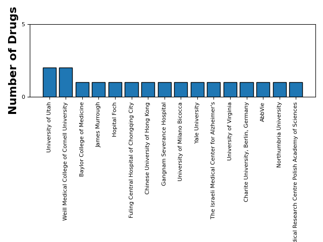
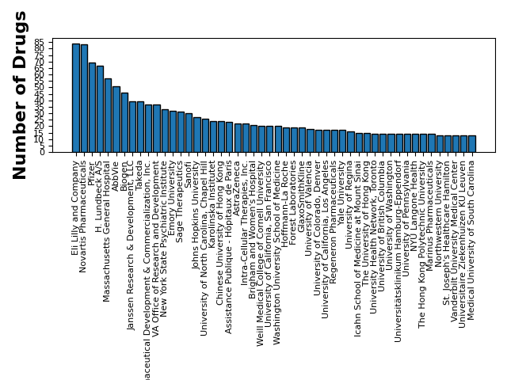
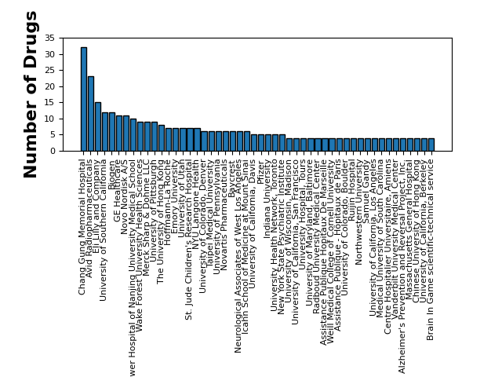
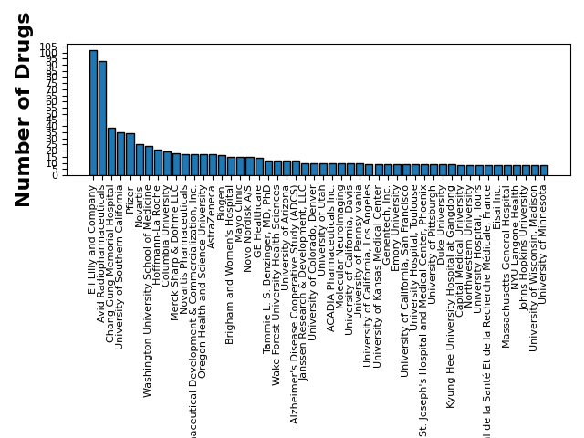

# Gateway Neuroscience
## October 29, 2024

### PubChem Search: zelquistinel (NMDAR)

| drug_name    | active_ingredient   |       cid | sid                    | compound_synonyms                                                                                                                                                                                                                                                                                                                                                                                           | substance_synonyms                                                                                                                                                                                                                       | description   | pubmed_ids   | link                                                |
|:-------------|:--------------------|----------:|:-----------------------|:------------------------------------------------------------------------------------------------------------------------------------------------------------------------------------------------------------------------------------------------------------------------------------------------------------------------------------------------------------------------------------------------------------|:-----------------------------------------------------------------------------------------------------------------------------------------------------------------------------------------------------------------------------------------|:--------------|:-------------|:----------------------------------------------------|
| zelquistinel | NMDAR               | 132155398 | [472419464, 387065541] | ['Zelquistinel [WHO-DD]', 'CS-0116348', 'zelquistinel', 'Zelquistinel', 'NMDAR', 'tert-butyl (4S)-2-[(2S,3R)-1-amino-3-hydroxy-1-oxobutan-2-yl]-3-oxo-2,5-diazaspiro[3.4]octane-5-carboxylate', 'UNII-387WYR6N95', 'GATE251', 'G18567', 'HY-109164', 'DA-59265', 'MS-24891', '387WYR6N95', 'SCHEMBL19628505', '2151842-64-5', 'GATE-251', 'AGN241751', 'AGN-241751', 'CHEMBL5314944', 'Zelquistinel [INN]'] | ['Zelquistinel [WHO-DD]', 'GATE251', 'zelquistinel', 'NMDA RECEPTOR', 'GATE-251', 'Zelquistinel', '387WYR6N95', 'AGN241751', 'AGN-241751', '4R3XO922WS', '2151842-64-5', 'NMDAR', 'Zelquistinel [INN]', 'N-methyl-D-aspartate receptor'] |               |              | https://pubchem.ncbi.nlm.nih.gov/compound/132155398 |
### NMDA
**FDA Approvals**

> * No Approved Drugs Found

**Clinical Trial Sponsors**

| Search Term                                                                                      | NCT Number   | Study Title                                                                                                             | Study URL                                    | Acronym    | Study Status       | Brief Summary                                                                                                                                                                                                                                                                                                                                                                                                                                                                                                                                                                                                                                                                                                                                                                                                                                                                                                                                                                                                                                                                                                                                                                                                                                                                                                                                                                                                                                                                                                                                                                                                                                                                                                                                                                                                                                                                                                                                                                                                                                                                                                                                                                                                                                                                                                                                                                                                                                                                                                                                        | Study Results   | Conditions                                                                                                      | Interventions                                                                                     | Sponsor                                     | Collaborators                                                                                                                                                                                                                                                                                                                                                                                                                                            | Phases       |   Enrollment | Funder Type   | Study Type     | Start Date   | Primary Completion Date   | Completion Date   | First Posted   | Results First Posted   | Last Update Posted   | Locations                                                                                                                                                                                                                                                                                                                                                                                                                                                                                                                                                                                                                                                                                                                                                                                                                                                                                                                                                                                                                                                                                                                                                                                                                                                                                                                                                                                                                                                                                                                                                                                                                                                                                                                                                                                                                                                                                                                                                                                                                                                                                                  | Study Documents                                                                                                                                                                       |
|:-------------------------------------------------------------------------------------------------|:-------------|:------------------------------------------------------------------------------------------------------------------------|:---------------------------------------------|:-----------|:-------------------|:-----------------------------------------------------------------------------------------------------------------------------------------------------------------------------------------------------------------------------------------------------------------------------------------------------------------------------------------------------------------------------------------------------------------------------------------------------------------------------------------------------------------------------------------------------------------------------------------------------------------------------------------------------------------------------------------------------------------------------------------------------------------------------------------------------------------------------------------------------------------------------------------------------------------------------------------------------------------------------------------------------------------------------------------------------------------------------------------------------------------------------------------------------------------------------------------------------------------------------------------------------------------------------------------------------------------------------------------------------------------------------------------------------------------------------------------------------------------------------------------------------------------------------------------------------------------------------------------------------------------------------------------------------------------------------------------------------------------------------------------------------------------------------------------------------------------------------------------------------------------------------------------------------------------------------------------------------------------------------------------------------------------------------------------------------------------------------------------------------------------------------------------------------------------------------------------------------------------------------------------------------------------------------------------------------------------------------------------------------------------------------------------------------------------------------------------------------------------------------------------------------------------------------------------------------|:----------------|:----------------------------------------------------------------------------------------------------------------|:--------------------------------------------------------------------------------------------------|:--------------------------------------------|:---------------------------------------------------------------------------------------------------------------------------------------------------------------------------------------------------------------------------------------------------------------------------------------------------------------------------------------------------------------------------------------------------------------------------------------------------------|:-------------|-------------:|:--------------|:---------------|:-------------|:--------------------------|:------------------|:---------------|:-----------------------|:---------------------|:-----------------------------------------------------------------------------------------------------------------------------------------------------------------------------------------------------------------------------------------------------------------------------------------------------------------------------------------------------------------------------------------------------------------------------------------------------------------------------------------------------------------------------------------------------------------------------------------------------------------------------------------------------------------------------------------------------------------------------------------------------------------------------------------------------------------------------------------------------------------------------------------------------------------------------------------------------------------------------------------------------------------------------------------------------------------------------------------------------------------------------------------------------------------------------------------------------------------------------------------------------------------------------------------------------------------------------------------------------------------------------------------------------------------------------------------------------------------------------------------------------------------------------------------------------------------------------------------------------------------------------------------------------------------------------------------------------------------------------------------------------------------------------------------------------------------------------------------------------------------------------------------------------------------------------------------------------------------------------------------------------------------------------------------------------------------------------------------------------------|:--------------------------------------------------------------------------------------------------------------------------------------------------------------------------------------|
| ['example+9']                                                                                    | NCT06387303  | Pain Control and Quality of Recovery After Intravenous Methadone Versus Intrathecal Morphine in Major Abdominal Surgery | https://clinicaltrials.gov/study/NCT06387303 |            | NOT_YET_RECRUITING | Moderate to severe postoperative pain is relatively common after major abdominal surgery. It is associated with less than optimal surgical experience, poor quality of recovery, and the development of persistent postsurgical pain. Opioids remain a significant component of postoperative pain management. Side effects of opioids used for the treatment of postoperative pain include constipation, pruritus, nausea, and vomiting. Enhanced recovery after surgery (ERAS) protocols involve the utilization of multimodal analgesia. Analgesic techniques used include epidural analgesia, nerve blocks, and Intrathecal (IT) administration of morph ne. IT morphine reduces the postoperative opioid requirement for 18-24 hours after major abdominal surgery and reduces hospital length of stay (LOS) compared with epidural analgesia. A significant number of patients who receive IT morphine still experience moderate to severe postoperative p in. Additionally, many patients refuse the invasive procedure or cannot receive IT morphine due to procedure contraindications, thrombocytopenia, and/or coagulopathy.Intravenous (IV) methadone has a long analgesic half-life and has N-methyl-D-aspartate (NMDA) receptor antagonist and serotonin and norepinephrine reuptake inhibitor (SNRI) properties. It has previously been shown to reduce postoperative opioid requirements, postoperative nausea and vomiting (PONV), and postoperative pain scores in patients who underwent orthopedic, abdominal, complex spine, and cardiac surg ry. Similar findings have been shown in obstetric patients who underwent cesarean delivery under general anesthesia as well as patients who underwent gynecologic surgery. IV methadone has, however, never been compared with IT morphine as a postoperative analgesic.The hypothesis is that intravenous (IV) methadone is non-inferior to IT morphine in patients who undergo major abdominal surg ry. It offers the advantage of being a noninvasive analgesic modality that may contribute to decreasing opioid consumption during the first 72 hours postoperatively, controlling postoperative pain, and improving the quality of recovery after surgery.                                                                                                                                                                                                                                                                                                                  | NO              | Pain, Postoperative                                                                                             | DRUG: Methadone|DRUG: Morphine                                                                    | University of Virginia                      |                                                                                                                                                                                                                                                                                                                                                                                                                                                          | EARLY_PHASE1 |          218 | OTHER         | INTERVENTIONAL | 2024-05-12   | 2026-05-11                | 2026-05-11        | 2024-04-29     |                        | 2024-05-02           | University of Virginia, Charlottesville, Virginia, 22908-0710, United States                                                                                                                                                                                                                                                                                                                                                                                                                                                                                                                                                                                                                                                                                                                                                                                                                                                                                                                                                                                                                                                                                                                                                                                                                                                                                                                                                                                                                                                                                                                                                                                                                                                                                                                                                                                                                                                                                                                                                                                                                               |                                                                                                                                                                                       |
| ['perampanel']                                                                                   | NCT05786066  | The Impact of AMPA Receptor Blockade on Ketamine's Anti-Suicidal Effects                                                | https://clinicaltrials.gov/study/NCT05786066 |            | RECRUITING         | The purpose of this study is to test the hypothesis that the anti-depressant and anti-suicidal effects of the N-methyl-D-aspartate receptor (NMDAR) antagonist Ketamine is critically dependent on stimulation of Alpha-Amino-3-Hydroxy-5-Methyl-4-Isoxazole Propionic Acid receptors (AMPAR).                                                                                                                                                                                                                                                                                                                                                                                                                                                                                                                                                                                                                                                                                                                                                                                                                                                                                                                                                                                                                                                                                                                                                                                                                                                                                                                                                                                                                                                                                                                                                                                                                                                                                                                                                                                                                                                                                                                                                                                                                                                                                                                                                                                                                                                       | NO              | Depressive Disorder|Major Depressive Disorder|Bipolar Disorder|Post Traumatic Stress Disorder|Suicidal Ideation | DRUG: Perampanel 6 MG|DRUG: Ketamine|DRUG: Placebo                                                | Yale University                             | American Foundation for Suicide Prevention|National Center for PTSD|VA Connecticut Healthcare System                                                                                                                                                                                                                                                                                                                                                     | PHASE2       |           30 | OTHER         | INTERVENTIONAL | 2023-04-03   | 2033-03                   | 2033-03           | 2023-03-27     |                        | 2023-09-13           | VA Connecticut Healthcare System, West Haven, Connecticut, 06516, United States                                                                                                                                                                                                                                                                                                                                                                                                                                                                                                                                                                                                                                                                                                                                                                                                                                                                                                                                                                                                                                                                                                                                                                                                                                                                                                                                                                                                                                                                                                                                                                                                                                                                                                                                                                                                                                                                                                                                                                                                                            |                                                                                                                                                                                       |
| ['3-alpha-hydroxy-5-alpha-pregnan-20-one', 'allopregnanolone', '3alpha-oh+dhp', '3alpha-oh-dhp'] | NCT06063369  | PEA vs. Placebo for Major Depression                                                                                    | https://clinicaltrials.gov/study/NCT06063369 | PEA-01     | RECRUITING         | Major Depression is often resistant to treatment, and all of the currently marketed anti-depressants can cause significant side effects and may precipitate mania. The aim of this proposal is to perform a proof-of-concept RCT testing Palmitoylethanolamide (PEA) as a treatment for unipolar or bipolar depression, randomizing 100 patients to 6-week treatment with PEA 1200 mg/d or matching placebo. There are several rationales for this study: (A) PEA acts at the peroxisome proliferator-activated receptor-alpha (PPAR-α), stimulating Allo biosynthesis. Allo is an endogenous, positive allosteric modulator of GABA-A receptors in glutamatergic neurons, including cortical and hippocampal pyramidal glutamatergic neurons and may be one of the endogenous regulators of depression and anxiety. (B) Sage Therapeutics has developed Allo which is FDA approved to treat post-partum depression, and is testing a molecular modification which can be administered orally for post-partum depression and unipolar depression, with mixed efficacy results. Pregnenolone, a precursor of neurosteroids, has also been reported to improve bipolar depression. Based on animal models, PEA increases Allo synthesis in areas of the brain thought to be involved in anxiety and depression. It may also favor the biosynthesis of sulfated forms of Allo and congeners that inhibit tonic rather than phasic NMDA-mediated excitatory neurotransmission. Showing that PEA-induced selective inhibition of tonic NMDA neurotransmission improves depression might enable development of steroid-based NMDA-inhibitor therapeutics. In addition, PEA-induced Allo upregulation potentiates GABA-A receptor-mediated inhibition. The NMDA and the GABAergic mechanisms may act in concert to improve behavioral outcomes. Since PEA increases Allo in the brain where it is endogenously formed, it might be more effective compared with exogenous administration, which is not site specific. There is evidence of a role of inflammation in depression; PEA has potent immunoregulatory and anti-inflammatory effects by directly activating PPAR-α, which has a protective role against neuroinflammation by inhibiting the signaling mediated by toll-like receptor 4.There is one published study which shows that PEA has an antidepressant effect in unipolar depression, 58 patients were randomized to receive 1200 mg/d of PEA or placebo added-on to citalopram, showing clinical improvements in patients receiving PEA. | NO              | Bipolar Depression|Major Depressive Disorder                                                                    | DRUG: Palmitoylethanolamide                                                                       | The Israeli Medical Center for Alzheimer's  |                                                                                                                                                                                                                                                                                                                                                                                                                                                          | PHASE2       |          100 | OTHER         | INTERVENTIONAL | 2022-12-21   | 2023-12-21                | 2024-12-21        | 2023-10-02     |                        | 2023-10-02           | State University of Medicine and Pharmacy " Nicolae Testemitsanu", Chișinău, Moldova, Republic of                                                                                                                                                                                                                                                                                                                                                                                                                                                                                                                                                                                                                                                                                                                                                                                                                                                                                                                                                                                                                                                                                                                                                                                                                                                                                                                                                                                                                                                                                                                                                                                                                                                                                                                                                                                                                                                                                                                                                                                                          |                                                                                                                                                                                       |
| ['uplizna']                                                                                      | NCT04372615  | The ExTINGUISH Trial of Inebilizumab in NMDAR Encephalitis                                                              | https://clinicaltrials.gov/study/NCT04372615 | ExTINGUISH | RECRUITING         | Determine the difference in the modified Rankin score at 16 weeks in participants with anti-N-methyl-D-aspartate receptor (NMDAR) encephalitis treated with "first-line" immunomodulatory therapies provided as standard-of-care, and either inebilizumab (investigational agent) or placebo.                                                                                                                                                                                                                                                                                                                                                                                                                                                                                                                                                                                                                                                                                                                                                                                                                                                                                                                                                                                                                                                                                                                                                                                                                                                                                                                                                                                                                                                                                                                                                                                                                                                                                                                                                                                                                                                                                                                                                                                                                                                                                                                                                                                                                                                        | NO              | Autoimmune Encephalitis|Encephalitis                                                                            | DRUG: Inebilizumab|DRUG: Placebo                                                                  | University of Utah                          |                                                                                                                                                                                                                                                                                                                                                                                                                                                          | PHASE2       |          116 | OTHER         | INTERVENTIONAL | 2022-03-30   | 2025-10-31                | 2026-08-31        | 2020-05-04     |                        | 2023-07-21           | University of Alabama at Birmingham, Birmingham, Alabama, 35233, United States|St. Joseph Hospital and Medical Center Barrow Neurological Institute, Phoenix, Arizona, 85013, United States|UC Irvine, Orange, California, 92868, United States|UC Davis, Sacramento, California, 95816, United States|Yale University, New Haven, Connecticut, 06510, United States|Mayo Clinic Jacksonville, Jacksonville, Florida, 32224, United States|University of Miami, Miami, Florida, 33136, United States|Northwestern University Feinberg School of Medicine, Chicago, Illinois, 60611, United States|University of Iowa, Iowa City, Iowa, 52242, United States|Massachusetts General Hospital, Boston, Massachusetts, 02114, United States|University of Michigan Health System, Ann Arbor, Michigan, 48109, United States|Washington University in St. Louis School of Medicine, Saint Louis, Missouri, 63110, United States|SUNY Downstate, Brooklyn, New York, 11203, United States|Mount Sinai, New York, New York, 10029, United States|Columbia University Medical Center, New York, New York, 10033, United States|University of Rochester, Rochester, New York, 14618, United States|SUNY Buffalo, Williamsville, New York, 14221, United States|Wake Forest University Health Sciences, Winston-Salem, North Carolina, 27101, United States|University of Cincinnati, Cincinnati, Ohio, 45219, United States|Ohio State University, Columbus, Ohio, 43210, United States|University of Pennsylvania, Philadelphia, Pennsylvania, 19104, United States|University of Pittsburgh, Pittsburgh, Pennsylvania, 15213, United States|Vanderbilt University, Nashville, Tennessee, 37212, United States|University of Texas Southwestern Medical Center, Dallas, Texas, 75390, United States|University of Utah, Salt Lake City, Utah, 84108, United States|University of Virginia, Charlottesville, Virginia, 22903, United States|Erasmus Medical University Center, Rotterdam, Netherlands|Institut d'Investigacions Biomèdiques August Pi i Sunyer (IDIBAPS), University of Barcelona, Barcelona, Spain |                                                                                                                                                                                       |
| ['uplizna']                                                                                      | NCT04372615  | The ExTINGUISH Trial of Inebilizumab in NMDAR Encephalitis                                                              | https://clinicaltrials.gov/study/NCT04372615 | ExTINGUISH | RECRUITING         | Determine the difference in the modified Rankin score at 16 weeks in participants with anti-N-methyl-D-aspartate receptor (NMDAR) encephalitis treated with "first-line" immunomodulatory therapies provided as standard-of-care, and either inebilizumab (investigational agent) or placebo.                                                                                                                                                                                                                                                                                                                                                                                                                                                                                                                                                                                                                                                                                                                                                                                                                                                                                                                                                                                                                                                                                                                                                                                                                                                                                                                                                                                                                                                                                                                                                                                                                                                                                                                                                                                                                                                                                                                                                                                                                                                                                                                                                                                                                                                        | NO              | Autoimmune Encephalitis|Encephalitis                                                                            | DRUG: Inebilizumab|DRUG: Placebo                                                                  | University of Utah                          |                                                                                                                                                                                                                                                                                                                                                                                                                                                          | PHASE2       |          116 | OTHER         | INTERVENTIONAL | 2022-03-30   | 2025-10-31                | 2026-08-31        | 2020-05-04     |                        | 2023-07-21           | University of Alabama at Birmingham, Birmingham, Alabama, 35233, United States|St. Joseph Hospital and Medical Center Barrow Neurological Institute, Phoenix, Arizona, 85013, United States|UC Irvine, Orange, California, 92868, United States|UC Davis, Sacramento, California, 95816, United States|Yale University, New Haven, Connecticut, 06510, United States|Mayo Clinic Jacksonville, Jacksonville, Florida, 32224, United States|University of Miami, Miami, Florida, 33136, United States|Northwestern University Feinberg School of Medicine, Chicago, Illinois, 60611, United States|University of Iowa, Iowa City, Iowa, 52242, United States|Massachusetts General Hospital, Boston, Massachusetts, 02114, United States|University of Michigan Health System, Ann Arbor, Michigan, 48109, United States|Washington University in St. Louis School of Medicine, Saint Louis, Missouri, 63110, United States|SUNY Downstate, Brooklyn, New York, 11203, United States|Mount Sinai, New York, New York, 10029, United States|Columbia University Medical Center, New York, New York, 10033, United States|University of Rochester, Rochester, New York, 14618, United States|SUNY Buffalo, Williamsville, New York, 14221, United States|Wake Forest University Health Sciences, Winston-Salem, North Carolina, 27101, United States|University of Cincinnati, Cincinnati, Ohio, 45219, United States|Ohio State University, Columbus, Ohio, 43210, United States|University of Pennsylvania, Philadelphia, Pennsylvania, 19104, United States|University of Pittsburgh, Pittsburgh, Pennsylvania, 15213, United States|Vanderbilt University, Nashville, Tennessee, 37212, United States|University of Texas Southwestern Medical Center, Dallas, Texas, 75390, United States|University of Utah, Salt Lake City, Utah, 84108, United States|University of Virginia, Charlottesville, Virginia, 22903, United States|Erasmus Medical University Center, Rotterdam, Netherlands|Institut d'Investigacions Biomèdiques August Pi i Sunyer (IDIBAPS), University of Barcelona, Barcelona, Spain |                                                                                                                                                                                       |
| ['perampanel']                                                                                   | NCT05756621  | Dual Anti-glutamate Therapy in Super-refractory Status Epilepticus After Cardiac Arrest                                 | https://clinicaltrials.gov/study/NCT05756621 | SUPER-CAT  | RECRUITING         | Status epilepticus (SE) is found in 20-30% of patients in coma after cardiac arrest, is often refractory to medical therapy and is considered a negative prognostic factor. Intensity and duration of treatment of refractory and super-refractory post-anoxic SE pose the ethical dilemma between futility of treatments and, conversely, their premature suspension. A recent study by the Epilepsy Center of the San Gerardo Hospital has shown that patients with super-refractory post-anoxic SE and favorable prognostic indicators can achieve a good functional outcome in more than 40% of cases, if treated with intensive and protracted therapy.However, there is profound uncertainty about the best combination of antiseizure medications and anesthetics to use in this condition. A combined anti-glutamatergic therapy with ketamine (anti-NMDA receptor) and perampanel (anti-AMPA receptor), aimed at counteracting the excitotoxicity linked to global cerebral ischemia, could be particularly effective in the treatment of super-refractory SE with post-anoxic etiology. Preliminary results in the first 26 patients treated in the Coordinating Center of the project indicate that this therapy appears safe and highly effective (80% SE resolution, 40% good neurological outcome).The aim of the SUPER-CAT study is to investigate the efficacy and safety of combined therapy with ketamine and perampanel (dual anti-glutamatergic therapy) in patients with post-anoxic super-refractory status epilepticus, compared to other therapies, using a multi-centre, retrospective, cohort study design.                                                                                                                                                                                                                                                                                                                                                                                                                                                                                                                                                                                                                                                                                                                                                                                                                                                                                                                | NO              | Status Epilepticus|Cardiac Arrest                                                                               | DRUG: Ketamine|DRUG: Any anti-epileptic and anesthetic therapy, excluding Ketamine and Perampanel | University of Milano Bicocca                | Azienda Ospedaliera San Gerardo di Monza|Azienda Ospedaliero-Universitaria di Modena|Azienda Ospedaliera Universitaria Integrata Verona|Ospedale Centrale Bolzano|Azienda Socio Sanitaria Territoriale degli Spedali Civili di Brescia|Azienda Ospedaliero-Universitaria Careggi|Azienda Ospedaliero-Universitaria di Parma|Santa Chiara Hospital|Ospedale M. Bufalini Cesena|Azienda Ospedaliera Brotzu|Istituto Di Ricerche Farmacologiche Mario Negri |              |           80 | OTHER         | OBSERVATIONAL  | 2022-01-15   | 2024-06-30                | 2024-09-30        | 2023-03-06     |                        | 2024-01-02           | ASST Spedali Civili Brescia, Brescia, BS, Italy|Ospedale Centrale di Bolzano, Bolzano, BZ, Italy|Ospedale G. Brotzu, Cagliari, CA, Italy|Ospedale M. Bufalini, Cesena, FC, Italy|AOU Careggi, Firenze, FI, Italy|Fondazione IRCCS San Gerardo dei Tintori Monza, Monza, MB, 20900, Italy|Azienda Ospedaliero-Universitaria di Modena, Modena, MO, Italy|Azienda Ospedaliero-Universitaria di Parma, Parma, PR, Italy|Ospedale Santa Chiara Trento, Trento, TN, Italy|Azienda Ospedaliero-Universitaria Integrata di Verona, Verona, VR, Italy                                                                                                                                                                                                                                                                                                                                                                                                                                                                                                                                                                                                                                                                                                                                                                                                                                                                                                                                                                                                                                                                                                                                                                                                                                                                                                                                                                                                                                                                                                                                                              |                                                                                                                                                                                       |
| ['ono+2745', 'remimazolam', 'cns+7056', 'cns-7056', 'ono2745', 'ono-2745', 'cns7056']            | NCT04968054  | Comparison of IONM Between Remimazolam and Propofol                                                                     | https://clinicaltrials.gov/study/NCT04968054 |            | COMPLETED          | Inhalation anesthetics significantly can delay latency and reduce amplitude of cortical MEPs and SSEPs signals compared to intravenous anesthetics by acting on not only GABA (γ-aminobutyric acid) receptors but also NMDA (N-methyl-D-aspartate) receptors, so total intravenous anesthesia (TIVA) have been more preferred for neurophysiological monitoring follow-up during surgery. However, just less than inhalation anesthetics, the decrease of amplitude and the delay of latency also occur according to the dose dependant of propofol. Moreover, it can cause various adverse effects such as delayed recovery after anesthesia or propofol infusion syndrome, consequently, combined methods with other agents or conversion to other relative anesthetics are being made. Remimazolam is a ultra-short-acting benzodiazepine, and unlike conventional benzodiazepine drugs, it is rapidly metabolized in plasma and not accumulates in the body for long periods of infusion or even with high dose administration. Recently, there have been repored that continuous infusion of 0.5-1.5 mg/kg of remimazolam has little effect on the motor evoked potential (MEPs) of cervical spine surgery patients, but this is a case report without the control group; further prospective studies are definitely needed. Therefore, in the case of using propofol or remimazolam for total intravenous anesthesia, we aim to investigate which intravenous anesthetic is more appropriate for intraoperative neurophysiological monitoring by comparing the results of the somatosensory evoked potential (SSEPs) and MEPs according to these anesthetics.                                                                                                                                                                                                                                                                                                                                                                                                                                                                                                                                                                                                                                                                                                                                                                                                                                                                                  | NO              | Ossification Posterior Longitudinal Ligament|Cervical Spondylotic Myelopathy                                    | DRUG: Arm I (Propofol)|DRUG: Arm II (Remimazolam)                                                 | Gangnam Severance Hospital                  |                                                                                                                                                                                                                                                                                                                                                                                                                                                          | NA           |           66 | OTHER         | INTERVENTIONAL | 2021-07-20   | 2023-05-02                | 2023-05-02        | 2021-07-20     |                        | 2023-10-18           | GangnamSeverance Hospital, Seoul, Korea, Republic of                                                                                                                                                                                                                                                                                                                                                                                                                                                                                                                                                                                                                                                                                                                                                                                                                                                                                                                                                                                                                                                                                                                                                                                                                                                                                                                                                                                                                                                                                                                                                                                                                                                                                                                                                                                                                                                                                                                                                                                                                                                       |                                                                                                                                                                                       |
| ['cbd']                                                                                          | NCT04244058  | Changes in Glutamatergic Neurotransmission of Severe TBI Patients                                                       | https://clinicaltrials.gov/study/NCT04244058 |            | SUSPENDED          | Studies in patients with disorders of consciousness (DOC) after severe brain injury implicate dysfunction of the anterior forebrain mesocircuit dysfunction a key underlying mechanism. The anterior forebrain metabolism in DOC is markedly downregulated across brain regions underpinning highly elaborated cognitive behaviors demonstrating a collapse of the level of synaptic background activity required for consistent goal-directed behavior and arousal regulation. Since dopamine levels are one of the primary controllers of the level of synaptic background activity within these forebrain structures and in regulating excitatory glutamatergic homeostasis, the investigators propose to investigate the specific contribution of presynaptic dopamine function in glutamatergic neurotransmission in posttraumatic DOC. The aim of the present study is to measure metabotropic glutamate receptors 5 occupancy in the main gutamatergic structures of the brain using (3-\[18F\]fluoro-5-(2-pyridinylethynyl)benzonitrile)-positron emission tomography ( \[18F\]FPEB-PET) at rest and following a short pharmacological challenge with amantadine, an N-methyl-D-aspartate receptor (NMDA-R) antagonist, following L-DOPA, and amantadine + L-DOPA. Using this novel technique in DOC the investigators will characterize the relevance of a presynaptic deficiency to synthesize and/or release dopamine in the final regulation of excitatory interneurons of the anterior forebrain mesocircuit.It is unknown whether glutamatergic neurotransmission is affected across the population of subjects with DOC and, if this condition is secondary to a presynaptic dopaminergic failure of the anterior forebrain mesocircuit (i.e., down-regulation). Since the investigators previously identified the existence of a presynaptic dopaminergic deficit in these subjects due to a failure in the biosynthesis of dopamine, the investigators will evaluate if by providing the main biological substrate of the biosynthesis process (i.e., L-DOPA) the glutamatergic system regains homeostasis. The investigators therefore propose to investigate patients with posttraumatic DOC using \[18F\]FPEB-PET at rest and following short pharmacological challenges aimed at increasing glutamate and dopamine release.                                                                                                                                                                                                     | NO              | Disorder of Consciousness|Traumatic Brain Injury                                                                | DRUG: Amantadine + L-DOPA|DRUG: NMDA blocker                                                      | Weill Medical College of Cornell University |                                                                                                                                                                                                                                                                                                                                                                                                                                                          | EARLY_PHASE1 |           30 | OTHER         | INTERVENTIONAL | 2020-09-23   | 2023-05-30                | 2023-06-30        | 2020-01-28     |                        | 2022-09-30           | Weill Cornell Medicine, New York, New York, 10065, United States                                                                                                                                                                                                                                                                                                                                                                                                                                                                                                                                                                                                                                                                                                                                                                                                                                                                                                                                                                                                                                                                                                                                                                                                                                                                                                                                                                                                                                                                                                                                                                                                                                                                                                                                                                                                                                                                                                                                                                                                                                           |                                                                                                                                                                                       |
| ['cbd']                                                                                          | NCT04244058  | Changes in Glutamatergic Neurotransmission of Severe TBI Patients                                                       | https://clinicaltrials.gov/study/NCT04244058 |            | SUSPENDED          | Studies in patients with disorders of consciousness (DOC) after severe brain injury implicate dysfunction of the anterior forebrain mesocircuit dysfunction a key underlying mechanism. The anterior forebrain metabolism in DOC is markedly downregulated across brain regions underpinning highly elaborated cognitive behaviors demonstrating a collapse of the level of synaptic background activity required for consistent goal-directed behavior and arousal regulation. Since dopamine levels are one of the primary controllers of the level of synaptic background activity within these forebrain structures and in regulating excitatory glutamatergic homeostasis, the investigators propose to investigate the specific contribution of presynaptic dopamine function in glutamatergic neurotransmission in posttraumatic DOC. The aim of the present study is to measure metabotropic glutamate receptors 5 occupancy in the main gutamatergic structures of the brain using (3-\[18F\]fluoro-5-(2-pyridinylethynyl)benzonitrile)-positron emission tomography ( \[18F\]FPEB-PET) at rest and following a short pharmacological challenge with amantadine, an N-methyl-D-aspartate receptor (NMDA-R) antagonist, following L-DOPA, and amantadine + L-DOPA. Using this novel technique in DOC the investigators will characterize the relevance of a presynaptic deficiency to synthesize and/or release dopamine in the final regulation of excitatory interneurons of the anterior forebrain mesocircuit.It is unknown whether glutamatergic neurotransmission is affected across the population of subjects with DOC and, if this condition is secondary to a presynaptic dopaminergic failure of the anterior forebrain mesocircuit (i.e., down-regulation). Since the investigators previously identified the existence of a presynaptic dopaminergic deficit in these subjects due to a failure in the biosynthesis of dopamine, the investigators will evaluate if by providing the main biological substrate of the biosynthesis process (i.e., L-DOPA) the glutamatergic system regains homeostasis. The investigators therefore propose to investigate patients with posttraumatic DOC using \[18F\]FPEB-PET at rest and following short pharmacological challenges aimed at increasing glutamate and dopamine release.                                                                                                                                                                                                     | NO              | Disorder of Consciousness|Traumatic Brain Injury                                                                | DRUG: Amantadine + L-DOPA|DRUG: NMDA blocker                                                      | Weill Medical College of Cornell University |                                                                                                                                                                                                                                                                                                                                                                                                                                                          | EARLY_PHASE1 |           30 | OTHER         | INTERVENTIONAL | 2020-09-23   | 2023-05-30                | 2023-06-30        | 2020-01-28     |                        | 2022-09-30           | Weill Cornell Medicine, New York, New York, 10065, United States                                                                                                                                                                                                                                                                                                                                                                                                                                                                                                                                                                                                                                                                                                                                                                                                                                                                                                                                                                                                                                                                                                                                                                                                                                                                                                                                                                                                                                                                                                                                                                                                                                                                                                                                                                                                                                                                                                                                                                                                                                           |                                                                                                                                                                                       |
| ['cbd']                                                                                          | NCT03362879  | COmedication Study Assessing Mono- and cOmbination Therapy With Levodopa-carbidopa inteStinal Gel                       | https://clinicaltrials.gov/study/NCT03362879 | COSMOS     | COMPLETED          | The purpose of this study is to evaluate treatment of advanced Parkinson's Disease (PD) patients on levodopa-carbidopa intestinal gel (LCIG) monotherapy in a routine clinical setting.                                                                                                                                                                                                                                                                                                                                                                                                                                                                                                                                                                                                                                                                                                                                                                                                                                                                                                                                                                                                                                                                                                                                                                                                                                                                                                                                                                                                                                                                                                                                                                                                                                                                                                                                                                                                                                                                                                                                                                                                                                                                                                                                                                                                                                                                                                                                                              | YES             | Parkinson's Disease (PD)                                                                                        |                                                                                                   | AbbVie                                      |                                                                                                                                                                                                                                                                                                                                                                                                                                                          |              |          412 | INDUSTRY      | OBSERVATIONAL  | 2017-12-14   | 2018-12-17                | 2018-12-17        | 2017-12-05     | 2020-01-06             | 2020-01-06           | Gailtal Klinik /ID# 202505, Hermagor-Pressegger See, Kaernten, 9620, Austria|Medizinische Universität Graz /ID# 202559, Graz, Steiermark, 8010, Austria|University of Calgary /ID# 206550, Calgary, Alberta, T2N 4Z6, Canada|Ottawa Hospital /ID# 169448, Ottawa, Ontario, K1Y 4E9, Canada|Toronto Western Hospital /ID# 169038, Toronto, Ontario, M5T 2S8, Canada|Clinique Neuro Levis /ID# 206549, Lévis, Quebec, G6W 0M5, Canada|Clinical Hosp Center Zagreb /ID# 203553, Zagreb, 10000, Croatia|Fakultni nemocnice u sv. Anny v Brne /ID# 209774, Brno 2, Brno-mesto, 602 00, Czechia|Fakultni Nemocnice Olomouc /ID# 209776, Olomouc, Olomoucky Kraj, 779 00, Czechia|Vseobecna Fakultni Nemocnice /ID# 209775, Prague, 128 08, Czechia|Aiginiteio University Hospital /ID# 203476, Athens, Attiki, 11528, Greece|HYGEIA Hospital /ID# 203474, Athens, 15123, Greece|Mediterraneo Hospital /ID# 203472, Glyfada, 16675, Greece|University Hospital of Ioannin /ID# 203471, Ioannina, 45500, Greece|Pecsi Tudomanyegyetem /ID# 170026, Pécs, Pecs, 7624, Hungary|Semmelweis Egyetem /ID# 170025, Budapest, 1083, Hungary|Borsod-Abauj-Zemplen Megyei /ID# 170027, Miskolc, 3526, Hungary|Szegedi Tudomanyegyetem /ID# 170028, Szeged, 6720, Hungary|Bon Secours Hospital /ID# 168424, Cork, T12 DV56, Ireland|University Hospital Galway /ID# 170754, Galway, H91 YR71, Ireland|Tel Aviv Sourasky Medical Ctr /ID# 167542, Tel Aviv-Yafo, Tel-Aviv, 6423906, Israel|Sheba Medical Center /ID# 167543, Ramat Gan, 5262100, Israel|Clinic Fundeni Institute /ID# 169265, Bucharest, Bucuresti, 022328, Romania|Colentina Clinical Hospital /ID# 169263, Bucharest, 20125, Romania|Emergency Clinical County Hosp /ID# 169269, Targu Mures, 540042, Romania|Timisoara County /ID# 169266, Timisoara, 300736, Romania|Timisoara County /ID# 169268, Timisoara, 300736, Romania|AbbVie Farmaceutica SLU /ID# 164364, Madrid, Spain|Centrum for neurologi /ID# 171391, Stockholm, 113 65, Sweden|Neurologmottagningen /ID# 171390, Stockholm, 171 76, Sweden                                                 | Study Protocol, https://cdn.clinicaltrials.gov/large-docs/79/NCT03362879/Prot_000.pdf|Statistical Analysis Plan, https://cdn.clinicaltrials.gov/large-docs/79/NCT03362879/SAP_001.pdf |

### depression
**FDA Approvals**

|   fda_year |   fda_year_approval_count | fda_drug_name   | fda_active_ingredient   | fda_approval_date   | fda_approved_use                                                                     | fda_drug_link                                                                                    | fda_press_release                                                                                           | fda_drug_trials_snapshot                                                              | fda_2_drug_name   | fda_2_active_ingredient   | fda_2_dosage_form           | fda_2_drug_link                                                                                | fda_2_application_type   |   fda_2_application_num | fda_2_sponsor   | sponsor   |
|-----------:|--------------------------:|:----------------|:------------------------|:--------------------|:-------------------------------------------------------------------------------------|:-------------------------------------------------------------------------------------------------|:------------------------------------------------------------------------------------------------------------|:--------------------------------------------------------------------------------------|:------------------|:--------------------------|:----------------------------|:-----------------------------------------------------------------------------------------------|:-------------------------|------------------------:|:----------------|:----------|
|       2023 |                        30 | Zurzuvae        | zuranolone              | 2023-08-04 00:00:00 | To treat postpartum depression Press ReleaseDrug Trials Snapshot                    | https://www.accessdata.fda.gov/drugsatfda_docs/label/2023/217369s000lbl.pdf                      | https://www.fda.gov/news-events/press-announcements/fda-approves-first-oral-treatment-postpartum-depression | https://www.fda.gov/drugs/drug-approvals-and-databases/drug-trials-snapshots-zurzuvae | ZURZUVAE          | ZURZUVAE (ZURANOLONE)     | ['CAPSULE', 'ORAL']         | https://www.accessdata.fda.gov/scripts/cder/daf/index.cfm?event=overview.process&ApplNo=217369 | NDA                      |                  217369 | BIOGEN INC      | Biogen    |
|       2019 |                         4 | Zulresso        | brexanolone             | 2019-03-19 00:00:00 | To treat postpartum depression (PPD) in adult womenPress ReleaseDrug Trials Snapshot | http://www.accessdata.fda.gov/scripts/cder/daf/index.cfm?event=overview.process&varApplNo=211371 | https://www.fda.gov/news-events/press-announcements/fda-approves-first-treatment-post-partum-depression     | https://www.fda.gov/drugs/drug-approvals-and-databases/drug-trials-snapshots-zulresso | ZULRESSO          | ZULRESSO (BREXANOLONE)    | ['SOLUTION', 'INTRAVENOUS'] | https://www.accessdata.fda.gov/scripts/cder/daf/index.cfm?event=overview.process&ApplNo=211371 | NDA                      |                  211371 | SAGE THERAP     | Sage      |

**Clinical Trial Sponsors**

| Search Term                                                                                                                                                                                                                                                       | NCT Number   | Study Title                                                                                                                                                         | Study URL                                    | Acronym   | Study Status       | Brief Summary                                                                                                                                                                                                                                                                                                                                                                                                                                                                                                                                                                                                                                                                                                                                                                                                                                                                                                                                                                                                                                                                                                                                                                                                                                                                                                                                                                                                                                                                                                                                                                                                                                                                                                                                                                                                                                                                                                                                                                                                                                                                                   | Study Results   | Conditions                                    | Interventions                                                                                                                                                                                                                                                                     | Sponsor                                                           | Collaborators                                                                                                       | Phases   |   Enrollment | Funder Type   | Study Type     | Start Date   | Primary Completion Date   | Completion Date   | First Posted   | Results First Posted   | Last Update Posted   | Locations                                                                                                                                                                                                                                                                                                                                                                                                                                             | Study Documents   |
|:------------------------------------------------------------------------------------------------------------------------------------------------------------------------------------------------------------------------------------------------------------------|:-------------|:--------------------------------------------------------------------------------------------------------------------------------------------------------------------|:---------------------------------------------|:----------|:-------------------|:------------------------------------------------------------------------------------------------------------------------------------------------------------------------------------------------------------------------------------------------------------------------------------------------------------------------------------------------------------------------------------------------------------------------------------------------------------------------------------------------------------------------------------------------------------------------------------------------------------------------------------------------------------------------------------------------------------------------------------------------------------------------------------------------------------------------------------------------------------------------------------------------------------------------------------------------------------------------------------------------------------------------------------------------------------------------------------------------------------------------------------------------------------------------------------------------------------------------------------------------------------------------------------------------------------------------------------------------------------------------------------------------------------------------------------------------------------------------------------------------------------------------------------------------------------------------------------------------------------------------------------------------------------------------------------------------------------------------------------------------------------------------------------------------------------------------------------------------------------------------------------------------------------------------------------------------------------------------------------------------------------------------------------------------------------------------------------------------|:----------------|:----------------------------------------------|:----------------------------------------------------------------------------------------------------------------------------------------------------------------------------------------------------------------------------------------------------------------------------------|:------------------------------------------------------------------|:--------------------------------------------------------------------------------------------------------------------|:---------|-------------:|:--------------|:---------------|:-------------|:--------------------------|:------------------|:---------------|:-----------------------|:---------------------|:------------------------------------------------------------------------------------------------------------------------------------------------------------------------------------------------------------------------------------------------------------------------------------------------------------------------------------------------------------------------------------------------------------------------------------------------------|:------------------|
| ['.delta.1(2)-trans-cannabidiol', 'epidiolex', 'delta(1(2))-trans-cannabidiol', '(a+/-)-cannabidiol', 'cbd', 'cannabidiol']                                                                                                                                       | NCT03883360  | Effects of Cannabidiol on Psychiatric Symptoms, Cognition, and Cannabis Consumption in Cannabis Users With Recent-Onset Psychosis                                   | https://clinicaltrials.gov/study/NCT03883360 |           | WITHDRAWN          | A large proportion of people with a schizophrenia-spectrum disorder, especially in the early stages of the disease, regularly consume cannabis. Cannabis use is associated with poor prognostic outcome; however, there are no effective interventions targeted at reducing cannabis use or its deleterious effects in this population. The present trial is designed to test whether cannabidiol (CBD), a cannabinoid whose effects are in many ways antagonistic to those of Δ9-tetrahydrocannabinol (THC), can reduce psychiatric symptoms, cognitive deficits, and cannabis use in people with recent-onset psychosis who regularly consume cannabis.                                                                                                                                                                                                                                                                                                                                                                                                                                                                                                                                                                                                                                                                                                                                                                                                                                                                                                                                                                                                                                                                                                                                                                                                                                                                                                                                                                                                                                       | NO              | Schizophrenia Spectrum Disorders|Cannabis Use | DRUG: Cannabidiol (CBD)|DRUG: Placebo                                                                                                                                                                                                                                             | University of Maryland, Baltimore                                 | Sheppard Pratt Health System|University of California, Los Angeles                                                  | PHASE2   |            0 | OTHER         | INTERVENTIONAL | 2050-01      | 2050-02                   | 2050-03           | 2019-03-20     |                        | 2021-04-19           | Semel Institute for Neuroscience and Human Behavior, Los Angeles, California, 90095, United States|Sheppard Pratt Health System, Baltimore, Maryland, 21204, United States|Maryland Psychiatric Research Center, Catonsville, Maryland, 21228, United States                                                                                                                                                                                          |                   |
| ['baricitinib+(incb028050)', 'ly+3009104', 'baricitinib+(ly3009104,+incb028050)', 'olumiant', 'baricitinib+(ly3009104)', 'incb028050', 'baricitinib', 'incb+028050', 'incb028050++++,++++ly3009104', 'incb-028050', '17|a-propionate', 'ly3009104', 'ly-3009104'] | NCT06381661  | Adaptive Platform Trial for Personnalisation of Sepsis Treatment in Children and Adults: a Multi-national, Treatable Traits-guided, Adaptive, Bayesian Basket Trial | https://clinicaltrials.gov/study/NCT06381661 | PALETTE   | NOT_YET_RECRUITING | PALETTE is a perpetual adaptive platform to efficiently study sepsis interventions within 'treatable traits' in all-ages patients enabling prompt evaluation of pandemic treatments. Treatable traits, therapeutic targets identified by phenotypes or endotypes (defined by biological mechanism or by treatment response) through validated biomarkers (measurable characteristic reflecting normal or pathogenic processes, or treatment responses), may include multi-omics, cellular, immune, metabolic, endocrine features, or intelligent algorithms. PALETTE Bayesian adaptive design enables parallel investigations of multiple interventions for sepsis, and quick inclusion of pandemic pathogens. PALETTE's new conceptual model will respond to the challenges of standard approaches, i.e. series of sepsis trials, each investigating one or two interventions, expensive, time consuming, and inappropriate in pandemic context.                                                                                                                                                                                                                                                                                                                                                                                                                                                                                                                                                                                                                                                                                                                                                                                                                                                                                                                                                                                                                                                                                                                                               | NO              | Sepsis                                        | DRUG: Tocilizumab|DRUG: Baricitinib|DRUG: Anakinra|DRUG: Hydrocortisone|DRUG: Hydrocortisone and fludrocortisone|DRUG: Heparin|DRUG: Low molecular weight heparin|DRUG: Recombinant humanThrombomodulin( rhTM)|DRUG: Sivelestat|BIOLOGICAL: Fresh frozen plasma|OTHER: Usual care | Assistance Publique - Hôpitaux de Paris                           |                                                                                                                     | PHASE3   |         2000 | OTHER         | INTERVENTIONAL | 2026-04-01   | 2029-05-01                | 2032-04-01        | 2024-04-24     |                        | 2024-04-24           |                                                                                                                                                                                                                                                                                                                                                                                                                                                       |                   |
| ['example+9']                                                                                                                                                                                                                                                     | NCT06077526  | Alleviating Burden of Chronic Musculoskeletal Pain in the Emergency Department                                                                                      | https://clinicaltrials.gov/study/NCT06077526 |           | NOT_YET_RECRUITING | Chronic musculoskeletal pain (CMP) and lack of physical activity often co-exist, contributing to increased disability, non-communicable diseases (e.g., obesity, diabetes, hypertension), psychological comorbidity (e.g., anxiety and depression), and healthcare utilization and costs \[1-6\]. Many individuals with CMP seek assistance at emergency departments (ED). ED overuse has been an ongoing concern, with 1-in-5 Americans presenting to the ED at least once each year \[7\]. Of these visits, 24 million are for adults seeking help for chronic pain, with an additional 12 million due to exacerbations of an existing chronic pain condition \[8\]. In 2021, the fourth most common reason for seeking care in the ED related to a primary diagnosis involving the musculoskeletal system, with an estimated 9.5 million visits \[9\]. Most ED visits result in a 'treat and release' approach, potentially disrupting continuity of care and resulting in follow-up ED visits \[10\]. These ED visits for chronic pain are indicative of accessibility problems to community-based primary and preventative care, compounded by limited or no health insurance coverage \[10\]. Based on the Emergency Medical Treatment and Labor Act, EDs are required to stabilize all patients regardless of ability to pay \[10\]. To alleviate the burden of CMP on patients and EDs, improve access to quality healthcare, and mitigate initial and repeat ED visits, alternative options are required. Here we propose a novel group-based intervention involving pain education (PE) and physical activity (PA) implemented in CMP patients presenting to the ED of a community level hospital. The investigators will recruit 60 adults from a community hospital located in the Shenandoah Valley region of Virginia; participants will be randomized to either Pain Education and Active Knowledge (P.E.A.K.) Rx (24 sessions of group PE+ + PA) or usual care. Research assessments are conducted with both groups at study entry (baseline), 8-weeks, 3-months, and 6-months. | NO              | Chronic Pain                                  | BEHAVIORAL: P.E.A.K. Rx|OTHER: Usual Care                                                                                                                                                                                                                                         | Bridgewater College                                               |                                                                                                                     | NA       |           60 | OTHER         | INTERVENTIONAL | 2026-01-13   | 2027-05-15                | 2027-05-15        | 2023-10-11     |                        | 2024-02-12           |                                                                                                                                                                                                                                                                                                                                                                                                                                                       |                   |
| ['pwv']                                                                                                                                                                                                                                                           | NCT04948489  | IUD and Norethindrone Acetate for Treatment of Endometriosis                                                                                                        | https://clinicaltrials.gov/study/NCT04948489 |           | NOT_YET_RECRUITING | Endometriosis is the most common reproductive disease afflicting young women, often leading to debilitating chronic pelvic pain and impaired quality of life. Safe, effective, and convenient long-term treatments are lacking for adolescents and young adults. The levonorgestrel-containing IUD (LNG-IUD) represents an attractive long-term drug delivery system for the treatment of endometriosis during adolescence and young adulthood. However, while the LNG-IUD has an acceptable safety profile, it is not associated with a favorable bleeding profile and may not fully suppress endometriosis pain when used as monotherapy. Investigators hypothesize that the addition of NETA will improve bleeding patterns, maximize pain control, and improve continuation rates of the IUD when the two medications are used in combination. This proposed prospective trial provides the ideal context in which to investigate these clinical questions and advance research on the best treatments for endometriosis.                                                                                                                                                                                                                                                                                                                                                                                                                                                                                                                                                                                                                                                                                                                                                                                                                                                                                                                                                                                                                                                                   | NO              | Endometriosis                                 | DRUG: norethindrone acetate (NETA)|DRUG: Placebo                                                                                                                                                                                                                                  | Boston Children's Hospital                                        |                                                                                                                     | PHASE2   |           80 | OTHER         | INTERVENTIONAL | 2026-01-01   | 2028-09-01                | 2029-09-01        | 2021-07-02     |                        | 2024-05-17           | Boston Children's Hospital, Boston, Massachusetts, 02115, United States                                                                                                                                                                                                                                                                                                                                                                               |                   |
| ['example+9']                                                                                                                                                                                                                                                     | NCT05712382  | Promoting Maintenance of Change Following Brief Intervention for Alcohol Use                                                                                        | https://clinicaltrials.gov/study/NCT05712382 |           | NOT_YET_RECRUITING | All students who enroll in the study will receive an efficacious counselor-delivered brief motivational intervention. The intervention is based in principles of motivational interviewing. Students complete a baseline assessment on their alcohol use and alcohol-related consequences. During the hour-long session, the counselor uses information from the baseline assessment to compare the student's level of alcohol consumption to that of peers at the same university, discuss choices that may lead to experiencing negative consequences, and provide opportunities for the student to set goals for risk reduction.This study will develop and pilot a maintenance enhancement intervention. The intervention is expected to consist of four components, for example: (1) Student participants may learn to use techniques based in mindfulness to cope with negative emotions. (2) Student participants may identify barriers to reducing their alcohol use and identify protective strategies for navigating those barriers. (3) Student participants may be presented with narratives from other students who successfully resumed moderate drinking after a heavy drinking episode. Students may also be prompted to identify alcohol free activities that they enjoy and can engage in after experiencing a heavy drinking episode. (4) Parents may also receive a handbook encouraging communication with their student about alcohol use.                                                                                                                                                                                                                                                                                                                                                                                                                                                                                                                                                                                                                                | NO              | Alcohol Drinking in College                   | BEHAVIORAL: Parent handbook|BEHAVIORAL: Coping with negative emotions|BEHAVIORAL: Problem-solving risky situations|BEHAVIORAL: Recovering from slips                                                                                                                              | University of Massachusetts, Amherst                              |                                                                                                                     | NA       |          160 | OTHER         | INTERVENTIONAL | 2025-09      | 2026-05                   | 2026-05           | 2023-02-03     |                        | 2023-02-10           |                                                                                                                                                                                                                                                                                                                                                                                                                                                       |                   |
| ['dara']                                                                                                                                                                                                                                                          | NCT05789446  | Confirmatory Efficacy of the Building a Strong Identity and Coping Skills Program                                                                                   | https://clinicaltrials.gov/study/NCT05789446 |           | NOT_YET_RECRUITING | The goal of this clinical trial is to the efficacy of the Building a Strong Identity and Coping Skills intervention within a sample of low-income and minoritized youth aged 11-14 who are seeking mental health treatment and have been placed on a waitlist to receive services.The aims of this study are to: (1) confirm the efficacy of BaSICS by replicating previous findings, (2) Examine the changes of coping mechanisms and symptom change over the course of the BaSICS intervention, and (3) test models of physiologic stress reactivity and regulation to capture biological "risk" and recalibration.Cohorts of 20 participants will randomly be enrolled in either the intervention (10) or control (10) groups. Participants enrolled in the intervention group will complete the BaSICS program and participants enrolled in the no intervention group will not be enrolled in the intervention program. The BaSICS program is designed to help treat anxiety, depression, and post-traumatic stress symptoms and disorders and have direct effects on physiologic stress response systems (hypothalamic-pituitary-adrenal (HPA) axis). Researchers will compare the intervention and no intervention groups to see if there is a difference in the reduction of markers for anxiety, depression, and suicide scores, changes in coping mechanism, and HPA reactivity profiles                                                                                                                                                                                                                                                                                                                                                                                                                                                                                                                                                                                                                                                                                               | NO              | Chronic Stress|Anxiety|Depression             | BEHAVIORAL: Building a Strong Identity and Coping Skills                                                                                                                                                                                                                          | Penn State University                                             |                                                                                                                     | NA       |          360 | OTHER         | INTERVENTIONAL | 2025-02-01   | 2029-01-01                | 2029-08-30        | 2023-03-29     |                        | 2024-06-21           | Pennsylvania Psychiatric Institute, Harrisburg, Pennsylvania, 17110, United States|Penn State Health Medical Group - Psychiatry and Behavioral Health, Hershey, Pennsylvania, 17033, United States|Penns Valley Area School District, Spring Mills, Pennsylvania, 16875, United States|Dr. Edwin L. Herr Clinic, State College, Pennsylvania, 16802, United States|Penn State Psychological Clinic, State College, Pennsylvania, 16802, United States |                   |
| ['dara']                                                                                                                                                                                                                                                          | NCT05789446  | Confirmatory Efficacy of the Building a Strong Identity and Coping Skills Program                                                                                   | https://clinicaltrials.gov/study/NCT05789446 |           | NOT_YET_RECRUITING | The goal of this clinical trial is to the efficacy of the Building a Strong Identity and Coping Skills intervention within a sample of low-income and minoritized youth aged 11-14 who are seeking mental health treatment and have been placed on a waitlist to receive services.The aims of this study are to: (1) confirm the efficacy of BaSICS by replicating previous findings, (2) Examine the changes of coping mechanisms and symptom change over the course of the BaSICS intervention, and (3) test models of physiologic stress reactivity and regulation to capture biological "risk" and recalibration.Cohorts of 20 participants will randomly be enrolled in either the intervention (10) or control (10) groups. Participants enrolled in the intervention group will complete the BaSICS program and participants enrolled in the no intervention group will not be enrolled in the intervention program. The BaSICS program is designed to help treat anxiety, depression, and post-traumatic stress symptoms and disorders and have direct effects on physiologic stress response systems (hypothalamic-pituitary-adrenal (HPA) axis). Researchers will compare the intervention and no intervention groups to see if there is a difference in the reduction of markers for anxiety, depression, and suicide scores, changes in coping mechanism, and HPA reactivity profiles                                                                                                                                                                                                                                                                                                                                                                                                                                                                                                                                                                                                                                                                                               | NO              | Chronic Stress|Anxiety|Depression             | BEHAVIORAL: Building a Strong Identity and Coping Skills                                                                                                                                                                                                                          | Penn State University                                             |                                                                                                                     | NA       |          360 | OTHER         | INTERVENTIONAL | 2025-02-01   | 2029-01-01                | 2029-08-30        | 2023-03-29     |                        | 2024-06-21           | Pennsylvania Psychiatric Institute, Harrisburg, Pennsylvania, 17110, United States|Penn State Health Medical Group - Psychiatry and Behavioral Health, Hershey, Pennsylvania, 17033, United States|Penns Valley Area School District, Spring Mills, Pennsylvania, 16875, United States|Dr. Edwin L. Herr Clinic, State College, Pennsylvania, 16802, United States|Penn State Psychological Clinic, State College, Pennsylvania, 16802, United States |                   |
| ['dara']                                                                                                                                                                                                                                                          | NCT05789446  | Confirmatory Efficacy of the Building a Strong Identity and Coping Skills Program                                                                                   | https://clinicaltrials.gov/study/NCT05789446 |           | NOT_YET_RECRUITING | The goal of this clinical trial is to the efficacy of the Building a Strong Identity and Coping Skills intervention within a sample of low-income and minoritized youth aged 11-14 who are seeking mental health treatment and have been placed on a waitlist to receive services.The aims of this study are to: (1) confirm the efficacy of BaSICS by replicating previous findings, (2) Examine the changes of coping mechanisms and symptom change over the course of the BaSICS intervention, and (3) test models of physiologic stress reactivity and regulation to capture biological "risk" and recalibration.Cohorts of 20 participants will randomly be enrolled in either the intervention (10) or control (10) groups. Participants enrolled in the intervention group will complete the BaSICS program and participants enrolled in the no intervention group will not be enrolled in the intervention program. The BaSICS program is designed to help treat anxiety, depression, and post-traumatic stress symptoms and disorders and have direct effects on physiologic stress response systems (hypothalamic-pituitary-adrenal (HPA) axis). Researchers will compare the intervention and no intervention groups to see if there is a difference in the reduction of markers for anxiety, depression, and suicide scores, changes in coping mechanism, and HPA reactivity profiles                                                                                                                                                                                                                                                                                                                                                                                                                                                                                                                                                                                                                                                                                               | NO              | Chronic Stress|Anxiety|Depression             | BEHAVIORAL: Building a Strong Identity and Coping Skills                                                                                                                                                                                                                          | Penn State University                                             |                                                                                                                     | NA       |          360 | OTHER         | INTERVENTIONAL | 2025-02-01   | 2029-01-01                | 2029-08-30        | 2023-03-29     |                        | 2024-06-21           | Pennsylvania Psychiatric Institute, Harrisburg, Pennsylvania, 17110, United States|Penn State Health Medical Group - Psychiatry and Behavioral Health, Hershey, Pennsylvania, 17033, United States|Penns Valley Area School District, Spring Mills, Pennsylvania, 16875, United States|Dr. Edwin L. Herr Clinic, State College, Pennsylvania, 16802, United States|Penn State Psychological Clinic, State College, Pennsylvania, 16802, United States |                   |
| ['daxxify', 'jeuveau']                                                                                                                                                                                                                                            | NCT06448676  | Head-to-Head Comparison of All Botulinum Neurotoxin Type A Products for Glabellar Rhytides                                                                          | https://clinicaltrials.gov/study/NCT06448676 |           | NOT_YET_RECRUITING | Study Type: This is a multicenter, triple-blind, randomized controlled trial.Purpose: The goal of this clinical trial is to compare the effectiveness and safety of all five commercially available Botulinum Neurotoxin Type A (BoNT-A) products for treating glabellar rhytides, commonly known as frown lines. This study is designed to provide comprehensive data on how these treatments compare in terms of improving frown lines and the duration of their effects.Main Questions the Study Aims to Answer:Which BoNT-A product provides the longest lasting effect on reducing glabellar rhytides? How do these products compare in terms of safety and the occurrence of side effects?Participant Tasks:Women aged 18 years or older with moderate to severe glabellar lines will participate.Participants will receive injections of a BoNT-A product into specific facial muscles.They will need to take weekly photographs using their smartphones to document changes in their frown lines.These photos will be securely sent to our research team for analysis. Participants will complete questionnaires at the start and end of the study to assess their satisfaction, quality of life, and any changes in their condition.Comparison Group:Researchers will compare participants receiving different types of BoNT-A products to see which one is more effective at reducing frown lines and maintaining these effects over time.The safety profiles of these products will also be compared to determine which has the fewest and least severe side effects.This study aims to fill important gaps in our understanding of Botulinum Neurotoxin Type A treatments, guiding more effective clinical decisions and improving patient outcomes.                                                                                                                                                                                                                                                                                                                                | NO              | Wrinkle                                       | DRUG: Botulinum toxin type A                                                                                                                                                                                                                                                      | Academisch Medisch Centrum - Universiteit van Amsterdam (AMC-UvA) | Universitair Medical Centrum Groningen                                                                              | PHASE4   |          240 | OTHER         | INTERVENTIONAL | 2025-01-01   | 2025-10-01                | 2025-11-01        | 2024-06-07     |                        | 2024-06-13           |                                                                                                                                                                                                                                                                                                                                                                                                                                                       |                   |
| ['example+9']                                                                                                                                                                                                                                                     | NCT06020937  | Olfactory and Trigeminal Functions in Patients With Multiple Sclerosis: Case-control Study                                                                          | https://clinicaltrials.gov/study/NCT06020937 |           | NOT_YET_RECRUITING | The sensation of smell is influenced by the somatosensory and chemesthetic sensati¬ons of the nose: for example, the cooling sensation of menthol or the prickle of carbon dioxide from carbonated drinks. These sensations are mediated in the nose by the trigeminal nerve and there is increasing evidence that trigeminal and olfactory functions are closely linked and potentially interdependent. In addition, trigeminal activation is crucial to the perception of nasal airflow. Some researchers speculate about the impact of trigeminal nerve on the entire olfactory sensation and about the presence of some specific "trigeminal cells" into the nose.Patients with Multiple sclerosis (MS) can suffer from quantitative olfactory disorders that generally are of light entity and do not interfere with daily life activities but it is important to underline that olfactory loss can be an onset sign of the MS. Considering the "trigeminal component" in the olfaction, because trigeminal nerve inflammation is quite common in MS patients due to central and peripheral inflammation, it could be possible that these patients suffer from changes in the quantitative, but more in the qualitative smell functions that are generally not identified because poorly investigated.                                                                                                                                                                                                                                                                                                                                                                                                                                                                                                                                                                                                                                                                                                                                                                                     | NO              | Multiple Sclerosis                            | DIAGNOSTIC_TEST: TDI|DIAGNOSTIC_TEST: Trigeminal Test|DIAGNOSTIC_TEST: Cognitive Evaluation by Montreal Cognitive Assessment|DIAGNOSTIC_TEST: Anxiety and Depression questionnaire|DIAGNOSTIC_TEST: Visual Analogue Scale Ratings|DIAGNOSTIC_TEST: Quality of smell Questionnaire | University of Catania                                             | University of Roma La Sapienza|Hospital General Universitario Santa Lucia|Klinik und Poliklinik fur Kinderheilkunde |          |          200 | OTHER         | OBSERVATIONAL  | 2024-10-30   | 2025-07-30                | 2026-12-30        | 2023-09-01     |                        | 2024-05-08           | Arianna Di Stadio, Catania, Sicily, 95121, Italy                                                                                                                                                                                                                                                                                                                                                                                                      |                   |

### cognitive impairment
**FDA Approvals**

|   fda_year |   fda_year_approval_count | fda_drug_name   | fda_active_ingredient   | fda_approval_date   | fda_approved_use                                                                                                                                                                                                                                                                            | fda_drug_link                                                                                                                                                                               |   fda_press_release |   fda_drug_trials_snapshot | fda_2_drug_name   | fda_2_active_ingredient   | fda_2_dosage_form           | fda_2_drug_link                                                                                | fda_2_application_type   |   fda_2_application_num | fda_2_sponsor        | sponsor          |
|-----------:|--------------------------:|:----------------|:------------------------|:--------------------|:--------------------------------------------------------------------------------------------------------------------------------------------------------------------------------------------------------------------------------------------------------------------------------------------|:--------------------------------------------------------------------------------------------------------------------------------------------------------------------------------------------|--------------------:|---------------------------:|:------------------|:--------------------------|:----------------------------|:-----------------------------------------------------------------------------------------------|:-------------------------|------------------------:|:---------------------|:-----------------|
|       2012 |                         9 | Amyvid          | Florbetapir F 18        | 2012-04-06 00:00:00 | Used as a radioactive diagnostic agent for Positron Emission Tomography (PET) imaging of the brain to estimate β-amyloid neuritic plaque density in adult patients with cognitive impairment who are being evaluated for Alzheimer’s Disease (AD) and other causes of cognitive decline. | https://wayback.archive-it.org//7993/20161022052138/http://www.accessdata.fda.gov/scripts/cder/drugsatfda/index.cfm?fuseaction=Search.SearchAction&searchTerm=202008&SearchType=BasicSearch |                 nan |                        nan | AMYVID            | AMYVID (FLORBETAPIR F-18) | ['SOLUTION', 'INTRAVENOUS'] | https://www.accessdata.fda.gov/scripts/cder/daf/index.cfm?event=overview.process&ApplNo=202008 | NDA                      |                  202008 | AVID RADIOPHARMS INC | Avid Radiopharms |

**Clinical Trial Sponsors**

| Search Term                                                                                                                                                                                                                                                                   | NCT Number   | Study Title                                                                                                  | Study URL                                    | Acronym    | Study Status       | Brief Summary                                                                                                                                                                                                                                                                                                                                                                                                                                                                                                                                                                                                                                                                                                                                                                                                                                                                                                                                                                                                                                                                                                                                                                                                                                                                                                                                                                                                                                                                                                                                                                                                                                                                                                                                                                                                                                                                                                                                                                                                                                                                                                                                                                                                                                                                                                                                                                                                                                                                                                                                                                                                                                                                                                                                                                                                                                                                                                                                                                                                                                                                                                                                                                                                                                                                                                                                                                                                                                                                                                                                                                                                                                                                                                                                                                                 | Study Results   | Conditions                                                                                       | Interventions                                                                                                         | Sponsor                                 | Collaborators                       | Phases   |   Enrollment | Funder Type   | Study Type     | Start Date   | Primary Completion Date   | Completion Date   | First Posted   | Results First Posted   | Last Update Posted   | Locations                                                                                                                                                                                   | Study Documents   |
|:------------------------------------------------------------------------------------------------------------------------------------------------------------------------------------------------------------------------------------------------------------------------------|:-------------|:-------------------------------------------------------------------------------------------------------------|:---------------------------------------------|:-----------|:-------------------|:----------------------------------------------------------------------------------------------------------------------------------------------------------------------------------------------------------------------------------------------------------------------------------------------------------------------------------------------------------------------------------------------------------------------------------------------------------------------------------------------------------------------------------------------------------------------------------------------------------------------------------------------------------------------------------------------------------------------------------------------------------------------------------------------------------------------------------------------------------------------------------------------------------------------------------------------------------------------------------------------------------------------------------------------------------------------------------------------------------------------------------------------------------------------------------------------------------------------------------------------------------------------------------------------------------------------------------------------------------------------------------------------------------------------------------------------------------------------------------------------------------------------------------------------------------------------------------------------------------------------------------------------------------------------------------------------------------------------------------------------------------------------------------------------------------------------------------------------------------------------------------------------------------------------------------------------------------------------------------------------------------------------------------------------------------------------------------------------------------------------------------------------------------------------------------------------------------------------------------------------------------------------------------------------------------------------------------------------------------------------------------------------------------------------------------------------------------------------------------------------------------------------------------------------------------------------------------------------------------------------------------------------------------------------------------------------------------------------------------------------------------------------------------------------------------------------------------------------------------------------------------------------------------------------------------------------------------------------------------------------------------------------------------------------------------------------------------------------------------------------------------------------------------------------------------------------------------------------------------------------------------------------------------------------------------------------------------------------------------------------------------------------------------------------------------------------------------------------------------------------------------------------------------------------------------------------------------------------------------------------------------------------------------------------------------------------------------------------------------------------------------------------------------------------|:----------------|:-------------------------------------------------------------------------------------------------|:----------------------------------------------------------------------------------------------------------------------|:----------------------------------------|:------------------------------------|:---------|-------------:|:--------------|:---------------|:-------------|:--------------------------|:------------------|:---------------|:-----------------------|:---------------------|:--------------------------------------------------------------------------------------------------------------------------------------------------------------------------------------------|:------------------|
| ['efd']                                                                                                                                                                                                                                                                       | NCT05773430  | The Targeted Neurocognitive Training (TNT) Study                                                             | https://clinicaltrials.gov/study/NCT05773430 | TNT        | SUSPENDED          | People with HIV (PWH) often suffer from cognitive impairments known as HIV-Associated Neurocognitive Disorder (HAND). Cognitive impairments in PWH are not fully captured by traditional neurocognitive assessment; thus, we must examine cognitive performance both within a task (inconsistency) and across cognitive domains (dispersion), called Intra-Individual Variability (IIV). IIV predicts cognitive impairment/decline, altered brain morphology, and neuropathology in many clinical populations. Conceptually, IIV results from "executive dyscontrol" or the efficiency (or inefficiency) with which executive control processes coordinate other cognitive processes/domains. Based on the Executive Dyscontrol Hypothesis and underlying calculations of IIV, one way to improve cognition in PWH is through interventions that target improvements in their most severely impaired cognitive domains. We hypothesize such improvements, in turn, should reduce the strain placed on executive functioning resources, freeing up resources needed to compensate for impairments in any domain and, in turn, reducing IIV. Computerized cognitive training, widely used in the study team's prior work, is ideally suited to target impairments in select cognitive domains using computerized cognitive training. In our systematic review of 13 cognitive training studies in PWH, we found cognitive training improved performance in the targeted domain. In this feasibility study, we will assess 150 PWH at baseline with the expectation to recruit 120 PWH with HAND. Then we will use a two-group pre-post experimental design of 120 adults with HAND including: 1) a Targeted Neurocognitive Training (TNT) group (n=60) to train each participant's two most impaired cognitive domains (e.g., attention \& memory) assessed from a neurocognitive battery at baseline, and 2) a no-contact control group (n=60). Aim 1 - Feasibility: To determine feasibility and acceptability of the intervention. Exploratory Aim 1 - Cognition: Compare adults who receive TNT to those who receive no training to determine whether they improve on the cognitive domains trained, show less cognitive IIV across domains and within a task, and demonstrate improved executive functioning. Exploratory Hypothesis 1: TNT will improve cognitive functioning in the targeted impaired cognitive domains. Exploratory Hypothesis 2: TNT will reduce cognitive IIV (both overall dispersion \& inconsistency). Exploratory Hypothesis 3: TNT will improve executive functioning. Exploratory Hypothesis 4: TNT will improve global cognition and reduce HAND severity. Innovation 1 - This is the first study to use IIV to guide cognitive training to target the most impaired cognitive domains to reduce cognitive IIV in HIV. Innovation 2 - This will be one of the first studies to prospectively include both types of cognitive IIV - dispersion and inconsistency - allowing us to examine the relationship between dispersion and inconsistency. Innovation 3 - The epicenter of HIV is in the Deep South where this study will occur.                                                                                                                                                                                                                                                                                                                                                                                                                                                                                                                                                                                                                          | NO              | HIV|Aging|Cognitive Function Abnormal|Cognitive Training|Older Adults                            | BEHAVIORAL: Targeted Neurocognitive Training                                                                          | University of Alabama at Birmingham     |                                     | NA       |          150 | OTHER         | INTERVENTIONAL | 2026-05-01   | 2027-02-01                | 2027-07-01        | 2023-03-17     |                        | 2024-05-29           | University of Alabama at Birmingham, Birmingham, Alabama, 35294, United States                                                                                                              |                   |
| ['efd']                                                                                                                                                                                                                                                                       | NCT05773430  | The Targeted Neurocognitive Training (TNT) Study                                                             | https://clinicaltrials.gov/study/NCT05773430 | TNT        | SUSPENDED          | People with HIV (PWH) often suffer from cognitive impairments known as HIV-Associated Neurocognitive Disorder (HAND). Cognitive impairments in PWH are not fully captured by traditional neurocognitive assessment; thus, we must examine cognitive performance both within a task (inconsistency) and across cognitive domains (dispersion), called Intra-Individual Variability (IIV). IIV predicts cognitive impairment/decline, altered brain morphology, and neuropathology in many clinical populations. Conceptually, IIV results from "executive dyscontrol" or the efficiency (or inefficiency) with which executive control processes coordinate other cognitive processes/domains. Based on the Executive Dyscontrol Hypothesis and underlying calculations of IIV, one way to improve cognition in PWH is through interventions that target improvements in their most severely impaired cognitive domains. We hypothesize such improvements, in turn, should reduce the strain placed on executive functioning resources, freeing up resources needed to compensate for impairments in any domain and, in turn, reducing IIV. Computerized cognitive training, widely used in the study team's prior work, is ideally suited to target impairments in select cognitive domains using computerized cognitive training. In our systematic review of 13 cognitive training studies in PWH, we found cognitive training improved performance in the targeted domain. In this feasibility study, we will assess 150 PWH at baseline with the expectation to recruit 120 PWH with HAND. Then we will use a two-group pre-post experimental design of 120 adults with HAND including: 1) a Targeted Neurocognitive Training (TNT) group (n=60) to train each participant's two most impaired cognitive domains (e.g., attention \& memory) assessed from a neurocognitive battery at baseline, and 2) a no-contact control group (n=60). Aim 1 - Feasibility: To determine feasibility and acceptability of the intervention. Exploratory Aim 1 - Cognition: Compare adults who receive TNT to those who receive no training to determine whether they improve on the cognitive domains trained, show less cognitive IIV across domains and within a task, and demonstrate improved executive functioning. Exploratory Hypothesis 1: TNT will improve cognitive functioning in the targeted impaired cognitive domains. Exploratory Hypothesis 2: TNT will reduce cognitive IIV (both overall dispersion \& inconsistency). Exploratory Hypothesis 3: TNT will improve executive functioning. Exploratory Hypothesis 4: TNT will improve global cognition and reduce HAND severity. Innovation 1 - This is the first study to use IIV to guide cognitive training to target the most impaired cognitive domains to reduce cognitive IIV in HIV. Innovation 2 - This will be one of the first studies to prospectively include both types of cognitive IIV - dispersion and inconsistency - allowing us to examine the relationship between dispersion and inconsistency. Innovation 3 - The epicenter of HIV is in the Deep South where this study will occur.                                                                                                                                                                                                                                                                                                                                                                                                                                                                                                                                                                                                                          | NO              | HIV|Aging|Cognitive Function Abnormal|Cognitive Training|Older Adults                            | BEHAVIORAL: Targeted Neurocognitive Training                                                                          | University of Alabama at Birmingham     |                                     | NA       |          150 | OTHER         | INTERVENTIONAL | 2026-05-01   | 2027-02-01                | 2027-07-01        | 2023-03-17     |                        | 2024-05-29           | University of Alabama at Birmingham, Birmingham, Alabama, 35294, United States                                                                                                              |                   |
| ['pwv']                                                                                                                                                                                                                                                                       | NCT06440369  | Physical Activity and Cardiovascular Risk                                                                    | https://clinicaltrials.gov/study/NCT06440369 | PACaR      | NOT_YET_RECRUITING | Physical activity (PA) is essential for the prevention and treatment of chronic conditions. Despite its benefits, global physical inactivity is prevalent, contributing to chronic diseases and premature mortality. For patients with chronic kidney disease (CKD) and rheumatoid arthritis (RA), PA is particularly beneficial as it improves endothelial health, reduces cardiovascular risk, diminishes inflammation, and enhances quality of life. Given the chronic inflammation and immune system dysregulation in CKD and RA, PA may mitigate these effects and improve patient outcomes. The primary objective of this study is to evaluate the effects of a personalized aerobic exercise program on cardiovascular risk in patients with CKD or RA. The secondary objectives are to assess the effects on inflammation and immunosenescence; investigate the relationship between inflammation, immunosenescence, and various health outcomes; compare the impacts of chronic PA and PA guidance on cardiovascular risk, disease activity, lifestyle habits, cognitive functions, and quality of life.This study presents an interventional design. A total of 105 subjects are expected to participate in this study, including 45 CKD patients and 45 RA patients. Participants will be stratified by PA level and cardiovascular risk (SCORE 2 scale) and then randomized into three groups: Control Group: 15 CKD and 15 RA patients; Therapeutic Education Group: 15 CKD and 15 RA patients; and Experimental Group: 15 CKD and 15 RA patients.The inclusion criteria are: age \> 50 years; diagnosed with CKD or RA; glomerular filtration rate between 45 and 29 ml/min/1.73 m² for CKD; DAS-28 score ≥ 2.6 for RA; medical clearance for PA; informed consent and affiliation with French social security. The exclusion criteria are: unstable corticosteroid therapy or \>10 mg prednisone/day; uncontrolled hypertension; pregnancy; cognitive impairment preventing adherence to the program; inability to perform PA; legal incapacity or anticipated poor cooperation; lack of health insurance and participation in an incompatible study.The primary efficacy criterion of this study is changes in endothelial function (macrovascular arterial stiffness) and the secondary efficacy criteria are: endothelial function (microvascular hyperemia test); levels of inflammation and immunity (blood tests); physical activity levels and quality of life (questionnaires); disease-related functional impairment; disease activity and cognitive function.Patient screening will begin with the identification of eligible patients in the Nephrology and Rheumatology departments. Day 0 will be the selection visit for participant information and consent. A week after Day 0, the inclusion visit and initial assessment (arterial stiffness, endothelial function, disease impact, and blood markers for immunosenescence and inflammation, blood pressure, heart rate, PA level, quality of life, and cognitive functions) will be conducted for all patients. Next, only the patients in the experimental group will carry out a 47-minute cycling intermittent exercise session, perceived exertion assessment, and post-exercise reassessment. They will redo the assessments after the exercise. They will have another 16 sessions of supervised exercise by a health professional and a final session identical to the first for reassessment. Patients in the physical activity guidance group will not undertake a physical exercise program but will receive one call per week to discuss the physical activities performed and get answers to their questions on the subject. The control group will continue with their usual lifestyle habits. | NO              | Rheumatoid Arthritis|Chronic Kidney Diseases|Endothelial Dysfunction|Arterial Stiffness|Exercise | OTHER: Training group|OTHER: Physical activity orientation group                                                      | University of Franche-Comté             |                                     | NA       |          105 | OTHER         | INTERVENTIONAL | 2024-09-01   | 2026-10-30                | 2026-12-30        | 2024-06-03     |                        | 2024-06-05           |                                                                                                                                                                                             |                   |
| ['efd']                                                                                                                                                                                                                                                                       | NCT06073717  | Motor-cognitive Training Effects on Cognition in Breast Cancer Survivors: the BRAINonFIT Study (BRAINonFIT). | https://clinicaltrials.gov/study/NCT06073717 | BRAINonFIT | RECRUITING         | The goal of this interventional study is to assess the effects of either physical exercise program or combined with cognitive training (dual motor and cognitive training program) on breast cancer survivors. The main questions it aims to answer are:* Analyze the effectiveness of a supervised dual-task training program or a physical exercise program on the executive functions of the participants.* Evaluate the impact of both interventions on physical function, emotional aspects, and important biomarkers related to muscle-brain crosstalk.Participants will perform a 20-week supervised and controlled program, three times a week, along with weekly calorie and step challenges.Researchers will compare the dual-task training group, with the physical exercise group, and with a control group, which will perform the guideline recommendations of physical activity (non-supervised) to see how these intervention approaches can impact cognitive functions, physical functions, emotional aspects, and biomarkers related to muscle-brain crosstalk.Assessments will take place at three-time points: at baseline, after the intervention (20 weeks post-baseline) and after a 12-week follow-up period (32 weeks post-baseline).                                                                                                                                                                                                                                                                                                                                                                                                                                                                                                                                                                                                                                                                                                                                                                                                                                                                                                                                                                                                                                                                                                                                                                                                                                                                                                                                                                                                                                                                                                                                                                                                                                                                                                                                                                                                                                                                                                                                                                                                                                                                                                                                                                                                                                                                                                                                                                                                                                                                                                                                | NO              | Breast Cancer Survivors|Cognitive Impairment|Executive Dysfunction                               | BEHAVIORAL: Exercise|BEHAVIORAL: Motor-cognitive Training|BEHAVIORAL: Health and Wellness                             | University of Seville                   |                                     | NA       |          108 | OTHER         | INTERVENTIONAL | 2024-09      | 2025-01                   | 2025-12           | 2023-10-10     |                        | 2024-06-21           | SADUS - Servicio de Actividades Deportivas de la Universidad de Sevilla, Sevilla, 41012, Spain|Laboratorio de Ciencias del Deporte, Sevilla, 41013, Spain|Oncoavanze, Sevilla, 41013, Spain |                   |
| ['5-isoleucine-angiotensin+ii', 'giapreza', '1-8-angiotensin+i', 'ile5-angiotensin+ii', 'isoleucine5-angiotensin+ii', 'angiotensin+ii', 'angiotensin+ii,+5-l-isoleucine-', 'ljpc-501', '5-l-isoleucineangiotensin+ii']                                                        | NCT05826912  | Multi-Arm Multi-Stage Adaptive Platform Trial (APT) for the Acute Treatment of Traumatic Brain Injury        | https://clinicaltrials.gov/study/NCT05826912 | APT-TBI-01 | NOT_YET_RECRUITING | The purpose of this study is to determine if experimental drug treatment improves recovery after TBI as compared to a control (placebo) group. Changes in recovery will be measured throughout the study. The study drugs listed below are approved by the U.S. Food and Drug Administration (FDA) but are being used "off-label" in this study. This means that the drugs are not currently approved to treat TBI.                                                                                                                                                                                                                                                                                                                                                                                                                                                                                                                                                                                                                                                                                                                                                                                                                                                                                                                                                                                                                                                                                                                                                                                                                                                                                                                                                                                                                                                                                                                                                                                                                                                                                                                                                                                                                                                                                                                                                                                                                                                                                                                                                                                                                                                                                                                                                                                                                                                                                                                                                                                                                                                                                                                                                                                                                                                                                                                                                                                                                                                                                                                                                                                                                                                                                                                                                                           | NO              | Traumatic Brain Injury                                                                           | DRUG: Atorvastatin Calcium|DRUG: Minocycline Hydrochloride|DRUG: Candesartan Cilexetil|DRUG: Placebo                  | University of California, San Francisco | United States Department of Defense | PHASE2   |          672 | OTHER         | INTERVENTIONAL | 2024-08-30   | 2028-08-31                | 2029-08-29        | 2023-04-24     |                        | 2024-05-17           | University of California, San Francisco, San Francisco, California, 94110, United States                                                                                                    |                   |
| ['baricitinib+(incb028050)', 'ly+3009104', 'jak+inhibitors:+baricitinib', 'baricitinib+(ly3009104,+incb028050)', 'baricitinib', 'baricitinib+(ly3009104)', 'incb028050', 'incb028050++++,++++ly3009104', 'olumiant', 'incb+028050', 'incb-028050', 'ly3009104', 'ly-3009104'] | NCT06439615  | Baricitinib for the Lung Injury Following Spontaneous SAH                                                    | https://clinicaltrials.gov/study/NCT06439615 | BLISS      | NOT_YET_RECRUITING | The present study is a randomized, parallel control, and double-blind trial designed to assess the efficacy of baricitinib in reducing the occurrence of pulmonary complications in patients with spontaneous subarachnoid hemorrhage (SAH). The research protocol incorporates an adaptive design, allowing for modifications to key elements such as the sample size enrolled during interim analysis.                                                                                                                                                                                                                                                                                                                                                                                                                                                                                                                                                                                                                                                                                                                                                                                                                                                                                                                                                                                                                                                                                                                                                                                                                                                                                                                                                                                                                                                                                                                                                                                                                                                                                                                                                                                                                                                                                                                                                                                                                                                                                                                                                                                                                                                                                                                                                                                                                                                                                                                                                                                                                                                                                                                                                                                                                                                                                                                                                                                                                                                                                                                                                                                                                                                                                                                                                                                      | NO              | Spontaneous Subarachnoid Hemorrhage                                                              | DRUG: Baricitinib 4 MG|OTHER: Standard treatment                                                                      | Tang-Du Hospital                        |                                     | PHASE2   |          100 | OTHER         | INTERVENTIONAL | 2024-08-01   | 2026-12-31                | 2027-06-30        | 2024-06-03     |                        | 2024-06-03           |                                                                                                                                                                                             |                   |
| ['vis']                                                                                                                                                                                                                                                                       | NCT05992831  | Transcranial Magnetic Stimulation for MCI                                                                    | https://clinicaltrials.gov/study/NCT05992831 | PUSH2      | RECRUITING         | The goal of this phase II study is to establish the dose-response curves of a safe and clinically feasible non-invasive brain stimulation technique (accelerated Transcranial Magnetic Stimulation (TMS)) to improve both depression and cognitive function in Mild Cognitive Impairment (MCI) patients with comorbid depression. It is known that TMS can effectively treat depression. Identifying the right dose of accelerated TMS in MCI patients is necessary prior to designing subsequent trials to determine efficacy. These results will inform future clinical trials of accelerated TMS for MCI, with the long-term goal of developing an efficacious treatment to prevent dementia.                                                                                                                                                                                                                                                                                                                                                                                                                                                                                                                                                                                                                                                                                                                                                                                                                                                                                                                                                                                                                                                                                                                                                                                                                                                                                                                                                                                                                                                                                                                                                                                                                                                                                                                                                                                                                                                                                                                                                                                                                                                                                                                                                                                                                                                                                                                                                                                                                                                                                                                                                                                                                                                                                                                                                                                                                                                                                                                                                                                                                                                                                              | NO              | Mild Cognitive Impairment|Depression                                                             | DEVICE: Accelerated iTBS|DEVICE: Sham Comparator                                                                      | Medical University of South Carolina    | National Institute on Aging (NIA)   | NA       |           60 | OTHER         | INTERVENTIONAL | 2024-07-15   | 2028-04-30                | 2028-04-30        | 2023-08-15     |                        | 2024-05-13           | Medical University of South Carolina, Charleston, South Carolina, 29425, United States                                                                                                      |                   |
| ['vis']                                                                                                                                                                                                                                                                       | NCT05992831  | Transcranial Magnetic Stimulation for MCI                                                                    | https://clinicaltrials.gov/study/NCT05992831 | PUSH2      | RECRUITING         | The goal of this phase II study is to establish the dose-response curves of a safe and clinically feasible non-invasive brain stimulation technique (accelerated Transcranial Magnetic Stimulation (TMS)) to improve both depression and cognitive function in Mild Cognitive Impairment (MCI) patients with comorbid depression. It is known that TMS can effectively treat depression. Identifying the right dose of accelerated TMS in MCI patients is necessary prior to designing subsequent trials to determine efficacy. These results will inform future clinical trials of accelerated TMS for MCI, with the long-term goal of developing an efficacious treatment to prevent dementia.                                                                                                                                                                                                                                                                                                                                                                                                                                                                                                                                                                                                                                                                                                                                                                                                                                                                                                                                                                                                                                                                                                                                                                                                                                                                                                                                                                                                                                                                                                                                                                                                                                                                                                                                                                                                                                                                                                                                                                                                                                                                                                                                                                                                                                                                                                                                                                                                                                                                                                                                                                                                                                                                                                                                                                                                                                                                                                                                                                                                                                                                                              | NO              | Mild Cognitive Impairment|Depression                                                             | DEVICE: Accelerated iTBS|DEVICE: Sham Comparator                                                                      | Medical University of South Carolina    | National Institute on Aging (NIA)   | NA       |           60 | OTHER         | INTERVENTIONAL | 2024-07-15   | 2028-04-30                | 2028-04-30        | 2023-08-15     |                        | 2024-05-13           | Medical University of South Carolina, Charleston, South Carolina, 29425, United States                                                                                                      |                   |
| ['c(pmp)']                                                                                                                                                                                                                                                                    | NCT06404112  | RECOVER-SLEEP: Platform Protocol, Appendix_B (CPSD)                                                          | https://clinicaltrials.gov/study/NCT06404112 |            | RECRUITING         | The platform protocol is designed to be flexible so that it is suitable for a range of study settings and intervention types. Therefore, the platform protocol provides a general protocol structure that can be shared by multiple interventions and allows comparative analysis across the interventions. For example, objectives, measures, and endpoints are generalized in the platform protocol, but intervention-specific features are detailed in separate appendices.This platform protocol is a prospective, multi-center, multi-arm, randomized controlled platform trial evaluating potential interventions for PASC-mediated sleep disturbances. The hypothesis is that symptoms of sleep and circadian disorders that emerge in patients with PASC can be improved by phenotype-targeted interventions. Specific sleep and circadian disorders addressed in this protocol include sleep-related daytime impairment (referred to as hypersomnia) and complex PASC-related sleep disturbance (reflecting symptoms of insomnia and sleep-wake rhythm disturbance).                                                                                                                                                                                                                                                                                                                                                                                                                                                                                                                                                                                                                                                                                                                                                                                                                                                                                                                                                                                                                                                                                                                                                                                                                                                                                                                                                                                                                                                                                                                                                                                                                                                                                                                                                                                                                                                                                                                                                                                                                                                                                                                                                                                                                                                                                                                                                                                                                                                                                                                                                                                                                                                                                                                 | NO              | Long COVID|Long COVID-19|Sleep Disturbance                                                       | DRUG: Melatonin|DRUG: Melantonin Placebo|DEVICE: Tailored lighting (TL) Active|DEVICE: Tailored lighting (TL) Placebo | Duke University                         |                                     | PHASE2   |          600 | OTHER         | INTERVENTIONAL | 2024-07-07   | 2025-10                   | 2025-10           | 2024-05-08     |                        | 2024-06-28           | All sites listed under NCT06404086, Durham, North Carolina, 27710, United States                                                                                                            |                   |
| ['solriamfetol']                                                                                                                                                                                                                                                              | NCT06404099  | RECOVER-SLEEP: Platform Protocol, Appendix_A (Hypersomnia)                                                   | https://clinicaltrials.gov/study/NCT06404099 |            | RECRUITING         | The platform protocol is designed to be flexible so that it is suitable for a range of study settings and intervention types. Therefore, the platform protocol provides a general protocol structure that can be shared by multiple interventions and allows comparative analysis across the interventions. For example, objectives, measures, and endpoints are generalized in the platform protocol, but intervention-specific features are detailed in separate appendices.This platform protocol is a prospective, multi-center, multi-arm, randomized controlled platform trial evaluating potential interventions for PASC-mediated sleep disturbances. The hypothesis is that symptoms of sleep and circadian disorders that emerge in patients with PASC can be improved by phenotype-targeted interventions. Specific sleep and circadian disorders addressed in this protocol include sleep-related daytime impairment (referred to as hypersomnia) and complex PASC-related sleep disturbance (reflecting symptoms of insomnia and sleep-wake rhythm disturbance).                                                                                                                                                                                                                                                                                                                                                                                                                                                                                                                                                                                                                                                                                                                                                                                                                                                                                                                                                                                                                                                                                                                                                                                                                                                                                                                                                                                                                                                                                                                                                                                                                                                                                                                                                                                                                                                                                                                                                                                                                                                                                                                                                                                                                                                                                                                                                                                                                                                                                                                                                                                                                                                                                                                 | NO              | Long COVID|Long COVID-19|Hypersomnia                                                             | DRUG: Modafinil|DRUG: Modafinil Placebo|DRUG: Solriamfetol|DRUG: Solriamfetol Placebo                                 | Duke University                         |                                     | PHASE2   |          474 | OTHER         | INTERVENTIONAL | 2024-07-07   | 2025-11                   | 2025-11           | 2024-05-08     |                        | 2024-06-28           | All sites listed under NCT06404086, Durham, North Carolina, 27710, United States                                                                                                            |                   |

### alzheimer
**FDA Approvals**

|   fda_year |   fda_year_approval_count | fda_drug_name   | fda_active_ingredient       | fda_approval_date   | fda_approved_use                                                                                                                                                                                                                                                                            | fda_drug_link                                                                                                                                                                               | fda_press_release                                                                                                                           | fda_drug_trials_snapshot                                                             | fda_2_drug_name   | fda_2_active_ingredient     | fda_2_dosage_form             | fda_2_drug_link                                                                                | fda_2_application_type   |   fda_2_application_num | fda_2_sponsor        | sponsor          |
|-----------:|--------------------------:|:----------------|:----------------------------|:--------------------|:--------------------------------------------------------------------------------------------------------------------------------------------------------------------------------------------------------------------------------------------------------------------------------------------|:--------------------------------------------------------------------------------------------------------------------------------------------------------------------------------------------|:--------------------------------------------------------------------------------------------------------------------------------------------|:-------------------------------------------------------------------------------------|:------------------|:----------------------------|:------------------------------|:-----------------------------------------------------------------------------------------------|:-------------------------|------------------------:|:---------------------|:-----------------|
|       2024 |                        22 | Kisunla         | donanemab-azbt              | 2024-07-02 00:00:00 | To treat Alzheimer's disease                                                                                                                                                                                                                                                                | https://www.accessdata.fda.gov/drugsatfda_docs/label/2024/761248s000lbl.pdf                                                                                                                 | nan                                                                                                                                         | nan                                                                                  | KISUNLA           | KISUNLA (DONANEMAB-AZBT)    | ['INJECTABLE', 'INJECTION']   | https://www.accessdata.fda.gov/scripts/cder/daf/index.cfm?event=overview.process&ApplNo=761248 | BLA                      |                  761248 | ELI LILLY CO         | Eli Lilly        |
|       2023 |                         1 | Leqembi         | lecanemab-irmb              | 2023-01-06 00:00:00 | To treat Alzheimer’s diseasePress Release                                                                                                                                                                                                                                                 | https://www.accessdata.fda.gov/drugsatfda_docs/label/2023/761269Orig1s000lbl.pdf                                                                                                            | https://www.fda.gov/news-events/press-announcements/fda-grants-accelerated-approval-alzheimers-disease-treatment                            | nan                                                                                  | LEQEMBI           | LEQEMBI (LECANEMAB-IRMB)    | ['INJECTABLE', 'INJECTION']   | https://www.accessdata.fda.gov/scripts/cder/daf/index.cfm?event=overview.process&ApplNo=761269 | BLA                      |                  761269 | EISAI INC            | Eisai            |
|       2021 |                        26 | Aduhelm         | aducanumab-avwa             | 2021-06-07 00:00:00 | To treat Alzheimer’s diseasePress ReleaseDrug Trials Snapshots                                                                                                                                                                                                                            | http://www.accessdata.fda.gov/scripts/cder/daf/index.cfm?event=overview.process&varApplNo=761178                                                                                            | https://www.fda.gov/news-events/press-announcements/fda-grants-accelerated-approval-alzheimers-drug                                         | https://www.fda.gov/drugs/drug-approvals-and-databases/drug-trials-snapshots-aduhelm | ADUHELM           | ADUHELM (ADUCANUMAB-AVWA)   | ['INJECTABLE', 'INJECTION']   | https://www.accessdata.fda.gov/scripts/cder/daf/index.cfm?event=overview.process&ApplNo=761178 | BLA                      |                  761178 | BIOGEN INC           | Biogen           |
|       2020 |                        22 | Tauvid          | flortaucipir F18            | 2020-05-28 00:00:00 | Diagnostic agent for patients with Alzheimer’s diseasePress ReleaseDrug Trials Snapshot                                                                                                                                                                                                   | http://www.accessdata.fda.gov/scripts/cder/daf/index.cfm?event=overview.process&varApplNo=212123                                                                                            | https://www.fda.gov/news-events/press-announcements/fda-approves-first-drug-image-tau-pathology-patients-being-evaluated-alzheimers-disease | nan                                                                                  | TAUVID            | TAUVID (FLORTAUCIPIR F-18)  | ['SOLUTION', 'INTRAVENOUS']   | https://www.accessdata.fda.gov/scripts/cder/daf/index.cfm?event=overview.process&ApplNo=212123 | NDA                      |                  212123 | AVID RADIOPHARMS INC | Avid Radiopharms |
|       2013 |                        20 | Vizamyl         | flutemetamol F 18 injection | 2013-10-25 00:00:00 | A†radioactive diagnostic drug for use with positron emission tomography (PET) imaging of the brain in adults being evaluated for Alzheimer's disease (AD) and dementia.Press Release                                                                                                        | https://wayback.archive-it.org//7993/20161022052135/http://www.accessdata.fda.gov/scripts/cder/drugsatfda/index.cfm?fuseaction=Search.SearchAction&searchTerm=203137&SearchType=BasicSearch | https://wayback.archive-it.org///7993/20161022052135/http://www.fda.gov/NewsEvents/Newsroom/PressAnnouncements/ucm372261.htm                | nan                                                                                  | VIZAMYL           | VIZAMYL (FLUTEMETAMOL F-18) | ['INJECTABLE', 'INTRAVENOUS'] | https://www.accessdata.fda.gov/scripts/cder/daf/index.cfm?event=overview.process&ApplNo=203137 | NDA                      |                  203137 | GE HEALTHCARE        | Ge               |
|       2012 |                         9 | Amyvid          | Florbetapir F 18            | 2012-04-06 00:00:00 | Used as a radioactive diagnostic agent for Positron Emission Tomography (PET) imaging of the brain to estimate β-amyloid neuritic plaque density in adult patients with cognitive impairment who are being evaluated for Alzheimer’s Disease (AD) and other causes of cognitive decline. | https://wayback.archive-it.org//7993/20161022052138/http://www.accessdata.fda.gov/scripts/cder/drugsatfda/index.cfm?fuseaction=Search.SearchAction&searchTerm=202008&SearchType=BasicSearch | nan                                                                                                                                         | nan                                                                                  | AMYVID            | AMYVID (FLORBETAPIR F-18)   | ['SOLUTION', 'INTRAVENOUS']   | https://www.accessdata.fda.gov/scripts/cder/daf/index.cfm?event=overview.process&ApplNo=202008 | NDA                      |                  202008 | AVID RADIOPHARMS INC | Avid Radiopharms |

**Clinical Trial Sponsors**

| Search Term                                                       | NCT Number   | Study Title                                                                                                                                                                                                           | Study URL                                    | Acronym   | Study Status       | Brief Summary                                                                                                                                                                                                                                                                                                                                                                                                                                                                                                                                                                                                                                                                                                                                                                                                                                                                                                                                                                                                                                                                                                                                                                                                                                                                                                                                                                                                                                                                                                                                                                                                                                                                                                                                                                                                                                        | Study Results   | Conditions                                                  | Interventions                                                                                                                                                                                                                                                                            | Sponsor                              | Collaborators                            | Phases   |   Enrollment | Funder Type   | Study Type     | Start Date   | Primary Completion Date   | Completion Date   | First Posted   | Results First Posted   | Last Update Posted   | Locations                                                                              | Study Documents   |
|:------------------------------------------------------------------|:-------------|:----------------------------------------------------------------------------------------------------------------------------------------------------------------------------------------------------------------------|:---------------------------------------------|:----------|:-------------------|:-----------------------------------------------------------------------------------------------------------------------------------------------------------------------------------------------------------------------------------------------------------------------------------------------------------------------------------------------------------------------------------------------------------------------------------------------------------------------------------------------------------------------------------------------------------------------------------------------------------------------------------------------------------------------------------------------------------------------------------------------------------------------------------------------------------------------------------------------------------------------------------------------------------------------------------------------------------------------------------------------------------------------------------------------------------------------------------------------------------------------------------------------------------------------------------------------------------------------------------------------------------------------------------------------------------------------------------------------------------------------------------------------------------------------------------------------------------------------------------------------------------------------------------------------------------------------------------------------------------------------------------------------------------------------------------------------------------------------------------------------------------------------------------------------------------------------------------------------------|:----------------|:------------------------------------------------------------|:-----------------------------------------------------------------------------------------------------------------------------------------------------------------------------------------------------------------------------------------------------------------------------------------|:-------------------------------------|:-----------------------------------------|:---------|-------------:|:--------------|:---------------|:-------------|:--------------------------|:------------------|:---------------|:-----------------------|:---------------------|:---------------------------------------------------------------------------------------|:------------------|
| ['a26']                                                           | NCT05006781  | The Dose Finding Study of DAOIB Added to tDCS for AD                                                                                                                                                                  | https://clinicaltrials.gov/study/NCT05006781 |           | SUSPENDED          | This is a 26-week randomized, double-blind, placebo-controlled trial. We will enroll patients with aMCI or mild AD. All patients will receive 2 weeks of tDCS (5 sessions per week, 10 sessions in total) during the first 2 weeks of the study, and will also be allocated randomly to either of 4 treatment groups for 24 weeks: (1) Dose A group; (2) Dose B group; (3) Dose C group; (4) placebo group. We will assess the patients every 8 weeks during the treatment period (weeks 0, 10, 18, and 26). We hypothesize that augmentation with certain dose of DAOIB will yield better effect than tDCS alone in improving the cognitive function, global functioning and quality of life in patients with aMCI or mild AD.                                                                                                                                                                                                                                                                                                                                                                                                                                                                                                                                                                                                                                                                                                                                                                                                                                                                                                                                                                                                                                                                                                                      | NO              | Transcranial Direct Current Stimulation|Dementia            | DRUG: DAOIB                                                                                                                                                                                                                                                                              | Chang Gung Memorial Hospital         |                                          | PHASE2   |          140 | OTHER         | INTERVENTIONAL | 2025-01      | 2027-12                   | 2027-12           | 2021-08-16     |                        | 2024-02-08           | Kaohsiung Chang Gung Memorial Hospital, Kaohsiung, 886, Taiwan                         |                   |
| ['a26']                                                           | NCT05006781  | The Dose Finding Study of DAOIB Added to tDCS for AD                                                                                                                                                                  | https://clinicaltrials.gov/study/NCT05006781 |           | SUSPENDED          | This is a 26-week randomized, double-blind, placebo-controlled trial. We will enroll patients with aMCI or mild AD. All patients will receive 2 weeks of tDCS (5 sessions per week, 10 sessions in total) during the first 2 weeks of the study, and will also be allocated randomly to either of 4 treatment groups for 24 weeks: (1) Dose A group; (2) Dose B group; (3) Dose C group; (4) placebo group. We will assess the patients every 8 weeks during the treatment period (weeks 0, 10, 18, and 26). We hypothesize that augmentation with certain dose of DAOIB will yield better effect than tDCS alone in improving the cognitive function, global functioning and quality of life in patients with aMCI or mild AD.                                                                                                                                                                                                                                                                                                                                                                                                                                                                                                                                                                                                                                                                                                                                                                                                                                                                                                                                                                                                                                                                                                                      | NO              | Transcranial Direct Current Stimulation|Dementia            | DRUG: DAOIB                                                                                                                                                                                                                                                                              | Chang Gung Memorial Hospital         |                                          | PHASE2   |          140 | OTHER         | INTERVENTIONAL | 2025-01      | 2027-12                   | 2027-12           | 2021-08-16     |                        | 2024-02-08           | Kaohsiung Chang Gung Memorial Hospital, Kaohsiung, 886, Taiwan                         |                   |
| ['a26']                                                           | NCT06413849  | Telephone-coached "Graphic Narrative" Bibliotherapy for Dementia Caregivers                                                                                                                                           | https://clinicaltrials.gov/study/NCT06413849 |           | NOT_YET_RECRUITING | This study aims to assess the efficacy of telephone-coached graphic narrative bibliotherapy in improving dementia caregiver depressive symptoms compared with the booklet group.                                                                                                                                                                                                                                                                                                                                                                                                                                                                                                                                                                                                                                                                                                                                                                                                                                                                                                                                                                                                                                                                                                                                                                                                                                                                                                                                                                                                                                                                                                                                                                                                                                                                     | NO              | Dementia Caregiver|Depressive Symptoms|Caregiving Appraisal | OTHER: Telephone coached graphic narrative bibliotherapy|OTHER: Control group                                                                                                                                                                                                            | The Hong Kong Polytechnic University |                                          | NA       |          128 | OTHER         | INTERVENTIONAL | 2024-09      | 2026-12                   | 2026-12           | 2024-05-14     |                        | 2024-05-14           |                                                                                        |                   |
| ['example+9']                                                     | NCT06451952  | Virtual Darkness Theraphy for Agitation in Dementia                                                                                                                                                                   | https://clinicaltrials.gov/study/NCT06451952 | DARKDEM   | NOT_YET_RECRUITING | Behavioral and psychological symptoms of dementia (BPSD) such as anxiety, depression, psychosis and agitation, are prevalent, often treatment resistant, resource demanding and significantly deteriorates cognition, independency, quality of life and mortality in people with dementia.The DARK.DEM trial aims at developing new diagnostics and treatment for BPSD in both specialized and municipal dementia care.The investigators will develop digital phenotyping by determining the convergent validity of data from a smartwatch against established psychometric scales for BPSD for patients admitted to NKS Olaviken gerontopsychiatric hospital.The investigators will conduct an open label single blinded randomized controlled trial to determine the effectiveness, feasibility and safety of virtual darkness as adjunctive treatment of agitation in patients with dementia admitted to the hospital. The investigators will randomize minimum 72 patients to treatment as usual (psychotropic drugs, psychological and environmental interventions) or 14 days of virtual darkness therapy, that is, exposure to light deprived of blue wavelengths from 19.00-08.00, provided in a secluded patient unit with circadian lightening. Primary outcome is 14 days change in agitation assessed with Cohen-Mansfield Agitation Inventory. Secondary outcomes are change in diurnal variation of motor activity assessed with a smartwatch, other BPSD, activities of daily living, quality of life, use of psychotropic drugs, use of restraints and coercion, length of hospital stay and resource utilization.The investigators will conduct focus group interviews with managers and staff in nursing homes to explore barriers, enablers and adaptions to support implementation of the new methods in municipal dementia care | NO              | Agitation in Dementia, Including Alzheimer's Disease        | OTHER: Virtual darkness                                                                                                                                                                                                                                                                  | University of Bergen                 | NKS Olaviken Gerontopsychiatric Hospital | NA       |           72 | OTHER         | INTERVENTIONAL | 2024-08-01   | 2026-12-31                | 2026-12-31        | 2024-06-11     |                        | 2024-06-11           |                                                                                        |                   |
| ['vis']                                                           | NCT05992831  | Transcranial Magnetic Stimulation for MCI                                                                                                                                                                             | https://clinicaltrials.gov/study/NCT05992831 | PUSH2     | RECRUITING         | The goal of this phase II study is to establish the dose-response curves of a safe and clinically feasible non-invasive brain stimulation technique (accelerated Transcranial Magnetic Stimulation (TMS)) to improve both depression and cognitive function in Mild Cognitive Impairment (MCI) patients with comorbid depression. It is known that TMS can effectively treat depression. Identifying the right dose of accelerated TMS in MCI patients is necessary prior to designing subsequent trials to determine efficacy. These results will inform future clinical trials of accelerated TMS for MCI, with the long-term goal of developing an efficacious treatment to prevent dementia.                                                                                                                                                                                                                                                                                                                                                                                                                                                                                                                                                                                                                                                                                                                                                                                                                                                                                                                                                                                                                                                                                                                                                     | NO              | Mild Cognitive Impairment|Depression                        | DEVICE: Accelerated iTBS|DEVICE: Sham Comparator                                                                                                                                                                                                                                         | Medical University of South Carolina | National Institute on Aging (NIA)        | NA       |           60 | OTHER         | INTERVENTIONAL | 2024-07-15   | 2028-04-30                | 2028-04-30        | 2023-08-15     |                        | 2024-05-13           | Medical University of South Carolina, Charleston, South Carolina, 29425, United States |                   |
| ['solriamfetol']                                                  | NCT06404099  | RECOVER-SLEEP: Platform Protocol, Appendix_A (Hypersomnia)                                                                                                                                                            | https://clinicaltrials.gov/study/NCT06404099 |           | RECRUITING         | The platform protocol is designed to be flexible so that it is suitable for a range of study settings and intervention types. Therefore, the platform protocol provides a general protocol structure that can be shared by multiple interventions and allows comparative analysis across the interventions. For example, objectives, measures, and endpoints are generalized in the platform protocol, but intervention-specific features are detailed in separate appendices.This platform protocol is a prospective, multi-center, multi-arm, randomized controlled platform trial evaluating potential interventions for PASC-mediated sleep disturbances. The hypothesis is that symptoms of sleep and circadian disorders that emerge in patients with PASC can be improved by phenotype-targeted interventions. Specific sleep and circadian disorders addressed in this protocol include sleep-related daytime impairment (referred to as hypersomnia) and complex PASC-related sleep disturbance (reflecting symptoms of insomnia and sleep-wake rhythm disturbance).                                                                                                                                                                                                                                                                                                                                                                                                                                                                                                                                                                                                                                                                                                                                                                        | NO              | Long COVID|Long COVID-19|Hypersomnia                        | DRUG: Modafinil|DRUG: Modafinil Placebo|DRUG: Solriamfetol|DRUG: Solriamfetol Placebo                                                                                                                                                                                                    | Duke University                      |                                          | PHASE2   |          474 | OTHER         | INTERVENTIONAL | 2024-07-07   | 2025-11                   | 2025-11           | 2024-05-08     |                        | 2024-06-28           | All sites listed under NCT06404086, Durham, North Carolina, 27710, United States       |                   |
| ['c(pmp)']                                                        | NCT06404112  | RECOVER-SLEEP: Platform Protocol, Appendix_B (CPSD)                                                                                                                                                                   | https://clinicaltrials.gov/study/NCT06404112 |           | RECRUITING         | The platform protocol is designed to be flexible so that it is suitable for a range of study settings and intervention types. Therefore, the platform protocol provides a general protocol structure that can be shared by multiple interventions and allows comparative analysis across the interventions. For example, objectives, measures, and endpoints are generalized in the platform protocol, but intervention-specific features are detailed in separate appendices.This platform protocol is a prospective, multi-center, multi-arm, randomized controlled platform trial evaluating potential interventions for PASC-mediated sleep disturbances. The hypothesis is that symptoms of sleep and circadian disorders that emerge in patients with PASC can be improved by phenotype-targeted interventions. Specific sleep and circadian disorders addressed in this protocol include sleep-related daytime impairment (referred to as hypersomnia) and complex PASC-related sleep disturbance (reflecting symptoms of insomnia and sleep-wake rhythm disturbance).                                                                                                                                                                                                                                                                                                                                                                                                                                                                                                                                                                                                                                                                                                                                                                        | NO              | Long COVID|Long COVID-19|Sleep Disturbance                  | DRUG: Melatonin|DRUG: Melantonin Placebo|DEVICE: Tailored lighting (TL) Active|DEVICE: Tailored lighting (TL) Placebo                                                                                                                                                                    | Duke University                      |                                          | PHASE2   |          600 | OTHER         | INTERVENTIONAL | 2024-07-07   | 2025-10                   | 2025-10           | 2024-05-08     |                        | 2024-06-28           | All sites listed under NCT06404086, Durham, North Carolina, 27710, United States       |                   |
| ['suv', 'florbetaben+((18)f)', 'florbetaben+f+18', 'florbetaben'] | NCT06474013  | A Clinical Trial to Evaluate the Initial Safety and Efficacy of Repetitive BBB (Blood Brain Barrier) Disruption Using High Intensity Focused Ultrasound 'ExAblate 4000 Type 2.1' in Patients With Alzheimer's Disease | https://clinicaltrials.gov/study/NCT06474013 |           | NOT_YET_RECRUITING | This clinical trial is designed to evaluate the initial safety and efficacy of opening the blood brain barrier (BBB) in patients with Alzheimer's disease using the ExAblate 4000 Type 2.1, a MR guided high-intensity focused ultrasound surgical device that disrupts brain tissue.                                                                                                                                                                                                                                                                                                                                                                                                                                                                                                                                                                                                                                                                                                                                                                                                                                                                                                                                                                                                                                                                                                                                                                                                                                                                                                                                                                                                                                                                                                                                                                | NO              | Alzheimer Disease                                           | DEVICE: ExAblate 4000 Type 2.1                                                                                                                                                                                                                                                           | Korea University Anam Hospital       |                                          | NA       |           15 | OTHER         | INTERVENTIONAL | 2024-07-01   | 2024-09-30                | 2025-07-31        | 2024-06-25     |                        | 2024-06-25           |                                                                                        |                   |
| ['example+9']                                                     | NCT06042413  | Prediction and Prevention of Postoperative Mortality and Morbidity                                                                                                                                                    | https://clinicaltrials.gov/study/NCT06042413 |           | NOT_YET_RECRUITING | This study will contribute to creating a prospective and robust automated preoperative risk assessment algorithm for 30-day mortality, major adverse cardiac and cerebrovascular events (MACCE) and perioperative neurocognitive disorders (PND) outcomes following elective general, orthopedic, cardiac, or vascular surgery. It will help to identify correlations between perioperative factors and Alzheimer's Disease (AD) or AD-related dementias (ADRD). Lastly, this study will create effective, validated multi-modal interventions to improve perioperative health. This study will explore two main hypotheses: 1. Preoperative prehabilitation and proactive cognitive/behavioral interventions will effectively improve postoperative cognitive outcomes, morbidities, and mortality, and; 2. The proactive bundled interventions are superior to current standard of care in reducing postoperative cognitive outcomes, MACCE and mortality. Expected Outcome: Improved EHR algorithm will have higher predictive accuracy for MACCE and mortality while predicting postoperative cognitive outcomes.                                                                                                                                                                                                                                                                                                                                                                                                                                                                                                                                                                                                                                                                                                                                | NO              | Alzheimer Disease|Alzheimer Disease Related Dementias       | OTHER: Personalized CPC Prehabilitation|BEHAVIORAL: Cognitive Training|BEHAVIORAL: Meditation|BEHAVIORAL: Daily Exercise|BEHAVIORAL: Enhanced Social Support|OTHER: Proactive Bundle Interventions|PROCEDURE: Pre-operative Standard of Care|PROCEDURE: Intra-operative Standard of Care | University of Pittsburgh             | National Institutes of Health (NIH)      | NA       |         1200 | OTHER         | INTERVENTIONAL | 2024-07-01   | 2025-09-01                | 2025-09-01        | 2023-09-18     |                        | 2024-04-04           | UPMC Presbyterian Hospital, Pittsburgh, Pennsylvania, 15213, United States             |                   |
| ['suv', 'florbetaben+((18)f)', 'florbetaben+f+18', 'florbetaben'] | NCT06474013  | A Clinical Trial to Evaluate the Initial Safety and Efficacy of Repetitive BBB (Blood Brain Barrier) Disruption Using High Intensity Focused Ultrasound 'ExAblate 4000 Type 2.1' in Patients With Alzheimer's Disease | https://clinicaltrials.gov/study/NCT06474013 |           | NOT_YET_RECRUITING | This clinical trial is designed to evaluate the initial safety and efficacy of opening the blood brain barrier (BBB) in patients with Alzheimer's disease using the ExAblate 4000 Type 2.1, a MR guided high-intensity focused ultrasound surgical device that disrupts brain tissue.                                                                                                                                                                                                                                                                                                                                                                                                                                                                                                                                                                                                                                                                                                                                                                                                                                                                                                                                                                                                                                                                                                                                                                                                                                                                                                                                                                                                                                                                                                                                                                | NO              | Alzheimer Disease                                           | DEVICE: ExAblate 4000 Type 2.1                                                                                                                                                                                                                                                           | Korea University Anam Hospital       |                                          | NA       |           15 | OTHER         | INTERVENTIONAL | 2024-07-01   | 2024-09-30                | 2025-07-31        | 2024-06-25     |                        | 2024-06-25           |                                                                                        |                   |

