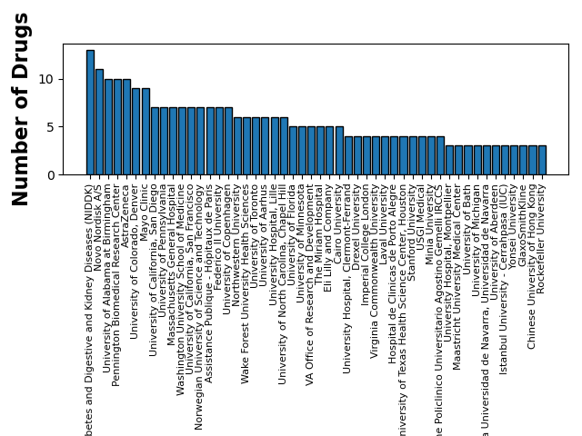

# Novo Nordisk
## November 19, 2024

### PubChem Search: ozempic (semaglutide)

| drug_name   | active_ingredient   |      cid |      sid | compound_synonyms                                                                                                                                                                                                                                                                                                                                                                                                                                                                                                                                                                                                                                                                | substance_synonyms                                                                                                                                                                                                                                                                                                                                                                                                                                                                                                                                                                                                            | description                                                                                                                                                                                                                                                                                                                                                                                                                              | pubmed_ids                                                                                               | link                                               |
|:------------|:--------------------|---------:|---------:|:---------------------------------------------------------------------------------------------------------------------------------------------------------------------------------------------------------------------------------------------------------------------------------------------------------------------------------------------------------------------------------------------------------------------------------------------------------------------------------------------------------------------------------------------------------------------------------------------------------------------------------------------------------------------------------|:------------------------------------------------------------------------------------------------------------------------------------------------------------------------------------------------------------------------------------------------------------------------------------------------------------------------------------------------------------------------------------------------------------------------------------------------------------------------------------------------------------------------------------------------------------------------------------------------------------------------------|:-----------------------------------------------------------------------------------------------------------------------------------------------------------------------------------------------------------------------------------------------------------------------------------------------------------------------------------------------------------------------------------------------------------------------------------------|:---------------------------------------------------------------------------------------------------------|:---------------------------------------------------|
| ozempic     | semaglutide         | 56843331 | 85366789 | ['910463-68-2', 'semaglutide', 'Rybelsus;Ozempic;NN9535;OG217SC;NNC 0113-0217', 'NNC0480 0389', 'EX-A2424', 'Semaglutide free base', 'UNII-53AXN4NNHX', 'NN1535 ICOSEMA COMPONENT SEMAGLUTIDE', '53AXN4NNHX', 'NNC 0113-0217', 'NN 9535', 'semaglutida', 'Wegovy', 'GTPL9724', 'Rybelsus (oral semaglutide)', 'ozempic', 'Ozempic', 'NN9535', 'Ozempic (injectable semaglutide)', 'semaglutidum', 'Semaglutide', 'SEMAGLUTIDE COMPONENT OF NN1535 ICOSEMA', 'Semaglutide(sodium salt)?', 'Rybelsus', 'AC-32580', 'NN1535 LAISEMA COMPONENT SEMAGLUTIDE', 'A10BJ06', 'NNC-0113-0217', 'DTXSID101027903', 'Semaglutide [USAN:INN]', 'NN-9535', 'Oral Semaglutide', 'CHEBI:167574'] | ['910463-68-2', 'semaglutide', 'Ozempic', 'NN9535', 'NN-9535', 'Rybelsus', 'NNC 0113-0217', 'Semaglutide', 'NN 9535', 'NNC-0113-0217', 'L-histidyl-2-methylalanyl-L-alpha-glutamylglycyl-L-threonyl-L-phenylalanyl-L-threonyl-L-seryl-L-alpha-aspartyl-L-valyl-L-seryl-L-seryl-L-tyrosyl-L-leucyl-L-alpha-glutamylglycyl-L-glutaminyl-L-alanyl-L-alanyl-N(6)-((N-(17-carboxyheptadecanoyl)-D-gamma-glutamyl)amino-10-oxo-3,6,12,15-tetraoxa-9-azaheptadecanan-1-oyl)-L-lysyl-L-alpha-glutamyl-L-phenylalanyl-L-isoleucyl-L-alanyl-L-tryptophyl-L-leucyl-L-valyl-L-arginylglycyl-L-arginylglycine', 'ozempic', 'CHEBI:167574'] | Semaglutide is a polypeptide that contains a linear sequence of 31 amino acids joined together by peptide linkages. It is an agonist of glucagon-like peptide-1 receptors (GLP-1 AR) and used for the treatment of type 2 diabetes. It has a role as a hypoglycemic agent, a glucagon-like peptide-1 receptor agonist, an anti-obesity agent, a neuroprotective agent and an appetite depressant. It is a polypeptide and a lipopeptide. | ['31185157', '5316', '38093506', '29049653', '38294187', '36075570', '38460497', '26308095', '38094694'] | https://pubchem.ncbi.nlm.nih.gov/compound/56843331 |
### Search Terms

#### Novo Nordisk
**FDA Approvals**

|   fda_year |   fda_year_approval_count | fda_drug_name   | fda_active_ingredient   | fda_approval_date   | fda_approved_use                   | fda_drug_link                                                                                    |   fda_press_release |   fda_drug_trials_snapshot | fda_2_drug_name   | fda_2_active_ingredient    | fda_2_dosage_form            | fda_2_drug_link                                                                                | fda_2_application_type   |   fda_2_application_num | fda_2_sponsor    | sponsor   |
|-----------:|--------------------------:|:----------------|:------------------------|:--------------------|:-----------------------------------|:-------------------------------------------------------------------------------------------------|--------------------:|---------------------------:|:------------------|:---------------------------|:-----------------------------|:-----------------------------------------------------------------------------------------------|:-------------------------|------------------------:|:-----------------|:----------|
|       2020 |                        38 | Sogroya         | somapacitan-beco        | 2020-08-28 00:00:00 | Growth hormoneDrug Trials Snapshot | http://www.accessdata.fda.gov/scripts/cder/daf/index.cfm?event=overview.process&varApplNo=761156 |                 nan |                        nan | SOGROYA           | SOGROYA (SOMAPACITAN-BECO) | ['SOLUTION', 'SUBCUTANEOUS'] | https://www.accessdata.fda.gov/scripts/cder/daf/index.cfm?event=overview.process&ApplNo=761156 | BLA                      |                  761156 | NOVO NORDISK INC | Novo      |> * No Approved Drugs Found

**Clinical Trial Sponsors**

| search_term   | NCT Number   | Study Title                                                                                                                                                                                       | Study URL                                    | Acronym    | Study Status       | Study Results   | Conditions                           | Interventions                                                                                                | Sponsor                                  | Collaborators                 | Phases   |   Enrollment | Funder Type   | Study Type     | Start Date   | Primary Completion Date   | Completion Date   | First Posted   | Results First Posted   | Last Update Posted   | Locations                                                                                                                                                                                                                                                                                                                                                                                                                                                                                                                                                                                                                                                                                                                                                                                                                                                                                                                                                                                                                                                                                                                                                                                                                                                                                                                                                                                                                                                                                                                                                                                                                                                                                                                                                                                                                                                                                                                                                                                                                                                                                                                                                                                                                                                                                                                                                                                                                                                                                                                                                                                                                                                                                                                                                                                                                                                                                                                                                                                                                                                                                                                                                                                                                                                                                                                                                                                                                                                                                                                                                                                                                                                                                                                                                                                                                                                                                                                                                                                                                                                                                                                                                                                                                                                                                                                                                                                                                                                                                                                                                                                                                                                                                                                                                                                                                                                                                                                                                                                                                                                                                                                                                                                                                                                                                                                                                                                                                                                                                                                                                                                                                                                                                                                                                                                                                                                                                                                                                                                                                                                                                                                                                                                                                                                                                                                                                                                                                                                                                                                                                                                                                                                                                                                                                                                                                                                                                                                                                                                                                                                                                                                                                                                                                                                                                                                                                                                                                                                                                                                                                                                                                                                                                                                                                                                                                                                                                                                                                                                                                                                                                                                                                                                                                                                                                                                                                                                                                                                                                                                                                                                                                                                                                                                                                                                                                                                                                                                                                                                                                                                                                                                                                                                                                                                                                                                                                                                                                                                                             | Study Documents   |
|:--------------|:-------------|:--------------------------------------------------------------------------------------------------------------------------------------------------------------------------------------------------|:---------------------------------------------|:-----------|:-------------------|:----------------|:-------------------------------------|:-------------------------------------------------------------------------------------------------------------|:-----------------------------------------|:------------------------------|:---------|-------------:|:--------------|:---------------|:-------------|:--------------------------|:------------------|:---------------|:-----------------------|:---------------------|:--------------------------------------------------------------------------------------------------------------------------------------------------------------------------------------------------------------------------------------------------------------------------------------------------------------------------------------------------------------------------------------------------------------------------------------------------------------------------------------------------------------------------------------------------------------------------------------------------------------------------------------------------------------------------------------------------------------------------------------------------------------------------------------------------------------------------------------------------------------------------------------------------------------------------------------------------------------------------------------------------------------------------------------------------------------------------------------------------------------------------------------------------------------------------------------------------------------------------------------------------------------------------------------------------------------------------------------------------------------------------------------------------------------------------------------------------------------------------------------------------------------------------------------------------------------------------------------------------------------------------------------------------------------------------------------------------------------------------------------------------------------------------------------------------------------------------------------------------------------------------------------------------------------------------------------------------------------------------------------------------------------------------------------------------------------------------------------------------------------------------------------------------------------------------------------------------------------------------------------------------------------------------------------------------------------------------------------------------------------------------------------------------------------------------------------------------------------------------------------------------------------------------------------------------------------------------------------------------------------------------------------------------------------------------------------------------------------------------------------------------------------------------------------------------------------------------------------------------------------------------------------------------------------------------------------------------------------------------------------------------------------------------------------------------------------------------------------------------------------------------------------------------------------------------------------------------------------------------------------------------------------------------------------------------------------------------------------------------------------------------------------------------------------------------------------------------------------------------------------------------------------------------------------------------------------------------------------------------------------------------------------------------------------------------------------------------------------------------------------------------------------------------------------------------------------------------------------------------------------------------------------------------------------------------------------------------------------------------------------------------------------------------------------------------------------------------------------------------------------------------------------------------------------------------------------------------------------------------------------------------------------------------------------------------------------------------------------------------------------------------------------------------------------------------------------------------------------------------------------------------------------------------------------------------------------------------------------------------------------------------------------------------------------------------------------------------------------------------------------------------------------------------------------------------------------------------------------------------------------------------------------------------------------------------------------------------------------------------------------------------------------------------------------------------------------------------------------------------------------------------------------------------------------------------------------------------------------------------------------------------------------------------------------------------------------------------------------------------------------------------------------------------------------------------------------------------------------------------------------------------------------------------------------------------------------------------------------------------------------------------------------------------------------------------------------------------------------------------------------------------------------------------------------------------------------------------------------------------------------------------------------------------------------------------------------------------------------------------------------------------------------------------------------------------------------------------------------------------------------------------------------------------------------------------------------------------------------------------------------------------------------------------------------------------------------------------------------------------------------------------------------------------------------------------------------------------------------------------------------------------------------------------------------------------------------------------------------------------------------------------------------------------------------------------------------------------------------------------------------------------------------------------------------------------------------------------------------------------------------------------------------------------------------------------------------------------------------------------------------------------------------------------------------------------------------------------------------------------------------------------------------------------------------------------------------------------------------------------------------------------------------------------------------------------------------------------------------------------------------------------------------------------------------------------------------------------------------------------------------------------------------------------------------------------------------------------------------------------------------------------------------------------------------------------------------------------------------------------------------------------------------------------------------------------------------------------------------------------------------------------------------------------------------------------------------------------------------------------------------------------------------------------------------------------------------------------------------------------------------------------------------------------------------------------------------------------------------------------------------------------------------------------------------------------------------------------------------------------------------------------------------------------------------------------------------------------------------------------------------------------------------------------------------------------------------------------------------------------------------------------------------------------------------------------------------------------------------------------------------------------------------------------------------------------------------------------------------------------------------------------------------------------------------------------------------------------------------------------------------------------------------------------------------------------------------------------------------------------------------------------------------------------------------------------------------------------------------------------------------------------------------------------------------------------------------------------------------------------------------------------------------------------------------------------------------------------------------------------------------|:------------------|
| Novo Nordisk  | NCT05689372  | Regulatory Post Marketing Surveillance (rPMS) Study of Ozempic (Semaglutide) to Evaluate Safety and Effectiveness in Patients With Type 2 Diabetes Mellitus in Routine Clinical Practice in Korea | https://clinicaltrials.gov/study/NCT05689372 |            | NOT_YET_RECRUITING | NO              | Diabetes Mellitus, Type 2            | DRUG: Semaglutide                                                                                            | Novo Nordisk A/S                         |                               |          |          600 | INDUSTRY      | OBSERVATIONAL  | 2025-03-31   | 2026-11-30                | 2026-11-30        | 2023-01-19     |                        | 2024-09-19           |                                                                                                                                                                                                                                                                                                                                                                                                                                                                                                                                                                                                                                                                                                                                                                                                                                                                                                                                                                                                                                                                                                                                                                                                                                                                                                                                                                                                                                                                                                                                                                                                                                                                                                                                                                                                                                                                                                                                                                                                                                                                                                                                                                                                                                                                                                                                                                                                                                                                                                                                                                                                                                                                                                                                                                                                                                                                                                                                                                                                                                                                                                                                                                                                                                                                                                                                                                                                                                                                                                                                                                                                                                                                                                                                                                                                                                                                                                                                                                                                                                                                                                                                                                                                                                                                                                                                                                                                                                                                                                                                                                                                                                                                                                                                                                                                                                                                                                                                                                                                                                                                                                                                                                                                                                                                                                                                                                                                                                                                                                                                                                                                                                                                                                                                                                                                                                                                                                                                                                                                                                                                                                                                                                                                                                                                                                                                                                                                                                                                                                                                                                                                                                                                                                                                                                                                                                                                                                                                                                                                                                                                                                                                                                                                                                                                                                                                                                                                                                                                                                                                                                                                                                                                                                                                                                                                                                                                                                                                                                                                                                                                                                                                                                                                                                                                                                                                                                                                                                                                                                                                                                                                                                                                                                                                                                                                                                                                                                                                                                                                                                                                                                                                                                                                                                                                                                                                                                                                                                                                                       |                   |
| Novo Nordisk  | NCT06612268  | A Research Study to Evaluate How Well Etavopivat Works in People With Sickle Cell Disease                                                                                                         | https://clinicaltrials.gov/study/NCT06612268 | Hibiscus 2 | NOT_YET_RECRUITING | NO              | Sickle Cell Disease                  | DRUG: Etavopivat|DRUG: Placebo                                                                               | Novo Nordisk A/S                         |                               | PHASE3   |          408 | INDUSTRY      | INTERVENTIONAL | 2024-12-16   | 2027-08-27                | 2028-09-22        | 2024-09-25     |                        | 2024-11-05           | Uni of Alabama at Birmingham, Birmingham, Alabama, 35233, United States|Univer South Alabama Ped/Onc, Mobile, Alabama, 36604, United States|Phoenix Children's Hsptl, Phoenix, Arizona, 85016, United States|Arkansas Children's Hospital, Little Rock, Arkansas, 72202, United States|Children's Hospital Los Angeles - Endocrinology, Los Angeles, California, 90027, United States|UCLA Health, Los Angeles, California, 90095, United States|Valley Children's Hospital, Madera, California, 93636, United States|University Of California Irvine, Orange, California, 92868, United States|Stanford Medicine, Redwood City, California, 94063, United States|Harbor-UCLA Medical Center, Torrance, California, 90502, United States|Clinical and Transl Res Center, Aurora, Colorado, 80045, United States|Nemours/AI duPont Hosp-Chld, Wilmington, Delaware, 19803, United States|Childrens National Medical Ctr, Washington, District of Columbia, 20010, United States|MedStar Hlth Res Institute, Washington, District of Columbia, 20010, United States|Memorial Healthcare, Hollywood, Florida, 33021, United States|Children's Healthcare Atlanta, Atlanta, Georgia, 30342, United States|Childrens Hospital of Chicago, Chicago, Illinois, 60611, United States|Univer Of Illinois at Chicago, Chicago, Illinois, 60612, United States|Children's Hosp-New Orleans, New Orleans, Louisiana, 70118, United States|Boston Children's Hospital, Boston, Massachusetts, 02115, United States|Boston Medical Center, Boston, Massachusetts, 02118, United States|University of Minnesota, Minneapolis, Minnesota, 55455, United States|Washington University-St.Louis, Saint Louis, Missouri, 63110, United States|Children's Nebraska, Omaha, Nebraska, 68114, United States|Cure 4 the Kids Foundation, Las Vegas, Nevada, 89135, United States|Newark Beth Israel Medical Center, Newark, New Jersey, 07112-2027, United States|Jacobi Medical Center, Bronx, New York, 10461, United States|Montefiore Medical Ctr, Bronx, New York, 10467, United States|NYC Health+Hospitals, Brooklyn, New York, 11203, United States|Interfaith Medical Center, Brooklyn, New York, 11238, United States|Northwell Health, Mount Kisco, New York, 10549, United States|Cohen Children's Medical Ctr, Queens, New York, 11040, United States|Duke University Medical Center, Durham, North Carolina, 27705, United States|Duke Comprehen Sickle Cell, Durham, North Carolina, 27710, United States|East Carolina University_Greenville_0, Greenville, North Carolina, 27834, United States|Atrium Health-Wake Forest Bapt, Winston-Salem, North Carolina, 27157, United States|Univ Hosp Cleveland Med Ctr, Cleveland, Ohio, 44106, United States|Ohio State Univ Wexner Med Ctr, Columbus, Ohio, 43210, United States|Univ of OK Health Sciences Ctr, Oklahoma City, Oklahoma, 73104, United States|Children's Hosptl Philadelphia, Philadelphia, Pennsylvania, 19104, United States|St Christopher Hosp for Child, Philadelphia, Pennsylvania, 19134, United States|Methodist University Hospital, Memphis, Tennessee, 38104, United States|St. Jude Children's Res Hosp, Memphis, Tennessee, 38105, United States|UT Health University of Texas, Houston, Texas, 77030, United States|Inova Health System, Fairfax, Virginia, 22031, United States|Children's Hsptl Of The Kings, Norfolk, Virginia, 23507, United States|Virginia Comm Univ Medical Ctr, Richmond, Virginia, 23298, United States|Mary Bridge Children's Health, Tacoma, Washington, 98405, United States|Royal Prince Alfred Hospital, Camperdown, New South Wales, 2050, Australia|Prince of Wales Hospital, Randwick, New South Wales, 2031, Australia|Monash Health, Clayton, Victoria, 3168, Australia|Fiona Stanley Hospital - Haemophilia and Haemostasis Centre, Murdoch, Western Australia, 6150, Australia|CHU Saint-Pierre - UMC Sint-Pieter, Bruxelles, 1000, Belgium|CHU - UVC Brugmann, Bruxelles, 1020, Belgium|HUB - Hôpital Erasme, Bruxelles, 1070, Belgium|UZ Antwerpen - UZA - Haematology, Edegem, 2650, Belgium|UZ Antwerpen - UZA - Kinderhemato-Oncologie, Edegem, 2650, Belgium|UZ Leuven - Kindergeneeskunde, Leuven, 3000, Belgium|MultiHemo - Grupo Oncoclínicas, Recife, Pernambuco, 52070-460, Brazil|HC da FMUSP Hospital das Clínicas São Paulo, São Paulo, SP, 05403-010, Brazil|Hemocentro UNICAMP, Distrito De Barão Geraldo - Campinas, São Paulo, 13083-878, Brazil|Fundação Hemocentro de Ribeirão Preto, Ribeirão Preto, São, 14051-140, Brazil|Hemorio-Fundarj, Rio de Janeiro, 20211-030, Brazil|Hospital Samaritano Higienópolis - Instituto de Conhecimento Ensino e Pesquisa (ICEP), São Paulo, 01232 -010, Brazil|Foothills Med Ctr-Univ Calgary, Calgary, Alberta, T2N 2T9, Canada|Stollery Children's Hospital, Edmonton, Alberta, T6G 2B7, Canada|University of Alberta_Edmonton, Edmonton, Alberta, T6G 2B7, Canada|BC Children's Hospital, Vancouver, British Columbia, V6H 3V4, Canada|LHSC - Victoria Hospital, London, Ontario, N6A5W9, Canada|University of Toronto, Toronto, Ontario, M5G1X8, Canada|CHUM-Hosp de Univ Montreal, Montreal, Quebec, H2X 0C1, Canada|Montreal Children's Hospital, Montreal, Quebec, H4A 3J1, Canada|Sociedad de Oncología y Hematología del Cesar SAS (SOHEC), Antioquia, 4006, Colombia|Clinica de la Costa, Barranquilla, 080020, Colombia|Centro de investigaciones clínicas, fudación valle del lili, Cali, 760032, Colombia|Hospital Pablo Tobon Uribe, Medellin, 050034, Colombia|Clínica IMAT Oncomedica Auna S.A.S., Monteria, 230002, Colombia|Ap-Hp-Hopital Avicenne, Bobigny, 93000, France|Centre Hospitalier Universitaire de Bordeaux-Hopital Pellegrin, Bordeaux, 33000, France|Ap-Hp-Hopital Henri Mondor, Créteil, 94000, France|Centre Hospitalier Universitaire Grenoble Alpes-Site Nord Michallon-1, Grenoble cedex 9, 38043, France|Hospices Civils de Lyon-Hopital Edouard Herriot, Lyon Cedex 03, 69437, France|Ap-Hp-Hopital Necker-1, Paris, 75015, France|Ap-Hp-Hopital Robert Debre, Paris, 75019, France|Centre Hospitalier Universitaire de Rouen-Hopital Charles Nicolle, Rouen cedex, 76031, France|"Laiko" General Hospital of Athens, Athens, 115 26, Greece|Childrens' Hospital of Athens "Agia Sofia", Athens, 115 27, Greece|Hippokration Hospital, Athens, 11527, Greece|University General Hospital Of Ioannina, Ioannina, 45500, Greece|"AHEPA" University General Hospital of Thessaloniki, Thessaloniki, 546 36, Greece|Gauhati Medical College and Hospital, Guwahati, Assam, 781032, India|All India Institute of Medical Sciences (AIIMS), Raipur, Raipur, Chhattisgarh, 492099, India|Zydus Medical College & Hospital, Dahod, Gujarat, 389151, India|Nirmal Hospital Pvt. Ltd., Surat, Gujarat, 395002, India|SSG Hospital, Baroda, Vadodara, Gujarat, 390006, India|HOCC Haemato Oncology Care Centre, Vadodara, Gujarat, 390020., India|JSS Hospital, Mysore, Mysuru, Karnataka, 570004, India|Government Medical College, Kozhikode, Kozhikode, Kerala, 673008, India|Arihant Multispeciality Hospital, Nagpur, Maharashtra, 440026, India|IMS and SUM Hospital, Bhubaneswar, Orissa, 751003, India|RNT Medical College, Udaipur, Rajasthan, 313001, India|NIZAM'S Institute of Medical Sciences, Hyderabad, Telangana, 500082, India|Post Graduate Institute of Child Health, Noida, Uttar Pradesh, 201303, India|All India Institute of Medical Sciences_New Dehli, New Delhi, 110029, India|Azienda Ospedaliera Universitaria San Luigi Gonzaga, Orbassano, Torino, 10043, Italy|ASST Civili di Brescia, Piazzale Spedali Civili 1, 25123 Brescia, Brescia, 25123, Italy|ARNAS Ospedale Garibaldi, Catania, 95123, Italy|A.O. Universitaria di Modena, Modena, 41100, Italy|Fondazione IRCCS San Gerardo dei Tintori, Monza, 20900, Italy|A.O.U. Università Studi della Campania "Luigi Vanvitelli", Naples, 80138, Italy|Azienda Ospedale Universita Padova, Padova, 35128, Italy|Azienda Ospedaliera Ospedali Riuniti Villa Sofia - Cervello, Palermo, 90146, Italy|Policlinico GB Rossi, Verona, 37134, Italy|Hospital Nini, Tripoli, 1434, Lebanon|Amsterdam UMC Lokatie VUMC, Amsterdam, 1081 HV, Netherlands|Haga Ziekenhuis, Den Haag, 2545AA, Netherlands|Erasmus MC, Rotterdam, 3015 GD, Netherlands|UMC Utrecht, Van Creveldkliniek, Utrecht, 3584 CX, Netherlands|King Abdulaziz Hospital-Al Ahsa-National Guard, Al Ahsa, 36428, Saudi Arabia|National Guard Hospital Dammam, Dhahran, 34232, Saudi Arabia|King Faisal Specialist Hospital & Research Centre, Riyadh, Riyadh, 12713, Saudi Arabia|Hospital Vall d'Hebron, Barcelona, 08035, Spain|Hospital Gregorio Marañón, Madrid, 28009, Spain|Hospital Universitario La Paz, Madrid, 28046, Spain|Hospital Universitario Virgen del Rocío, Sevilla, 41013, Spain|Acibadem Adana Hastanesi, Adana, 01130, Turkey|Baskent Universitesi Adana, Adana, 01250, Turkey|Cukurova University Medical Faculty, Adana, 01250, Turkey|Hacettepe University Hematology, Ankara, 06230, Turkey|Mersin University Medical Faculty Pediatric Hematology, Mersin, 33110, Turkey|VM Medical Park Mersin Hospital, Mersin, 33200, Turkey|Addenbrooke's Hospital, Cambridge, CB2 0QQ, United Kingdom|Whittington Hospital, London, N19 5NF, United Kingdom|Guy's Hospital, London, SE1 9RT, United Kingdom|Kings College Hospital, London, SE5 9RS, United Kingdom|Imperial College London, London, W12 0NN, United Kingdom |                   |
| Novo Nordisk  | NCT06609226  | A Research Study Looking at Long-term Treatment With Etavopivat in People With Sickle Cell Disease or Thalassaemia                                                                                | https://clinicaltrials.gov/study/NCT06609226 | FLORAL     | NOT_YET_RECRUITING | NO              | Sickle Cell Disease, Thalassemia     | DRUG: Etavopivat A|DRUG: Etavopivat B                                                                        | Novo Nordisk A/S                         |                               | PHASE3   |          325 | INDUSTRY      | INTERVENTIONAL | 2024-12-09   | 2029-11-30                | 2029-11-30        | 2024-09-24     |                        | 2024-10-09           | Univ of Alabama Birmingham, Birmingham, Alabama, 35233, United States|Phoenix Children's Hsptl, Phoenix, Arizona, 85016, United States|University Of California Irvine, Irvine, California, 92697, United States|Children's Hospital Los Angeles - Endocrinology, Los Angeles, California, 90027, United States|UCSF Oakland Benioff ChildHosp, Oakland, California, 94609, United States|Children's Hosp Of Orange, Orange, California, 92868, United States|University of Connecticut, Farmington, Connecticut, 06030, United States|Children's National Medical Center, Washington, District of Columbia, 20010, United States|Univ Miami-Miller School Med, Miami, Florida, 33136, United States|Emory University School of Medicine, Atlanta, Georgia, 30303, United States|Children's Healthcare Atlanta, Atlanta, Georgia, 30342, United States|Children's Hosp-New Orleans, New Orleans, Louisiana, 70118, United States|Boston Medical Center, Boston, Massachusetts, 02118, United States|Jacobi Medical Center, Bronx, New York, 10461, United States|Montefiore Medical Center, Bronx, New York, 10467, United States|NYC Health+Hospitals, Brooklyn, New York, 11203, United States|Columbia University Medical Center_New York_0, New York, New York, 10032, United States|Weill Cornell Med Coll-NYPH, New York, New York, 10065, United States|Duke University_Durham, Durham, North Carolina, 27705, United States|East Carolina University_Greenville, Greenville, North Carolina, 27834, United States|Atrium Health-Wake Forest Bapt, Winston-Salem, North Carolina, 27157, United States|Cincinnati Child's Hsp Med Ctr, Cincinnati, Ohio, 45229, United States|Neuro-Behavioral Clinical Research, North Canton, Ohio, 44720, United States|Medical University Of South Carolina_Charleston, Charleston, South Carolina, 29425, United States|East Carolina University_Greenville_0, Greenville, South Carolina, 27858, United States|UTHSC-Memphis, Memphis, Tennessee, 38104, United States|UT Health University of Texas, Houston, Texas, 77030, United States|Virginia Comm Univ Medical Ctr, Richmond, Virginia, 23298, United States|Mary Bridge Children's Health, Tacoma, Washington, 98405, United States|Providence Hematolgy, Vancouver, British Columbia, V6E 1M7, Canada|The Hospital for Sick Children, Toronto, Ontario, M5G 1X8, Canada|University Health Network - Toronto General Hospital, Toronto, Ontario, M5G 2C4, Canada|CHU Ste-Justine, Montreal, Quebec, H3T 1C5, Canada|Ap-Hp-Hopital Henri Mondor, Créteil, 94000, France|Hospices Civils de Lyon-Hopital Edouard Herriot, Lyon Cedex 03, 69437, France|Ap-Hp-Hopital Robert Debre, Paris, 75019, France|Charité Campus Virchow Klinikum - Klinik für Pädiatrie mit Schwerpunkt Onkologie und Hämatologie, Berlin, 13353, Germany|Universitätsklinikum Freiburg, Kinder- und Jugendklinik, Freiburg, 79106, Germany|General Hospital Of Larissa Koutlibaneio And Triantafylleio, Larissa, Thessaly, 412 21, Greece|Hippokration Hospital, Athens, 11527, Greece|General University Hospital of Patras, Patra, 26504, Greece|'Ippokrateio' General Hospital of Thessaloniki, Thessaloniki, 54642, Greece|Azienda Ospedaliera Universitaria San Luigi Gonzaga, Orbassano, Torino, 10043, Italy|Azienda Ospedale Universita Padova, Padova, 35128, Italy|Fondazione IRCCS Policlinico San Matteo, Pavia, 27100, Italy|American University of Beirut Medical Centre, Hamra, Lebanon|Chronic Care Center, Hazmieh, 21211, Lebanon|Hospital Nini, Tripoli, 1434, Lebanon|Sultan Qaboos University Hospital, Muscat, 123, Oman|Prince Mohammad Bin Naser Hospital, Jizan, 82943, Saudi Arabia|King Khalid University Hospital, Riyadh, 12372, Saudi Arabia|Hospital Universitario de Cruces, Baracaldo, 48903, Spain|Hospital Vall d'Hebron, Barcelona, 08035, Spain|Hospital Universitario La Paz, Madrid, 28046, Spain|Baskent Universitesi Adana, Adana, 01250, Turkey|Hacettepe University Hematology, Ankara, 06230, Turkey|Mersin University Medical Faculty Hospital, Hematology, Mersin, 33110, Turkey|Mersin University Medical Faculty Pediatric Hematology, Mersin, 33110, Turkey                                                                                                                                                                                                                                                                                                                                                                                                                                                                                                                                                                                                                                                                                                                                                                                                                                                                                                                                                                                                                                                                                                                                                                                                                                                                                                                                                                                                                                                                                                                                                                                                                                                                                                                                                                                                                                                                                                                                                                                                                                                                                                                                                                                                                                                                                                                                                                                                                                                                                                                                                                                                                                                                                                                                                                                                                                                                                                                                                                                                                                                                                                                                                                                                                                                                                                                                                                                                                                                                                                                                                                                                                                                                                                                                                                                                                                                                                                                                                                                                                                                                                                                                                                                                                                                                                                                                                                                                                                                                                                                                                                                                                                                                                                                                                                                                                                                                                                                                                                                                                                                                                                                                                                                                                                                                                               |                   |
| Novo Nordisk  | NCT06113341  | A Research Study in Italy to Understand How the Dose Check App Used With Xultophy® Works in the Treatment of People Living With Type 2 Diabetes                                                   | https://clinicaltrials.gov/study/NCT06113341 |            | WITHDRAWN          | NO              | Diabetes Mellitus, Type 2            | DRUG: IDegLira                                                                                               | Novo Nordisk A/S                         |                               |          |            0 | INDUSTRY      | OBSERVATIONAL  | 2024-11-07   | 2025-02-23                | 2026-03-02        | 2023-11-02     |                        | 2024-10-01           | Azienda Ospedaliero-Universitaria Renato Dulbecco, Catanzaro, Cz, 88100, Italy|Azienda Ospedaliero Universitario Policlinico "G. Martino", Gazi, ME, 98124, Italy|Azienda Ospedaliera Cannizzaro, Catania, Sicily, 95126, Italy|A.O. SS Antonio e Biagio e Cesare Arrigo, Alessandria, 15121, Italy|Azienda Ospedaliera Ospedale Policlinico Consorziale, Bari, 70120, Italy|Azienda Ospedaliero-Universitaria Renato Dulbecco, Catanzaro, 88100, Italy|Ospedale di Chivasso, Chivasso, 10034, Italy|Presidio Ospedale di Cittadella Azienda ULSS 6 Euganea, Cittadella, 35013, Italy|Ospedale Santa Croce, Fano, 61032, Italy|Presidio Ospedaliero Santa Barbara, Iglesias, 09016, Italy|IRCCS Ospedale Sacro Cuore Don Calabria, Negrar Di Valpolicella, 37024, Italy|Ospedale San Francesco d'Assisi, Oliveto Citra, 84020, Italy|ARNAS Ospedali Civico Di Cristina Benfratelli, Palermo, 90127, Italy|Azienda Ospedaliero Universitaria Pisana Ospedale Cisanello, Pisa, 56124, Italy|Nuovo Ospedale degli Infermi, Ponderano, 13875, Italy|DIABETOLOGIA Ravenna AUSL della Romagna, Ravenna, 48121, Italy|AUSL Reggio Emilia, Reggio Emilia, 42123, Italy|A.O.U. Policlinico Umberto I, Roma, 00161, Italy|Fondazione Univ. Policlinico A.Gemelli, Roma, 00168, Italy                                                                                                                                                                                                                                                                                                                                                                                                                                                                                                                                                                                                                                                                                                                                                                                                                                                                                                                                                                                                                                                                                                                                                                                                                                                                                                                                                                                                                                                                                                                                                                                                                                                                                                                                                                                                                                                                                                                                                                                                                                                                                                                                                                                                                                                                                                                                                                                                                                                                                                                                                                                                                                                                                                                                                                                                                                                                                                                                                                                                                                                                                                                                                                                                                                                                                                                                                                                                                                                                                                                                                                                                                                                                                                                                                                                                                                                                                                                                                                                                                                                                                                                                                                                                                                                                                                                                                                                                                                                                                                                                                                                                                                                                                                                                                                                                                                                                                                                                                                                                                                                                                                                                                                                                                                                                                                                                                                                                                                                                                                                                                                                                                                                                                                                                                                                                                                                                                                                                                                                                                                                                                                                                                                                                                                                                                                                                                                                                                                                                                                                                                                                                                                                                                                                                                                                                                                                                                                                                                                                                                                                                                                                                                                                                                                                                                                                                                                                                                                                                                                                                                                                                                                                                                                                                                                                                                                                                                                                                                                                                                                                                                                                                                                                                            |                   |
| Novo Nordisk  | NCT05829460  | Primary Prevention and Uterine Preservation in Premenopausal Women With Obesity and Endometrial Hyperplasia                                                                                       | https://clinicaltrials.gov/study/NCT05829460 |            | NOT_YET_RECRUITING | NO              | Endometrial Hyperplasia              | DRUG: Semaglutide|DRUG: Placebo|DRUG: LNG-IUD (Progestin)|BEHAVIORAL: Telemedicine behavioral weight program | Washington University School of Medicine | Novo Nordisk A/S              | PHASE2   |           96 | OTHER         | INTERVENTIONAL | 2024-10-31   | 2029-10-31                | 2031-10-31        | 2023-04-25     |                        | 2024-08-30           | Washington University School of Medicine, Saint Louis, Missouri, 63110, United States                                                                                                                                                                                                                                                                                                                                                                                                                                                                                                                                                                                                                                                                                                                                                                                                                                                                                                                                                                                                                                                                                                                                                                                                                                                                                                                                                                                                                                                                                                                                                                                                                                                                                                                                                                                                                                                                                                                                                                                                                                                                                                                                                                                                                                                                                                                                                                                                                                                                                                                                                                                                                                                                                                                                                                                                                                                                                                                                                                                                                                                                                                                                                                                                                                                                                                                                                                                                                                                                                                                                                                                                                                                                                                                                                                                                                                                                                                                                                                                                                                                                                                                                                                                                                                                                                                                                                                                                                                                                                                                                                                                                                                                                                                                                                                                                                                                                                                                                                                                                                                                                                                                                                                                                                                                                                                                                                                                                                                                                                                                                                                                                                                                                                                                                                                                                                                                                                                                                                                                                                                                                                                                                                                                                                                                                                                                                                                                                                                                                                                                                                                                                                                                                                                                                                                                                                                                                                                                                                                                                                                                                                                                                                                                                                                                                                                                                                                                                                                                                                                                                                                                                                                                                                                                                                                                                                                                                                                                                                                                                                                                                                                                                                                                                                                                                                                                                                                                                                                                                                                                                                                                                                                                                                                                                                                                                                                                                                                                                                                                                                                                                                                                                                                                                                                                                                                                                                                                                 |                   |
| Novo Nordisk  | NCT06185296  | The Intelligent Diabetes TelemonitoRing Using Decision Support to Treat Patients on Insulin Therapy                                                                                               | https://clinicaltrials.gov/study/NCT06185296 | DiaTRUST   | NOT_YET_RECRUITING | NO              | Type 2 Diabetes Treated With Insulin | DEVICE: Intelligent telemonitoring|DEVICE: Telemonitoring                                                    | Aalborg University Hospital              | Novo Nordisk A/S|DexCom, Inc. | NA       |           51 | OTHER         | INTERVENTIONAL | 2024-10      | 2025-06                   | 2025-06           | 2023-12-29     |                        | 2024-07-30           | Department of Endocrinology, Aalborg, North Jutland, 9000, Denmark                                                                                                                                                                                                                                                                                                                                                                                                                                                                                                                                                                                                                                                                                                                                                                                                                                                                                                                                                                                                                                                                                                                                                                                                                                                                                                                                                                                                                                                                                                                                                                                                                                                                                                                                                                                                                                                                                                                                                                                                                                                                                                                                                                                                                                                                                                                                                                                                                                                                                                                                                                                                                                                                                                                                                                                                                                                                                                                                                                                                                                                                                                                                                                                                                                                                                                                                                                                                                                                                                                                                                                                                                                                                                                                                                                                                                                                                                                                                                                                                                                                                                                                                                                                                                                                                                                                                                                                                                                                                                                                                                                                                                                                                                                                                                                                                                                                                                                                                                                                                                                                                                                                                                                                                                                                                                                                                                                                                                                                                                                                                                                                                                                                                                                                                                                                                                                                                                                                                                                                                                                                                                                                                                                                                                                                                                                                                                                                                                                                                                                                                                                                                                                                                                                                                                                                                                                                                                                                                                                                                                                                                                                                                                                                                                                                                                                                                                                                                                                                                                                                                                                                                                                                                                                                                                                                                                                                                                                                                                                                                                                                                                                                                                                                                                                                                                                                                                                                                                                                                                                                                                                                                                                                                                                                                                                                                                                                                                                                                                                                                                                                                                                                                                                                                                                                                                                                                                                                                                    |                   |
| Novo Nordisk  | NCT06507475  | Real World Effectiveness of Oral Semaglutide in Thailand Participants With Type 2 Diabetes                                                                                                        | https://clinicaltrials.gov/study/NCT06507475 | REALISED   | NOT_YET_RECRUITING | NO              | Diabetes Mellitus, Type 2            | DRUG: Semaglutide                                                                                            | Novo Nordisk A/S                         |                               |          |          209 | INDUSTRY      | OBSERVATIONAL  | 2024-09-30   | 2025-01-15                | 2025-01-15        | 2024-07-18     |                        | 2024-09-19           |                                                                                                                                                                                                                                                                                                                                                                                                                                                                                                                                                                                                                                                                                                                                                                                                                                                                                                                                                                                                                                                                                                                                                                                                                                                                                                                                                                                                                                                                                                                                                                                                                                                                                                                                                                                                                                                                                                                                                                                                                                                                                                                                                                                                                                                                                                                                                                                                                                                                                                                                                                                                                                                                                                                                                                                                                                                                                                                                                                                                                                                                                                                                                                                                                                                                                                                                                                                                                                                                                                                                                                                                                                                                                                                                                                                                                                                                                                                                                                                                                                                                                                                                                                                                                                                                                                                                                                                                                                                                                                                                                                                                                                                                                                                                                                                                                                                                                                                                                                                                                                                                                                                                                                                                                                                                                                                                                                                                                                                                                                                                                                                                                                                                                                                                                                                                                                                                                                                                                                                                                                                                                                                                                                                                                                                                                                                                                                                                                                                                                                                                                                                                                                                                                                                                                                                                                                                                                                                                                                                                                                                                                                                                                                                                                                                                                                                                                                                                                                                                                                                                                                                                                                                                                                                                                                                                                                                                                                                                                                                                                                                                                                                                                                                                                                                                                                                                                                                                                                                                                                                                                                                                                                                                                                                                                                                                                                                                                                                                                                                                                                                                                                                                                                                                                                                                                                                                                                                                                                                                                       |                   |
| Novo Nordisk  | NCT06649630  | A Study Looking at How Different Doses of Study Medicine (Inno8) Works in the Body of Healthy Men                                                                                                 | https://clinicaltrials.gov/study/NCT06649630 | VOYAGER1   | RECRUITING         | NO              | Haemophilia A                        | DRUG: NNC0442-0344 A|DRUG: Placebo                                                                           | Novo Nordisk A/S                         |                               | PHASE1   |           92 | INDUSTRY      | INTERVENTIONAL | 2024-09-23   | 2025-06-02                | 2025-09-04        | 2024-10-21     |                        | 2024-10-21           | Charité Research Organisation GmbH, Berlin, 10117, Germany|Charité Research Organisation GmbH, Berlin, 10117, Germany                                                                                                                                                                                                                                                                                                                                                                                                                                                                                                                                                                                                                                                                                                                                                                                                                                                                                                                                                                                                                                                                                                                                                                                                                                                                                                                                                                                                                                                                                                                                                                                                                                                                                                                                                                                                                                                                                                                                                                                                                                                                                                                                                                                                                                                                                                                                                                                                                                                                                                                                                                                                                                                                                                                                                                                                                                                                                                                                                                                                                                                                                                                                                                                                                                                                                                                                                                                                                                                                                                                                                                                                                                                                                                                                                                                                                                                                                                                                                                                                                                                                                                                                                                                                                                                                                                                                                                                                                                                                                                                                                                                                                                                                                                                                                                                                                                                                                                                                                                                                                                                                                                                                                                                                                                                                                                                                                                                                                                                                                                                                                                                                                                                                                                                                                                                                                                                                                                                                                                                                                                                                                                                                                                                                                                                                                                                                                                                                                                                                                                                                                                                                                                                                                                                                                                                                                                                                                                                                                                                                                                                                                                                                                                                                                                                                                                                                                                                                                                                                                                                                                                                                                                                                                                                                                                                                                                                                                                                                                                                                                                                                                                                                                                                                                                                                                                                                                                                                                                                                                                                                                                                                                                                                                                                                                                                                                                                                                                                                                                                                                                                                                                                                                                                                                                                                                                                                                                 |                   |
| Novo Nordisk  | NCT06380426  | Real-life Evaluation of WEGOVY (Semaglutide) Treatment in Adults With Monogenic Obesity (ObGeSema)                                                                                                | https://clinicaltrials.gov/study/NCT06380426 | ObGeSema   | RECRUITING         | NO              | Monogenic Obesity                    |                                                                                                              | Assistance Publique - Hôpitaux de Paris  |                               |          |          175 | OTHER         | OBSERVATIONAL  | 2024-09-19   | 2027-04-30                | 2027-11-30        | 2024-04-23     |                        | 2024-11-18           | Centre de référence Syndrome de Prader-Willi et autres obésités avec troubles du comportement alimentaire (PRADORT). Service de Nutrition, GH Pitié-Salpêtrière, APHP, Paris, 75013, France|CHU Pitié Salpêtrière - APHP, Paris, 75013, France                                                                                                                                                                                                                                                                                                                                                                                                                                                                                                                                                                                                                                                                                                                                                                                                                                                                                                                                                                                                                                                                                                                                                                                                                                                                                                                                                                                                                                                                                                                                                                                                                                                                                                                                                                                                                                                                                                                                                                                                                                                                                                                                                                                                                                                                                                                                                                                                                                                                                                                                                                                                                                                                                                                                                                                                                                                                                                                                                                                                                                                                                                                                                                                                                                                                                                                                                                                                                                                                                                                                                                                                                                                                                                                                                                                                                                                                                                                                                                                                                                                                                                                                                                                                                                                                                                                                                                                                                                                                                                                                                                                                                                                                                                                                                                                                                                                                                                                                                                                                                                                                                                                                                                                                                                                                                                                                                                                                                                                                                                                                                                                                                                                                                                                                                                                                                                                                                                                                                                                                                                                                                                                                                                                                                                                                                                                                                                                                                                                                                                                                                                                                                                                                                                                                                                                                                                                                                                                                                                                                                                                                                                                                                                                                                                                                                                                                                                                                                                                                                                                                                                                                                                                                                                                                                                                                                                                                                                                                                                                                                                                                                                                                                                                                                                                                                                                                                                                                                                                                                                                                                                                                                                                                                                                                                                                                                                                                                                                                                                                                                                                                                                                                                                                                                                        |                   |
| Novo Nordisk  | NCT06269120  | SEMA-CardioDiab HUNGARY: A Research Study to Understand the Effects of Oral Semaglutide on Blood Sugar Levels, Weight, and Cardiovascular Risk in People With Type 2 Diabetes Patients in Hungary | https://clinicaltrials.gov/study/NCT06269120 |            | NOT_YET_RECRUITING | NO              | Type 2 Diabetes                      | DRUG: Oral Semaglutide                                                                                       | Novo Nordisk A/S                         |                               |          |          470 | INDUSTRY      | OBSERVATIONAL  | 2024-09-11   | 2024-09-30                | 2025-09-30        | 2024-02-21     |                        | 2024-09-19           |                                                                                                                                                                                                                                                                                                                                                                                                                                                                                                                                                                                                                                                                                                                                                                                                                                                                                                                                                                                                                                                                                                                                                                                                                                                                                                                                                                                                                                                                                                                                                                                                                                                                                                                                                                                                                                                                                                                                                                                                                                                                                                                                                                                                                                                                                                                                                                                                                                                                                                                                                                                                                                                                                                                                                                                                                                                                                                                                                                                                                                                                                                                                                                                                                                                                                                                                                                                                                                                                                                                                                                                                                                                                                                                                                                                                                                                                                                                                                                                                                                                                                                                                                                                                                                                                                                                                                                                                                                                                                                                                                                                                                                                                                                                                                                                                                                                                                                                                                                                                                                                                                                                                                                                                                                                                                                                                                                                                                                                                                                                                                                                                                                                                                                                                                                                                                                                                                                                                                                                                                                                                                                                                                                                                                                                                                                                                                                                                                                                                                                                                                                                                                                                                                                                                                                                                                                                                                                                                                                                                                                                                                                                                                                                                                                                                                                                                                                                                                                                                                                                                                                                                                                                                                                                                                                                                                                                                                                                                                                                                                                                                                                                                                                                                                                                                                                                                                                                                                                                                                                                                                                                                                                                                                                                                                                                                                                                                                                                                                                                                                                                                                                                                                                                                                                                                                                                                                                                                                                                                                       |                   |

#### obesity
**FDA Approvals**

|   fda_year |   fda_year_approval_count | fda_drug_name   | fda_active_ingredient   | fda_approval_date   | fda_approved_use                                                                                                                                                                       | fda_drug_link                                                                                    |   fda_press_release | fda_drug_trials_snapshot                                 | fda_2_drug_name   | fda_2_active_ingredient          | fda_2_dosage_form            | fda_2_drug_link                                                                                | fda_2_application_type   |   fda_2_application_num | fda_2_sponsor   | sponsor   |
|-----------:|--------------------------:|:----------------|:------------------------|:--------------------|:---------------------------------------------------------------------------------------------------------------------------------------------------------------------------------------|:-------------------------------------------------------------------------------------------------|--------------------:|:---------------------------------------------------------|:------------------|:---------------------------------|:-----------------------------|:-----------------------------------------------------------------------------------------------|:-------------------------|------------------------:|:----------------|:----------|
|       2020 |                        45 | Imcivree        | setmelanotide           | 2020-11-25 00:00:00 | To treat obesity and the control of hunger associated with pro-opiomelanocortin deficiency, a rare disorder that causes severe obesity that begins at an early ageDrug Trials Snapshot | http://www.accessdata.fda.gov/scripts/cder/daf/index.cfm?event=overview.process&varApplNo=213793 |                 nan | https://www.fda.gov/drugs/drug-trials-snapshots-imcivree | IMCIVREE          | IMCIVREE (SETMELANOTIDE ACETATE) | ['SOLUTION', 'SUBCUTANEOUS'] | https://www.accessdata.fda.gov/scripts/cder/daf/index.cfm?event=overview.process&ApplNo=213793 | NDA                      |                  213793 | RHYTHM          | Rhythm    |> * No Approved Drugs Found

**Clinical Trial Sponsors**

| search_term   | NCT Number   | Study Title                                                                                                                                                                                      | Study URL                                    | Acronym      | Study Status       | Study Results   | Conditions                                                                             | Interventions                                                                                                                                                                                                                                                                                                                                                                                                                                                     | Sponsor                                   | Collaborators                                                                                                                                                                                                                                                                                                                                                                                                                                                                                                                                                                                         | Phases        |   Enrollment | Funder Type   | Study Type     | Start Date   | Primary Completion Date   | Completion Date   | First Posted   | Results First Posted   | Last Update Posted   | Locations                                                                                                                                                                                                                                                                                                                                                                                                                                                                                                                               | Study Documents   |
|:--------------|:-------------|:-------------------------------------------------------------------------------------------------------------------------------------------------------------------------------------------------|:---------------------------------------------|:-------------|:-------------------|:----------------|:---------------------------------------------------------------------------------------|:------------------------------------------------------------------------------------------------------------------------------------------------------------------------------------------------------------------------------------------------------------------------------------------------------------------------------------------------------------------------------------------------------------------------------------------------------------------|:------------------------------------------|:------------------------------------------------------------------------------------------------------------------------------------------------------------------------------------------------------------------------------------------------------------------------------------------------------------------------------------------------------------------------------------------------------------------------------------------------------------------------------------------------------------------------------------------------------------------------------------------------------|:--------------|-------------:|:--------------|:---------------|:-------------|:--------------------------|:------------------|:---------------|:-----------------------|:---------------------|:----------------------------------------------------------------------------------------------------------------------------------------------------------------------------------------------------------------------------------------------------------------------------------------------------------------------------------------------------------------------------------------------------------------------------------------------------------------------------------------------------------------------------------------|:------------------|
| obesity       | NCT06646120  | Machine Learning and 3D Image-Based Modeling for Real-Time Body Weight and Body Composition Estimation During Emergency Medical Care. Study 1                                                    | https://clinicaltrials.gov/study/NCT06646120 |              | NOT_YET_RECRUITING | NO              | Body Weights and Measures|Body Weight in the Overweight and Obese Class - I Population |                                                                                                                                                                                                                                                                                                                                                                                                                                                                   | Florida Atlantic University               |                                                                                                                                                                                                                                                                                                                                                                                                                                                                                                                                                                                                       |               |          800 | OTHER         | OBSERVATIONAL  | 2025-07-01   | 2026-06-30                | 2026-06-30        | 2024-10-17     |                        | 2024-10-17           |                                                                                                                                                                                                                                                                                                                                                                                                                                                                                                                                         |                   |
| obesity       | NCT05885074  | Mechanistic Insights to Weight Loss Maintenance Through SGLT2 Inhibitors                                                                                                                         | https://clinicaltrials.gov/study/NCT05885074 |              | WITHDRAWN          | NO              | Obesity|Weight Loss                                                                    | DRUG: Empagliflozin Arm|OTHER: Control Arm|OTHER: Exercise capacity VO2 maximum determination|OTHER: Exercise Challenge                                                                                                                                                                                                                                                                                                                                           | University of Alabama at Birmingham       |                                                                                                                                                                                                                                                                                                                                                                                                                                                                                                                                                                                                       | PHASE2        |            0 | OTHER         | INTERVENTIONAL | 2025-01-30   | 2026-01-30                | 2027-06-30        | 2023-06-01     |                        | 2024-08-07           | University of Alabama at Birmingham, Birmingham, Alabama, 35294, United States                                                                                                                                                                                                                                                                                                                                                                                                                                                          |                   |
| obesity       | NCT06553482  | FatMax Training on Metabolic and Epigenetic Parameters                                                                                                                                           | https://clinicaltrials.gov/study/NCT06553482 |              | NOT_YET_RECRUITING | NO              | Overweight and Obesity|Body Weight Changes                                             | OTHER: FatMAx training intervention|OTHER: FatMax and physical endurance exercise intervention|OTHER: Control                                                                                                                                                                                                                                                                                                                                                     | Universidad Autonoma de Baja California   |                                                                                                                                                                                                                                                                                                                                                                                                                                                                                                                                                                                                       | NA            |          156 | OTHER         | INTERVENTIONAL | 2025-01-01   | 2026-08-01                | 2027-01-01        | 2024-08-14     |                        | 2024-08-15           | Medical and Psychology School, Tijuana, California, 22390, Mexico                                                                                                                                                                                                                                                                                                                                                                                                                                                                       |                   |
| obesity       | NCT02586831  | Diabetes Islet Preservation Immune Treatment                                                                                                                                                     | https://clinicaltrials.gov/study/NCT02586831 | DIPIT        | WITHDRAWN          | NO              | Diabetes Mellitus, Type 1|Hypoglycemia|Autoimmune Diseases|Diabetes Mellitus           | DRUG: Anti-Thymocyte Globulin (ATG)|DRUG: Interleukin 2|DRUG: Exenatide|DRUG: Adalimumab|OTHER: ATG Placebo|OTHER: IL-2 Placebo|OTHER: Adalimumab Placebo|OTHER: Exenatide Placebo                                                                                                                                                                                                                                                                                | Camillo Ricordi and Jay Skyler            | Diabetes Research Institute Foundation                                                                                                                                                                                                                                                                                                                                                                                                                                                                                                                                                                | PHASE1|PHASE2 |            0 | OTHER         | INTERVENTIONAL | 2025-01      | 2028-12                   | 2029-12           | 2015-10-26     |                        | 2024-06-06           | Diabetes Research Institute, University of Miami Miller School of Medicine, Miami, Florida, 33136, United States                                                                                                                                                                                                                                                                                                                                                                                                                        |                   |
| obesity       | NCT06662539  | Once-weekly Petrelintide Versus Placebo for Obesity or Overweight With Co-morbidities                                                                                                            | https://clinicaltrials.gov/study/NCT06662539 | ZUPREME      | NOT_YET_RECRUITING | NO              | Obesity                                                                                | DRUG: Petrelintide|DRUG: Placebo                                                                                                                                                                                                                                                                                                                                                                                                                                  | Zealand Pharma                            | Parexel                                                                                                                                                                                                                                                                                                                                                                                                                                                                                                                                                                                               | PHASE2        |          480 | INDUSTRY      | INTERVENTIONAL | 2024-12-06   | 2025-11-07                | 2026-04-17        | 2024-10-29     |                        | 2024-11-01           |                                                                                                                                                                                                                                                                                                                                                                                                                                                                                                                                         |                   |
| obesity       | NCT06687122  | Egg Intake, Metabolic Outcomes and Choline Levels                                                                                                                                                | https://clinicaltrials.gov/study/NCT06687122 |              | NOT_YET_RECRUITING | NO              | Obesity and Obesity-related Medical Conditions                                         | DIETARY_SUPPLEMENT: 3 whole eggs                                                                                                                                                                                                                                                                                                                                                                                                                                  | University of Guelph                      | Research Center of the Institut universitaire de cardiologie et de pneumologie de Québec - ULaval                                                                                                                                                                                                                                                                                                                                                                                                                                                                                                     | NA            |           20 | OTHER         | INTERVENTIONAL | 2024-12      | 2025-12                   | 2025-12           | 2024-11-13     |                        | 2024-11-15           | Research Center of the Institut universitaire de cardiologie et de pneumologie de Québec - ULaval, Quebec City, Quebec, G1V 4G5, Canada                                                                                                                                                                                                                                                                                                                                                                                                 |                   |
| obesity       | NCT06660173  | A Study of Maridebart Cafraglutide in Adult Participants With Type 2 Diabetes Mellitus (T2DM)                                                                                                    | https://clinicaltrials.gov/study/NCT06660173 |              | NOT_YET_RECRUITING | NO              | Type 2 Diabetes Mellitus (T2DM)                                                        | DRUG: Maridebart Cafraglutide|DRUG: Placebo                                                                                                                                                                                                                                                                                                                                                                                                                       | Amgen                                     |                                                                                                                                                                                                                                                                                                                                                                                                                                                                                                                                                                                                       | PHASE2        |          350 | INDUSTRY      | INTERVENTIONAL | 2024-11-21   | 2025-11-05                | 2026-07-22        | 2024-10-28     |                        | 2024-10-28           |                                                                                                                                                                                                                                                                                                                                                                                                                                                                                                                                         |                   |
| obesity       | NCT06683222  | Mediating Role of Myokines in the Dialogue Between Muscle and Bone Tissue in a Population of Healthy Women Aged 20-89 Years                                                                      | https://clinicaltrials.gov/study/NCT06683222 | MyOs         | NOT_YET_RECRUITING | NO              | Bone Density                                                                           | DIAGNOSTIC_TEST: Blood sample|DIAGNOSTIC_TEST: Saliva sample|DIAGNOSTIC_TEST: Grip test|OTHER: MicroFET2® maximum isometric force test|OTHER: Maximum isometric knee extension bench test.|OTHER: The SPPB (Short Physical Performance Battery)|OTHER: The 6-minute walking test.|OTHER: Segmental impedancemetry examination.|OTHER: Indirect calorimetry test.|OTHER: Fardellone's questionnaire|OTHER: ONAPS questionnaire|OTHER: Dietary intake.questionnaire | Centre Hospitalier Universitaire de Nīmes |                                                                                                                                                                                                                                                                                                                                                                                                                                                                                                                                                                                                       | NA            |          280 | OTHER         | INTERVENTIONAL | 2024-11-15   | 2029-09-01                | 2029-09-30        | 2024-11-12     |                        | 2024-11-12           |                                                                                                                                                                                                                                                                                                                                                                                                                                                                                                                                         |                   |
| obesity       | NCT06648031  | Comparison of the Safety, Efficacy and Pharmacokinetics of DehydraTECH -CBD and DehydraTECH-GLP1 Agonists Alone or in Combination, in Overweight or Obese, Pre- and Type 2 Diabetic Participants | https://clinicaltrials.gov/study/NCT06648031 | DehydraTECH  | NOT_YET_RECRUITING | NO              | Type2diabetes                                                                          | DRUG: Arm 1 - DehydraTECH-CBD alone|DRUG: Arm 2 - DehydraTECH-semaglutide alone|DRUG: Arm 3 - DehydraTECH-CBD in combination with DehydraTECH-semaglutide|DRUG: Arm 4 - Rybelsus medication (semaglutide) alone                                                                                                                                                                                                                                                   | Lexaria Bioscience Corp.                  |                                                                                                                                                                                                                                                                                                                                                                                                                                                                                                                                                                                                       | PHASE1        |           80 | INDUSTRY      | INTERVENTIONAL | 2024-11-15   | 2025-05-30                | 2025-09-30        | 2024-10-18     |                        | 2024-10-18           | Paratus Clinical Pty Ltd, Blacktown Trial Clinic, Blacktown, New South Wales, 2148, Australia|Emeritus - Sydney, Botany, New South Wales, 2019, Australia|Sutherland Shire Clinical Research (SSCR), Miranda, New South Wales, 2228, Australia|Wollongong Clinical Research (WOCR), Wollongong, New South Wales, 2500, Australia|Paratus Clinical Brisbane Pty Ltd, Herston, Queensland, 4006, Australia|CMAX Clinical Research, Adelaide, South Australia, 5000, Australia|Emeritus - Melbourne, Camberwell, Victoria, 3124, Australia |                   |
| obesity       | NCT06680674  | Multinational Point Prevalence Study on the Management of Diabesity in Hospitals                                                                                                                 | https://clinicaltrials.gov/study/NCT06680674 | DiabesityDay | NOT_YET_RECRUITING | NO              | Diabetes Mellitus|Obesity                                                              | OTHER: Routine care for people with diabetes, with or without obesity, in the hospital setting                                                                                                                                                                                                                                                                                                                                                                    | Medical University of Vienna              | Hospital de Cascais Dr. José de Almeida (Portugal)|Centre Hospitalier Universitaire Sétif, Service Médecine Interne (Algeria)|Rabin Medical Center|Hospital Regional de Malaga|Charles University, Czech Republic|University Hospital Bratislava|Complejo Hospitalario de Especialidades Juan Ramón Jimenez|Medical University Innsbruck|Aristotle University Of Thessaloniki|Rostov State Medical University|Hospital Marina Baixa|Riga East Clinical University Hospital|University Hospital, Aachen|San Raffaele University Hospital, Italy|Kanuni Sultan Suleyman Training and Research Hospital |               |          400 | OTHER         | OBSERVATIONAL  | 2024-11-13   | 2024-11-15                | 2025-01-01        | 2024-11-08     |                        | 2024-11-08           |                                                                                                                                                                                                                                                                                                                                                                                                                                                                                                                                         |                   |

