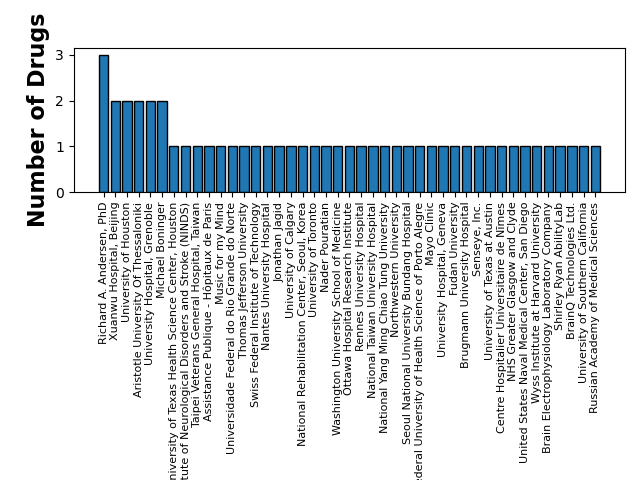
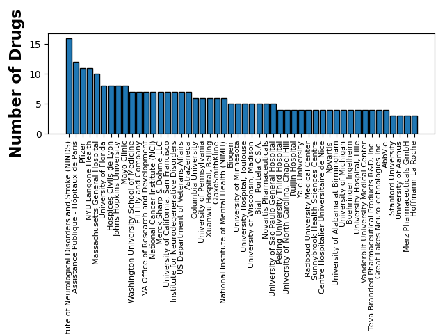
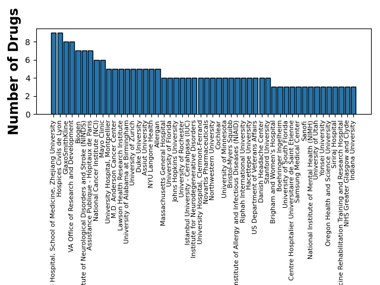

# Synchron
## November 19, 2024

### PubChem Search: stentrode (stentrode)

| drug_name   | active_ingredient   | cid   | sid   | compound_synonyms   | substance_synonyms   | description   | pubmed_ids   | link                                           |
|:------------|:--------------------|:------|:------|:--------------------|:---------------------|:--------------|:-------------|:-----------------------------------------------|
| stentrode   | stentrode           |       |       | ['stentrode']       | ['stentrode']        |               |              | https://pubchem.ncbi.nlm.nih.gov/compound/None |
### Search Terms
#### Synchron
**FDA Approvals**

> * No Approved Drugs Found

**Clinical Trial Sponsors**

| search_term   | NCT Number   | Study Title                                                                                                                                                  | Study URL                                    | Acronym   | Study Status          | Study Results   | Conditions                                                                                                                                                                                                                                                   | Interventions                                                                                                                                                                                                                                                                                                                         | Sponsor                                             | Collaborators                                                                                                                                             | Phases   |   Enrollment | Funder Type   | Study Type     | Start Date   | Primary Completion Date   | Completion Date   | First Posted   | Results First Posted   | Last Update Posted   | Locations                                                                                                                                                                                                                                      | Study Documents                                                                                                                                                                                                     |
|:--------------|:-------------|:-------------------------------------------------------------------------------------------------------------------------------------------------------------|:---------------------------------------------|:----------|:----------------------|:----------------|:-------------------------------------------------------------------------------------------------------------------------------------------------------------------------------------------------------------------------------------------------------------|:--------------------------------------------------------------------------------------------------------------------------------------------------------------------------------------------------------------------------------------------------------------------------------------------------------------------------------------|:----------------------------------------------------|:----------------------------------------------------------------------------------------------------------------------------------------------------------|:---------|-------------:|:--------------|:---------------|:-------------|:--------------------------|:------------------|:---------------|:-----------------------|:---------------------|:-----------------------------------------------------------------------------------------------------------------------------------------------------------------------------------------------------------------------------------------------|:--------------------------------------------------------------------------------------------------------------------------------------------------------------------------------------------------------------------|
| Synchron      | NCT05485402  | Dietary Strategy to Tackle Sarcopenia in Early Elderly Subjects (FOOP-Sarc)                                                                                  | https://clinicaltrials.gov/study/NCT05485402 | FOOP-Sarc | RECRUITING            | NO              | Sarcopenia                                                                                                                                                                                                                                                   | DIETARY_SUPPLEMENT: Refined olive oil (38.6 mg hydroxytyrosol and tyrosol/kg oil)|DIETARY_SUPPLEMENT: Virgin olive oil rich in phenolic compounds (156 mg hydroxytyrosol and tyrosol/kg oil)|DIETARY_SUPPLEMENT: Maltodextrin|DIETARY_SUPPLEMENT: Prebiotic (FOS and inulin)|OTHER: Nutritional and physical activity recommendations | University Rovira i Virgili                         |                                                                                                                                                           | NA       |          135 | OTHER         | INTERVENTIONAL | 2022-09-01   | 2023-12                   | 2024-05           | 2022-08-03     |                        | 2023-05-19           | Universitat Rovira i Virgili, Reus, Tarragona, 43201, Spain                                                                                                                                                                                    |                                                                                                                                                                                                                     |
| Synchron      | NCT05035823  | COMMAND Early Feasibility Study: Implantable BCI to Control a Digital Device for People With Paralysis                                                       | https://clinicaltrials.gov/study/NCT05035823 |           | ACTIVE_NOT_RECRUITING | NO              | Neurologic Disorder|Paralysis|Paralysis; Stroke|Amyotrophic Lateral Sclerosis|Muscular Dystrophies|Spinal Cord Injuries|Stroke, Lacunar|Stroke Brainstem|Cervical Spinal Cord Injury|Spinal Muscular Atrophy|Tetraplegic; Paralysis|Quadriplegia/Tetraplegia | DEVICE: Motor Neuroprosthesis (MNP)                                                                                                                                                                                                                                                                                                   | Synchron Medical, Inc.                              |                                                                                                                                                           | NA       |            6 | INDUSTRY      | INTERVENTIONAL | 2022-04-27   | 2024-08                   | 2024-08           | 2021-09-05     |                        | 2024-04-23           | University at Buffalo Neurosurgery (UBNS), Buffalo, New York, 14203, United States|Mount Sinai Health System, New York, New York, 10029, United States|University of Pittsburgh Medical Center, Pittsburgh, Pennsylvania, 15213, United States |                                                                                                                                                                                                                     |
| Synchron      | NCT05041114  | SWITCH II Early Feasibility Study: Implantable BCI to Control a Digital Device for People With Paralysis                                                     | https://clinicaltrials.gov/study/NCT05041114 |           | WITHDRAWN             | NO              | Neurologic Disorder|Paralysis|Paralysis; Stroke|Amyotrophic Lateral Sclerosis|Muscular Dystrophies|Spinal Cord Injury|Stroke, Lacunar|Stroke, Brainstem|Upper Limb Injury|Spinal Muscular Atrophy                                                            | DEVICE: Motor Neuroprosthesis                                                                                                                                                                                                                                                                                                         | Synchron Medical, Inc.                              |                                                                                                                                                           | NA       |            0 | INDUSTRY      | INTERVENTIONAL | 2022-04-21   | 2022-11-30                | 2022-11-30        | 2021-09-10     |                        | 2023-03-21           | Sydney Local Health District, Sydney, New South Wales, Australia|Metro North Health, Brisbane, Queensland, Australia|Melbourne Health, Melbourne, Victoria, 3050, Australia                                                                    |                                                                                                                                                                                                                     |
| Synchron      | NCT05423184  | The Effectıveness Of Structured Myofascial Chain Exercise Training After Anterior Cruciate Ligament Reconstruction                                           | https://clinicaltrials.gov/study/NCT05423184 |           | COMPLETED             | NO              | Anterior Cruciate Ligament Injuries|Anterior Cruciate Ligament Rupture|Anterior Cruciate Ligament Tear                                                                                                                                                       | OTHER: Exercise Therapy For Lower Extremities|OTHER: Exercise Therapy For Myofascial Chains                                                                                                                                                                                                                                           | Bahçeşehir University                               | Istanbul University - Cerrahpasa (IUC)                                                                                                                    | NA       |           52 | OTHER         | INTERVENTIONAL | 2022-01-01   | 2023-06-30                | 2023-08-15        | 2022-06-21     |                        | 2023-09-25           | Istanbul University-Cerrahpasa, Istanbul, Turkey                                                                                                                                                                                               |                                                                                                                                                                                                                     |
| Synchron      | NCT05630456  | The Effect of Health Provider's Feedback on Physical Activity Surveillance Using Wearable Device-Smartphone Application for Resolution of Metabolic Syndrome | https://clinicaltrials.gov/study/NCT05630456 |           | COMPLETED             | NO              | Metabolic Syndrome|Physical Activity                                                                                                                                                                                                                         | OTHER: Receving feedback|OTHER: No regular feedback                                                                                                                                                                                                                                                                                   | Pusan National University Hospital                  |                                                                                                                                                           | NA       |           67 | OTHER         | INTERVENTIONAL | 2020-08-01   | 2021-01-31                | 2021-01-31        | 2022-11-29     |                        | 2022-11-29           | Pusan National University Hospital, Busan, Seo-gu, 49241, Korea, Republic of                                                                                                                                                                   |                                                                                                                                                                                                                     |
| Synchron      | NCT04723823  | Sensorimotor Imaging for Brain-Computer Interfaces                                                                                                           | https://clinicaltrials.gov/study/NCT04723823 |           | COMPLETED             | YES             | Functional Neuroimaging                                                                                                                                                                                                                                      | OTHER: Motor or sensory imagery with fMRI                                                                                                                                                                                                                                                                                             | University of Pittsburgh                            | University of Pittsburgh Medical Center|Carnegie Mellon University|Synchron Medical, Inc.|National Institute of Neurological Disorders and Stroke (NINDS) | NA       |            8 | OTHER         | INTERVENTIONAL | 2019-08-08   | 2024-05-21                | 2024-05-21        | 2021-01-26     | 2024-08-30             | 2024-08-30           | University of Pittsburgh, Pittsburgh, Pennsylvania, 15213, United States                                                                                                                                                                       | Study Protocol and Statistical Analysis Plan, https://cdn.clinicaltrials.gov/large-docs/23/NCT04723823/Prot_SAP_000.pdf|Informed Consent Form, https://cdn.clinicaltrials.gov/large-docs/23/NCT04723823/ICF_001.pdf |
| Synchron      | NCT03834857  | SWITCH: Stentrode First-in-Human Study of Implantable BCI for Control of a Digital Device                                                                    | https://clinicaltrials.gov/study/NCT03834857 |           | COMPLETED             | NO              | Neurologic Disorder                                                                                                                                                                                                                                          | DEVICE: Stentrode                                                                                                                                                                                                                                                                                                                     | Synchron Australia Pty Ltd.                         |                                                                                                                                                           | NA       |            5 | INDUSTRY      | INTERVENTIONAL | 2019-05-27   | 2021-12-10                | 2022-01-09        | 2019-02-08     |                        | 2022-09-01           | Royal Melbourne Hospital, Melbourne, Victoria, 3050, Australia                                                                                                                                                                                 |                                                                                                                                                                                                                     |
| Synchron      | NCT03795324  | Red-fleshed Apple as a Novel Anthocyanin-biofortified Food to Improve Cardiometabolic Risk Factors.                                                          | https://clinicaltrials.gov/study/NCT03795324 | AppleCor  | UNKNOWN               | NO              | High LDL-cholesterol Levels                                                                                                                                                                                                                                  | OTHER: Redlove Apple intervention|OTHER: Green Apple intervention|OTHER: Aronia drink intervention                                                                                                                                                                                                                                    | University Rovira i Virgili                         | Universitat de Lleida|Ministerio de Ciencia e Innovación, Spain                                                                                           | PHASE2   |          120 | OTHER         | INTERVENTIONAL | 2019-01      | 2019-12                   | 2020-02           | 2019-01-07     |                        | 2019-01-07           | University Rovira i Virgili, Reus, Tarragona, Spain                                                                                                                                                                                            |                                                                                                                                                                                                                     |
| Synchron      | NCT03630588  | Effect of the Consumption of an Enriched Surimi in Abdominal Visceral Adiposity                                                                              | https://clinicaltrials.gov/study/NCT03630588 |           | COMPLETED             | NO              | Obesity, Abdominal                                                                                                                                                                                                                                           | COMBINATION_PRODUCT: Surimi intervention|COMBINATION_PRODUCT: Placebo                                                                                                                                                                                                                                                                 | Technological Centre of Nutrition and Health, Spain |                                                                                                                                                           | PHASE2   |          120 | OTHER         | INTERVENTIONAL | 2018-08-02   | 2018-12-23                | 2018-12-23        | 2018-08-15     |                        | 2022-03-02           | Centro Tecnológico de Nutrición y Salud (Eurecat-Reus), Reus, Tarragona, Spain                                                                                                                                                                 |                                                                                                                                                                                                                     |
| Synchron      | NCT02909309  | Pilot Study : New Sensors to Monitor Apnea During Sedation                                                                                                   | https://clinicaltrials.gov/study/NCT02909309 | JAWAC     | COMPLETED             | NO              | Sleep Apnea, Obstructive|Anesthesia                                                                                                                                                                                                                          | DEVICE: JAWAC system + Capnoline + Spo2                                                                                                                                                                                                                                                                                               | Erasme University Hospital                          |                                                                                                                                                           | NA       |           21 | OTHER         | INTERVENTIONAL | 2017-03-01   | 2017-07-31                | 2017-07-31        | 2016-09-21     |                        | 2018-08-23           | Erasme Hospital, Brussels, 1070, Belgium                                                                                                                                                                                                       |                                                                                                                                                                                                                     |

#### brain-machine interface
**FDA Approvals**

> * No Approved Drugs Found

**Clinical Trial Sponsors**

| search_term             | NCT Number   | Study Title                                                                                                              | Study URL                                    | Acronym     | Study Status       | Study Results   | Conditions                                                                                  | Interventions                                                                                                               | Sponsor                                              | Collaborators                                                                | Phases       |   Enrollment | Funder Type   | Study Type     | Start Date   | Primary Completion Date   | Completion Date   | First Posted   | Results First Posted   | Last Update Posted   | Locations                                                                                                                                                                                                                                       | Study Documents   |
|:------------------------|:-------------|:-------------------------------------------------------------------------------------------------------------------------|:---------------------------------------------|:------------|:-------------------|:----------------|:--------------------------------------------------------------------------------------------|:----------------------------------------------------------------------------------------------------------------------------|:-----------------------------------------------------|:-----------------------------------------------------------------------------|:-------------|-------------:|:--------------|:---------------|:-------------|:--------------------------|:------------------|:---------------|:-----------------------|:---------------------|:------------------------------------------------------------------------------------------------------------------------------------------------------------------------------------------------------------------------------------------------|:------------------|
| brain-machine interface | NCT05936619  | MindEx: a Novel, Multifocal, Cognitive Brain-Machine Interface System                                                    | https://clinicaltrials.gov/study/NCT05936619 |             | NOT_YET_RECRUITING | NO              | Paralysis; Quadriplegic                                                                     | DEVICE: Mind Extender (MindEx)                                                                                              | Nader Pouratian                                      |                                                                              | NA           |            2 | OTHER         | INTERVENTIONAL | 2025-06-01   | 2026-05-30                | 2031-09-01        | 2023-07-10     |                        | 2024-10-28           | UT Southwestern Medical Center, Dallas, Texas, 75390, United States                                                                                                                                                                             |                   |
| brain-machine interface | NCT05465486  | NeuroSuitUp: Neurorehabilitation Through Synergistic Man-machine Interfaces                                              | https://clinicaltrials.gov/study/NCT05465486 | NeuroSuitUp | NOT_YET_RECRUITING | NO              | Spinal Cord Injuries                                                                        | DEVICE: Brain-Computer Interface control of robotic arms with augmented reality|DEVICE: Serious game with augmented reality | Aristotle University Of Thessaloniki                 |                                                                              | NA           |           20 | OTHER         | INTERVENTIONAL | 2025-02-01   | 2025-12-31                | 2025-12-31        | 2022-07-19     |                        | 2024-07-31           | Laboratory of Medical Physics and Digital Innovation, AUTH, Thessaloniki, 54636, Greece                                                                                                                                                         |                   |
| brain-machine interface | NCT06642519  | Brain-Machine Interface for Freezing of Gait                                                                             | https://clinicaltrials.gov/study/NCT06642519 |             | NOT_YET_RECRUITING | NO              | Parkinson Disease|Freezing of Gait Symptoms in Parkinson&#39;s Disease                      | OTHER: Brain Stimulation                                                                                                    | University of Toronto                                |                                                                              | NA           |           10 | OTHER         | INTERVENTIONAL | 2025-01-30   | 2026-10-30                | 2027-07-30        | 2024-10-15     |                        | 2024-10-18           |                                                                                                                                                                                                                                                 |                   |
| brain-machine interface | NCT06160453  | HEROES: Human Extremity Robotic Rehabilitation and Outcome Enhancement for Stroke                                        | https://clinicaltrials.gov/study/NCT06160453 | HEROES      | NOT_YET_RECRUITING | NO              | Stroke                                                                                      | DEVICE: Brain-Computer Interface control of robotic arms with augmented reality|DEVICE: Serious game with augmented reality | Aristotle University Of Thessaloniki                 |                                                                              | NA           |           70 | OTHER         | INTERVENTIONAL | 2024-12-01   | 2025-12-31                | 2025-12-31        | 2023-12-07     |                        | 2024-07-17           | Laboratory of Medical Physics and Digital Innovation, AUTH, Thessaloniki, 54636, Greece                                                                                                                                                         |                   |
| brain-machine interface | NCT06538506  | ANIMATOR - RehUP BCI Controlled Robotic Therapy vs. an Attention-based Control                                           | https://clinicaltrials.gov/study/NCT06538506 | ANIMATOR    | NOT_YET_RECRUITING | NO              | Chronic Stroke                                                                              | DEVICE: RehUp BCI Intervention|OTHER: Control Therapy                                                                       | University of Calgary                                | VIBRAINT Inc.                                                                | PHASE2       |           60 | OTHER         | INTERVENTIONAL | 2024-08      | 2027-03                   | 2027-03           | 2024-08-05     |                        | 2024-08-09           | Foothills Hospital, Calgary, Alberta, T2N2T9, Canada                                                                                                                                                                                            |                   |
| brain-machine interface | NCT05771844  | Home Sleep Therapy for Older Adults With MCI                                                                             | https://clinicaltrials.gov/study/NCT05771844 |             | RECRUITING         | NO              | Mild Cognitive Impairment|Sleep|Transcranial Electrical Stimulation|Machine Learning|Memory | DEVICE: Transcranial Electrical Stimulation                                                                                 | Brain Electrophysiology Laboratory Company           | National Institute on Aging (NIA)|Wake Forest University                     | NA           |           82 | INDUSTRY      | INTERVENTIONAL | 2023-02-08   | 2026-06-01                | 2026-06-01        | 2023-03-16     |                        | 2024-10-08           | Wake Forest University, Winston-Salem, North Carolina, 27109, United States|Brain Electrophysiology Laboratory Company, Eugene, Oregon, 97405, United States                                                                                    |                   |
| brain-machine interface | NCT05696925  | Effects of Motor Imagery and Action Observation on Upper Limb Motor Chances and Cognitive Chances in Parkinson's Disease | https://clinicaltrials.gov/study/NCT05696925 |             | NOT_YET_RECRUITING | NO              | Parkinson Disease                                                                           | OTHER: Motor Imagery|OTHER: Action Observation|OTHER: Exoskeletons|OTHER: Execution of the Action                           | Federal University of Health Science of Porto Alegre |                                                                              | NA           |           95 | OTHER         | INTERVENTIONAL | 2023-02-01   | 2024-09-30                | 2026-09-30        | 2023-01-25     |                        | 2023-01-25           |                                                                                                                                                                                                                                                 |                   |
| brain-machine interface | NCT05272202  | Investigation of Cerebral Motor Activity Modulations Following Median Nerve Stimulation During General Anaesthesia       | https://clinicaltrials.gov/study/NCT05272202 |             | RECRUITING         | NO              | Accidental Awareness During General Anesthesia                                              | DRUG: Propofol|DEVICE: Median nerve stimulation|DEVICE: EEG measurements                                                    | Brugmann University Hospital                         |                                                                              | EARLY_PHASE1 |           30 | OTHER         | INTERVENTIONAL | 2023-01-15   | 2026-12-31                | 2026-12-31        | 2022-03-09     |                        | 2023-02-16           | CHU Brugmann, Brussels, 1020, Belgium                                                                                                                                                                                                           |                   |
| brain-machine interface | NCT05374486  | EEG Brain-Machine Interface Control of an Upper-Limb Robotic Exoskeleton for Robot-Assisted Rehabilitation After Stroke  | https://clinicaltrials.gov/study/NCT05374486 | NeuroExo    | UNKNOWN            | NO              | Stroke|Hemiparesis                                                                          | DEVICE: NeuroExo co-robot neurorehabilitation system                                                                        | University of Houston                                | TIRR Memorial Hermann|The University of Texas Health Science Center, Houston | NA           |           30 | OTHER         | INTERVENTIONAL | 2022-04-25   | 2022-08                   | 2022-08           | 2022-05-16     |                        | 2022-05-16           | The Institute for Rehabilitation and Research (TIRR) at Memorial Hermann, Houston, Texas, 77030, United States|TIRR Memorial Hermann Hospital, Houston, Texas, 77056, United States|University of Houston, Houston, Texas, 77204, United States |                   |
| brain-machine interface | NCT05372523  | Senseye's OBCI Diagnostic Tool for PTSD                                                                                  | https://clinicaltrials.gov/study/NCT05372523 |             | TERMINATED         | NO              | PTSD                                                                                        | DIAGNOSTIC_TEST: CAPS-5 Assessment|DIAGNOSTIC_TEST: Senseye OBCI                                                            | Senseye, Inc.                                        |                                                                              |              |           61 | INDUSTRY      | OBSERVATIONAL  | 2022-04-25   | 2023-01-11                | 2023-01-11        | 2022-05-12     |                        | 2023-04-12           | Olive View - UCLA Medical Center, Sylmar, California, 91342, United States                                                                                                                                                                      |                   |

#### neurodegenerative disease
**FDA Approvals**

> * No Approved Drugs Found

**Clinical Trial Sponsors**

| search_term               | NCT Number   | Study Title                                                                                                                                                        | Study URL                                    | Acronym   | Study Status       | Study Results   | Conditions                                                                                                                                                                            | Interventions                                          | Sponsor                               | Collaborators                                                                      | Phases       |   Enrollment | Funder Type   | Study Type     | Start Date   | Primary Completion Date   | Completion Date   | First Posted   | Results First Posted   | Last Update Posted   | Locations                                                                                                | Study Documents   |
|:--------------------------|:-------------|:-------------------------------------------------------------------------------------------------------------------------------------------------------------------|:---------------------------------------------|:----------|:-------------------|:----------------|:--------------------------------------------------------------------------------------------------------------------------------------------------------------------------------------|:-------------------------------------------------------|:--------------------------------------|:-----------------------------------------------------------------------------------|:-------------|-------------:|:--------------|:---------------|:-------------|:--------------------------|:------------------|:---------------|:-----------------------|:---------------------|:---------------------------------------------------------------------------------------------------------|:------------------|
| neurodegenerative disease | NCT06604065  | Essential Amino Acids and Parkinsons Disease                                                                                                                       | https://clinicaltrials.gov/study/NCT06604065 | EAAPD     | NOT_YET_RECRUITING | NO              | Parkinson Disease                                                                                                                                                                     | DRUG: AMS2434 (amino acids)|DRUG: Placebo              | University of Arkansas                |                                                                                    | PHASE1       |           15 | OTHER         | INTERVENTIONAL | 2025-07      | 2026-06                   | 2026-12           | 2024-09-19     |                        | 2024-09-19           |                                                                                                          |                   |
| neurodegenerative disease | NCT06397274  | Stemchymal® for Polyglutamine Spinocerebellar Ataxia                                                                                                               | https://clinicaltrials.gov/study/NCT06397274 |           | NOT_YET_RECRUITING | NO              | Spinocerebellar Ataxias                                                                                                                                                               | BIOLOGICAL: Stemchymal|BIOLOGICAL: Placebo             | Steminent US, Inc.                    |                                                                                    | PHASE2       |           20 | INDUSTRY      | INTERVENTIONAL | 2025-06-01   | 2028-06-01                | 2028-06-01        | 2024-05-02     |                        | 2024-05-02           |                                                                                                          |                   |
| neurodegenerative disease | NCT06298474  | The BRAIN App (Phase 2 SBIR)                                                                                                                                       | https://clinicaltrials.gov/study/NCT06298474 |           | NOT_YET_RECRUITING | NO              | Dementia|Alzheimer Disease|Vascular Dementia                                                                                                                                          | BEHAVIORAL: The BRAIN App                              | Hopeful Aging                         |                                                                                    | NA           |          120 | INDUSTRY      | INTERVENTIONAL | 2025-02-15   | 2025-11-15                | 2025-11-30        | 2024-03-07     |                        | 2024-03-26           | Hopeful Aging, Winchester, Massachusetts, 01890, United States                                           |                   |
| neurodegenerative disease | NCT06679374  | Reducing Falls with Varenicline in Hypocholinergic Parkinson Disease                                                                                               | https://clinicaltrials.gov/study/NCT06679374 | CRANE     | NOT_YET_RECRUITING | NO              | Parkinson Disease                                                                                                                                                                     | DRUG: Placebo|DRUG: Varenicline                        | Vikas Kotagal                         | National Institute of Neurological Disorders and Stroke (NINDS)                    | PHASE2       |          102 | OTHER         | INTERVENTIONAL | 2025-02      | 2027-01                   | 2027-01           | 2024-11-07     |                        | 2024-11-07           | University of Michigan, Ann Arbor, Michigan, 48109, United States                                        |                   |
| neurodegenerative disease | NCT06532474  | Exploring the Physiologic, Pharmacodynamic, and Clinical Responses of Skeletal Muscle in Patients With Spinal Muscular Atrophy Treated With SMN-Directed Therapies | https://clinicaltrials.gov/study/NCT06532474 |           | NOT_YET_RECRUITING | NO              | Spinal Muscular Atrophy                                                                                                                                                               |                                                        | St. Jude Children's Research Hospital | Genentech, Inc.                                                                    |              |           24 | OTHER         | OBSERVATIONAL  | 2025-01      | 2026-05                   | 2026-11           | 2024-08-01     |                        | 2024-11-08           | St. Jude Children's Research Hospital, Memphis, Tennessee, 38105, United States                          |                   |
| neurodegenerative disease | NCT06588673  | Art Therapy in Progressive Supranuclear Palsy                                                                                                                      | https://clinicaltrials.gov/study/NCT06588673 |           | NOT_YET_RECRUITING | NO              | Progressive Supranuclear Palsy                                                                                                                                                        | OTHER: Art Thrapy                                      | Vanderbilt University Medical Center  | CurePSP                                                                            | NA           |           10 | OTHER         | INTERVENTIONAL | 2025-01      | 2025-09-02                | 2026-09-02        | 2024-09-19     |                        | 2024-11-07           |                                                                                                          |                   |
| neurodegenerative disease | NCT06604520  | Vortioxetine for the Treatment of Mood and Cognitive Symptoms in Frontotemporal Dementia                                                                           | https://clinicaltrials.gov/study/NCT06604520 |           | NOT_YET_RECRUITING | NO              | Fronto-temporal Dementia|Fronto-temporal Lobar Dementia|Frontotemporal Degeneration|Frontotemporal Dementia (FTD)|Frontotemporal Dementia, Behavioral Variant|Frontotemporal Dementia | DRUG: Vortioxetine                                     | Johns Hopkins University              | National Institute on Aging (NIA)                                                  | PHASE2       |           50 | OTHER         | INTERVENTIONAL | 2025-01      | 2029-05                   | 2029-09           | 2024-09-19     |                        | 2024-11-08           | The Johns Hopkins Hospital, Baltimore, Maryland, 21287, United States                                    |                   |
| neurodegenerative disease | NCT06684782  | Prevalence and Characteristics of Restless Leg Syndrome in Thai Patients With Parkinson's Disease                                                                  | https://clinicaltrials.gov/study/NCT06684782 |           | NOT_YET_RECRUITING | NO              | Restless Legs Syndrome                                                                                                                                                                | OTHER: Screening for symptoms of restless leg syndrome | Siriraj Hospital                      |                                                                                    |              |          310 | OTHER         | OBSERVATIONAL  | 2024-12-01   | 2026-10-31                | 2026-11-30        | 2024-11-12     |                        | 2024-11-12           | Siriraj Hospital, Mahidol University, Bangkok, 10700, Thailand                                           |                   |
| neurodegenerative disease | NCT06419166  | An Exploratory Clinical Study of GC012F Injection for Refractory gMG                                                                                               | https://clinicaltrials.gov/study/NCT06419166 | gMG       | NOT_YET_RECRUITING | NO              | Refractory Generalized Myasthenia Gravis                                                                                                                                              | DRUG: GC012F injection                                 | Zhejiang University                   | Gracell Biotechnologies (Shanghai) Co., Ltd.                                       | EARLY_PHASE1 |           18 | OTHER         | INTERVENTIONAL | 2024-12-01   | 2027-06-01                | 2027-10-01        | 2024-05-17     |                        | 2024-07-29           | The First Affiliated Hospital,College of Medicine, Zhejiang University, Hanzhou, Zhejiang, 310003, China |                   |
| neurodegenerative disease | NCT06689982  | Tofacitinib in Patients With Amyotrophic Lateral Sclerosis                                                                                                         | https://clinicaltrials.gov/study/NCT06689982 | TALENT    | NOT_YET_RECRUITING | NO              | Amyotrophic Lateral Sclerosis                                                                                                                                                         | DRUG: Tofacitinib tablets                              | Beijing Tiantan Hospital              | Turing-Darwin Laboratory; West Institute of Computing Technology, Chongqing, China | EARLY_PHASE1 |           12 | OTHER         | INTERVENTIONAL | 2024-12-01   | 2025-12-01                | 2026-06-01        | 2024-11-15     |                        | 2024-11-15           | Beijing Tiantan Hospital, Beijing, 100050, China                                                         |                   |

#### neurological disorder
**FDA Approvals**

> * No Approved Drugs Found

**Clinical Trial Sponsors**

| search_term           | NCT Number   | Study Title                                                                                                     | Study URL                                    | Acronym   | Study Status       | Study Results   | Conditions                                                                                                                                                                            | Interventions                                                                                   | Sponsor                                             | Collaborators                                                               | Phases   |   Enrollment | Funder Type   | Study Type     | Start Date   | Primary Completion Date   | Completion Date   | First Posted   | Results First Posted   | Last Update Posted   | Locations                                                                  | Study Documents   |
|:----------------------|:-------------|:----------------------------------------------------------------------------------------------------------------|:---------------------------------------------|:----------|:-------------------|:----------------|:--------------------------------------------------------------------------------------------------------------------------------------------------------------------------------------|:------------------------------------------------------------------------------------------------|:----------------------------------------------------|:----------------------------------------------------------------------------|:---------|-------------:|:--------------|:---------------|:-------------|:--------------------------|:------------------|:---------------|:-----------------------|:---------------------|:---------------------------------------------------------------------------|:------------------|
| neurological disorder | NCT04944420  | Health enSuite Caregivers: an App-based Treatment for Distressed Caregivers of Persons With Moderate Dementia   | https://clinicaltrials.gov/study/NCT04944420 |           | NOT_YET_RECRUITING | NO              | Caregiver Burnout                                                                                                                                                                     | BEHAVIORAL: Health enSuite Caregivers                                                           | IWK Health Centre                                   |                                                                             | NA       |          430 | OTHER         | INTERVENTIONAL | 2025-07      | 2026-06                   | 2027-06           | 2021-06-29     |                        | 2024-03-06           |                                                                            |                   |
| neurological disorder | NCT06397274  | Stemchymal® for Polyglutamine Spinocerebellar Ataxia                                                            | https://clinicaltrials.gov/study/NCT06397274 |           | NOT_YET_RECRUITING | NO              | Spinocerebellar Ataxias                                                                                                                                                               | BIOLOGICAL: Stemchymal|BIOLOGICAL: Placebo                                                      | Steminent US, Inc.                                  |                                                                             | PHASE2   |           20 | INDUSTRY      | INTERVENTIONAL | 2025-06-01   | 2028-06-01                | 2028-06-01        | 2024-05-02     |                        | 2024-05-02           |                                                                            |                   |
| neurological disorder | NCT06298474  | The BRAIN App (Phase 2 SBIR)                                                                                    | https://clinicaltrials.gov/study/NCT06298474 |           | NOT_YET_RECRUITING | NO              | Dementia|Alzheimer Disease|Vascular Dementia                                                                                                                                          | BEHAVIORAL: The BRAIN App                                                                       | Hopeful Aging                                       |                                                                             | NA       |          120 | INDUSTRY      | INTERVENTIONAL | 2025-02-15   | 2025-11-15                | 2025-11-30        | 2024-03-07     |                        | 2024-03-26           | Hopeful Aging, Winchester, Massachusetts, 01890, United States             |                   |
| neurological disorder | NCT06679374  | Reducing Falls with Varenicline in Hypocholinergic Parkinson Disease                                            | https://clinicaltrials.gov/study/NCT06679374 | CRANE     | NOT_YET_RECRUITING | NO              | Parkinson Disease                                                                                                                                                                     | DRUG: Placebo|DRUG: Varenicline                                                                 | Vikas Kotagal                                       | National Institute of Neurological Disorders and Stroke (NINDS)             | PHASE2   |          102 | OTHER         | INTERVENTIONAL | 2025-02      | 2027-01                   | 2027-01           | 2024-11-07     |                        | 2024-11-07           | University of Michigan, Ann Arbor, Michigan, 48109, United States          |                   |
| neurological disorder | NCT06579274  | Evaluation of the Safety and Efficacy of Parecoxib in Patients With Subarachnoid Hemorrhage                     | https://clinicaltrials.gov/study/NCT06579274 | PARISAH   | NOT_YET_RECRUITING | NO              | Neurological Complication                                                                                                                                                             | DRUG: Parecoxib|DRUG: Placebo                                                                   | St. Anne's University Hospital Brno, Czech Republic | Masaryk University|CZECRIN - Czech Clinical Research Infrastructure Network | PHASE2   |          112 | OTHER         | INTERVENTIONAL | 2025-01-01   | 2027-01-01                | 2027-07-01        | 2024-08-30     |                        | 2024-08-30           | St. Anne's University Hospital Brno, Brno, Czech Republic, 602 00, Czechia |                   |
| neurological disorder | NCT06435520  | Enhancing Hypnotic Medication Discontinuation in Primary Care                                                   | https://clinicaltrials.gov/study/NCT06435520 |           | NOT_YET_RECRUITING | NO              | Insomnia|Hypnotic Dependence                                                                                                                                                          | BEHAVIORAL: Digital Cognitive Behavioral Therapy|BEHAVIORAL: Structured Medication Tapering     | National Jewish Health                              |                                                                             | PHASE4   |          430 | OTHER         | INTERVENTIONAL | 2025-01-01   | 2028-06-30                | 2029-06-30        | 2024-05-30     |                        | 2024-11-18           |                                                                            |                   |
| neurological disorder | NCT06604520  | Vortioxetine for the Treatment of Mood and Cognitive Symptoms in Frontotemporal Dementia                        | https://clinicaltrials.gov/study/NCT06604520 |           | NOT_YET_RECRUITING | NO              | Fronto-temporal Dementia|Fronto-temporal Lobar Dementia|Frontotemporal Degeneration|Frontotemporal Dementia (FTD)|Frontotemporal Dementia, Behavioral Variant|Frontotemporal Dementia | DRUG: Vortioxetine                                                                              | Johns Hopkins University                            | National Institute on Aging (NIA)                                           | PHASE2   |           50 | OTHER         | INTERVENTIONAL | 2025-01      | 2029-05                   | 2029-09           | 2024-09-19     |                        | 2024-11-08           | The Johns Hopkins Hospital, Baltimore, Maryland, 21287, United States      |                   |
| neurological disorder | NCT06660082  | Early Rehabilitation Using Head Impulse Test for Acute Vestibular Deficit                                       | https://clinicaltrials.gov/study/NCT06660082 | KINE HIT  | NOT_YET_RECRUITING | NO              | Vestibular Schwannoma|Unilateral Vestibular Deficit                                                                                                                                   | PROCEDURE: Experimental treatment: Head movements|PROCEDURE: Sham treatment: only eye movements | Hospices Civils de Lyon                             |                                                                             | NA       |           26 | OTHER         | INTERVENTIONAL | 2025-01      | 2027-01                   | 2027-01           | 2024-10-26     |                        | 2024-10-26           | Pierre Wertheimer Hospital - Neurological Hospital, Bron, 69677, France    |                   |
| neurological disorder | NCT06684782  | Prevalence and Characteristics of Restless Leg Syndrome in Thai Patients With Parkinson's Disease               | https://clinicaltrials.gov/study/NCT06684782 |           | NOT_YET_RECRUITING | NO              | Restless Legs Syndrome                                                                                                                                                                | OTHER: Screening for symptoms of restless leg syndrome                                          | Siriraj Hospital                                    |                                                                             |          |          310 | OTHER         | OBSERVATIONAL  | 2024-12-01   | 2026-10-31                | 2026-11-30        | 2024-11-12     |                        | 2024-11-12           | Siriraj Hospital, Mahidol University, Bangkok, 10700, Thailand             |                   |
| neurological disorder | NCT06692920  | Characterizing the Pathophysiological Role of the Pallido-thalamocortical Motor Pathway in Parkinson's Disease. | https://clinicaltrials.gov/study/NCT06692920 |           | RECRUITING         | NO              | Parkinson Disease                                                                                                                                                                     | OTHER: DBS stimulation                                                                          | University of Minnesota                             |                                                                             | NA       |           25 | OTHER         | INTERVENTIONAL | 2024-12-01   | 2026-12-01                | 2027-12-01        | 2024-11-18     |                        | 2024-11-18           | University of Minnesota, Minneapolis, Minnesota, 55455, United States      |                   |

